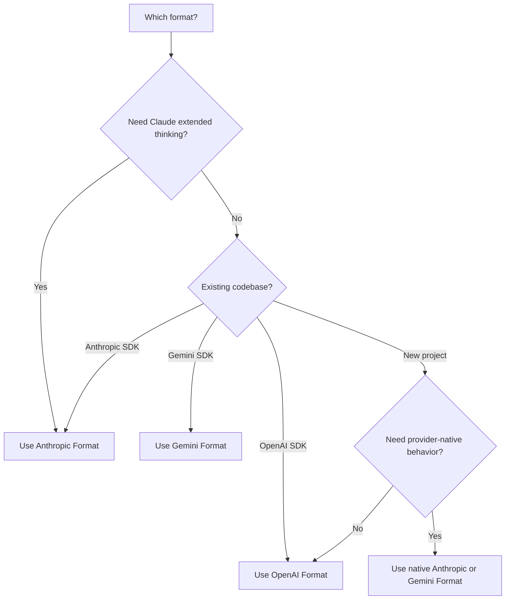

## نظرة عامة

تدعم AI Sonar **ثلاث صيغ API أصلية** باستخدام مفتاح API واحد. اختر الصيغة التي تناسب حالة الاستخدام لديك — لا حاجة لتغيير أي إعدادات.

<CardGroup cols={3}>
  <Card title="صيغة OpenAI" icon="plug">
    `/v1/chat/completions`
    صيغة قياسية، أوسع توافق
  </Card>
  <Card title="صيغة Anthropic" icon="message">
    `/v1/messages`
    تفكير موسّع، ميزات Claude الأصلية
  </Card>
  <Card title="صيغة Gemini" icon="sparkles">
    `/v1beta/models/:model:generateContent`
    تكامل مع نظام Google البيئي
  </Card>
</CardGroup>

## لماذا الصيغ المتعددة؟

| الميزة | الوصف |
|---------|-------------|
| **لا حاجة لتبديل SDK** | استخدم أي نموذج مع SDK المفضل لديك |
| **ميزات أصلية** | الوصول إلى قدرات خاصة بكل صيغة |
| **ترحيل سهل** | الانتقال من واجهات API الرسمية بتغيير عنوان الأساس فقط |
| **فوترة واحدة** | حساب واحد، مفتاح API واحد، جميع الصيغ |

## مقارنة الصيغ

| الميزة | OpenAI | Anthropic | Gemini |
|---------|--------|-----------|--------|
| **نقطة النهاية** | `/v1/chat/completions` | `/v1/messages` | `/v1beta/models/:model:generateContent` |
| **رأس المصادقة** | `Authorization: Bearer` | `x-api-key` | `Authorization: Bearer` |
| **موجه النظام** | داخل مصفوفة `messages` | حقل `system` منفصل | داخل `systemInstruction` |
| **التفكير الموسّع** | ❌ | ✅ | ❌ |
| **البث** | ✅ SSE | ✅ SSE | ✅ SSE |
| **استدعاء الأدوات** | ✅ | ✅ | ✅ |
| **الرؤية** | ✅ | ✅ | ✅ |

## صيغة OpenAI

استخدم مسار التوافق هذا للتكاملات الحالية مع OpenAI SDK وتدفّقات الدردشة أو التضمين المحمولة. بالنسبة لسلوك Claude أو Gemini الأصلي، استخدم تنسيق Anthropic أو Gemini أدناه.

```python
from openai import OpenAI

client = OpenAI(
    api_key="sk-your-api-key",
    base_url="https://api.aisonar.dev/v1"
)

# Portable chat works across many models
response = client.chat.completions.create(
    model="claude-sonnet-4-6",  # Claude via OpenAI format
    messages=[
        {"role": "system", "content": "You are a helpful assistant."},
        {"role": "user", "content": "Hello!"}
    ]
)
```

**مناسب لـ:**
- الاستخدام العام
- التكاملات القائمة مع OpenAI SDK
- أقصى درجات التوافق

## صيغة Anthropic

واجهة Anthropic Messages الأصلية. مطلوبة لميزات Claude الخاصة مثل التفكير الموسّع.

```python
from anthropic import Anthropic

client = Anthropic(
    api_key="sk-your-api-key",
    base_url="https://api.aisonar.dev"  # No /v1 suffix!
)

message = client.messages.create(
    model="claude-sonnet-4-6",
    max_tokens=1024,
    system="You are a helpful assistant.",  # Separate system field
    messages=[
        {"role": "user", "content": "Hello!"}
    ]
)
```

### التفكير الموسّع (Claude Opus 4.6)

متاح فقط في صيغة Anthropic:

```python
message = client.messages.create(
    model="claude-opus-4-6",
    max_tokens=16000,
    thinking={
        "type": "enabled",
        "budget_tokens": 10000
    },
    messages=[{"role": "user", "content": "Solve this complex problem..."}]
)

# Access thinking process
for block in message.content:
    if block.type == "thinking":
        print(f"Thinking: {block.thinking}")
    elif block.type == "text":
        print(f"Answer: {block.text}")
```

**مناسب لـ:**
- الميزات الخاصة بـ Claude
- وضع التفكير الموسّع
- مستخدمي Anthropic SDK الأصليين

## صيغة Gemini

صيغة Google Gemini الأصلية لتكامل نظام Google البيئي.

```bash
curl "https://api.aisonar.dev/v1beta/models/gemini-2.5-flash:generateContent" \
  -H "Authorization: Bearer sk-your-api-key" \
  -H "Content-Type: application/json" \
  -d '{
    "contents": [{
      "parts": [{"text": "Hello!"}]
    }],
    "systemInstruction": {
      "parts": [{"text": "You are a helpful assistant."}]
    }
  }'
```

### البث

```bash
curl "https://api.aisonar.dev/v1beta/models/gemini-2.5-flash:streamGenerateContent?alt=sse" \
  -H "Authorization: Bearer sk-your-api-key" \
  -H "Content-Type: application/json" \
  -d '{
    "contents": [{"parts": [{"text": "Write a story"}]}]
  }'
```

**مناسب لـ:**
- تكاملات Google Cloud
- مشروعات قائمة باستخدام Gemini SDK
- ميزات Gemini الأصلية

**Gemini Files و Cache:** يدعم مسار Gemini الأصلي `/upload/v1beta/files` و `/v1beta/files` و `/v1beta/files:register` و `/v1beta/cachedContents`. تستخدم Files قنوات upstream متوافقة مع Gemini File API؛ ويمكن أيضًا توجيه موارد Cache الصريحة عبر قنوات Vertex AI. الموارد التي يتم إنشاؤها عبر AI Sonar ترتبط بالقناة/key نفسها في upstream لاستخدامها لاحقًا في استدعاءات `generateContent`.

## حدود توافق الأدوات

يمكن تحويل أدوات الدوال بين الصيغ عندما يدعمها المسار الهدف. أما أدوات المزوّد الأصلية فيجب أن تبقى على مسارها الأصلي:

- أدوات OpenAI Responses المستضافة والأصلية مثل `tool_search` و`web_search` و`file_search` و`code_interpreter` وMCP وshell/apply_patch وأدوات computer-use تتطلب `/v1/responses`.
- أدوات Anthropic server/native مثل `web_search_*` و`web_fetch_*` و`code_execution_*` و`tool_search_*` وbash وcomputer-use وtext-editor تتطلب `/v1/messages`.
- أدوات Gemini المدمجة مثل `googleSearch` و`codeExecution` و`urlContext` و`computerUse` وحقول `tools` المشابهة تتطلب `/v1beta`.

إذا لم يتمكن AI Sonar من توجيه طلب يحتوي على أدوات أصلية إلى مسار upstream يدعم الصيغة الأصلية، فإنه يعيد خطأ unsupported-field واضحًا بدلًا من إسقاط الأداة بصمت أو تقديمها كدالة Chat Completions. تظل أدوات الدوال التي يعرّفها المستخدم هي المسار الأكثر قابلية للنقل.

## اختيار الصيغة المناسبة



## أدلة الترحيل

### من واجهة OpenAI الرسمية

```python
# Before (OpenAI)
client = OpenAI(api_key="sk-openai-key")

# After (AI Sonar)
client = OpenAI(
    api_key="sk-your-api-key",
    base_url="https://api.aisonar.dev/v1"  # Add this line
)
# That's it! Same code works
```

### من واجهة Anthropic الرسمية

```python
# Before (Anthropic)
client = Anthropic(api_key="sk-ant-key")

# After (AI Sonar)
client = Anthropic(
    api_key="sk-your-api-key",
    base_url="https://api.aisonar.dev"  # Add this line (no /v1!)
)
```

### من Google AI Studio

```python
# Before (Google)
import google.generativeai as genai
genai.configure(api_key="google-api-key")

# After (AI Sonar) - Use REST API
import requests

response = requests.post(
    "https://api.aisonar.dev/v1beta/models/gemini-2.5-flash:generateContent",
    headers={"Authorization": "Bearer sk-your-api-key"},
    json={"contents": [{"parts": [{"text": "Hello"}]}]}
)
```

## التوافق بين النماذج

ميزة AI Sonar: استخدم **أي SDK** مع **أي نموذج**. تقوم البوابة تلقائيًا بتحويل الصيغ.

### أي SDK → أي نموذج

```python
# Anthropic SDK with GPT-4o (auto-converts to OpenAI format)
from anthropic import Anthropic

client = Anthropic(
    api_key="sk-your-api-key",
    base_url="https://api.aisonar.dev"
)

response = client.messages.create(
    model="gpt-4o",  # ✅ Works! Auto-converted
    max_tokens=1024,
    messages=[{"role": "user", "content": "Hello!"}]
)

# Same compatibility SDK for portable chat; native-only features still need native routes
response = client.messages.create(model="gemini-2.5-flash", ...)  # ✅ Works!
response = client.messages.create(model="deepseek-r1", ...)       # ✅ Works!
```

### OpenAI SDK → جميع النماذج

```python
from openai import OpenAI

client = OpenAI(base_url="https://api.aisonar.dev/v1", api_key="sk-...")

# These portable chat calls use the same /v1 compatibility SDK:
response = client.chat.completions.create(model="gpt-4o", ...)
response = client.chat.completions.create(model="claude-sonnet-4-6", ...)
response = client.chat.completions.create(model="gemini-2.5-flash", ...)
```

### مقارنة الصناعة

| المنصة | OpenAI Format | Anthropic Format | Gemini Format | Responses API |
|----------|:---:|:---:|:---:|:---:|
| **AI Sonar** | ✅ جميع النماذج | ✅ جميع النماذج | ✅ جميع النماذج | ✅ جميع النماذج |
| OpenRouter | ✅ جميع النماذج | ❌ | ❌ | ❌ |
| Together AI | ✅ جميع النماذج | ❌ | ❌ | ❌ |
| Fireworks | ✅ جميع النماذج | ❌ | ❌ | ❌ |

<Note>
بينما يعمل التوافق عبر الصيغ لمعظم الميزات، تتطلب الميزات الخاصة بكل صيغة (مثل التفكير الموسّع في Anthropic) استخدام الصيغة الأصلية.
</Note>
