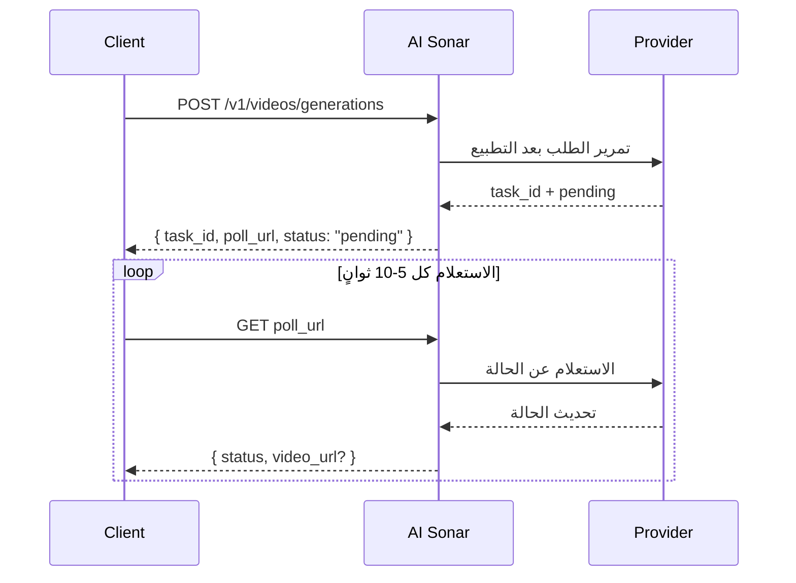

<span data-mintlify-rebuild="2026-05-19-after-mdx-parse-fix" aria-hidden="true" />

## نظرة عامة

توفّر AI Sonar توليد الفيديو عبر API موحّد. تعمل العملية بشكل **غير متزامن**: ترسل طلبًا، وتتلقى `task_id` و `poll_url`، ثم تتحقق من الحالة بشكل دوري حتى تصبح النتيجة النهائية جاهزة.

### التوفر والاستعلام

يمكنك الاطلاع على أحدث مخزون لنماذج الفيديو العامة عبر [واجهة Models API](/ar/api-reference/models/list-models) أو عبر [صفحة النماذج](https://aisonar.dev/models).

إذا أعادت استجابة الإنشاء `poll_url`، فاستدعِ هذا الرابط نفسه تمامًا. وعندما يشير إلى `/v1/tasks/{id}`، فاعتبره نقطة الحالة الثابتة المعيارية.

### سلوك النموذج والوسائط

يعتمد سلوك الصوت على النموذج. في AI Sonar، تُعامل عائلة Veo 3 على أن الصوت مفعّل افتراضيًا عندما يُحذف `output_audio`. أما النماذج العامة الأخرى فقد تكون صامتة افتراضيًا أو لا تكشف مفتاحًا ثابتًا للتحكم في الصوت.

في تكاملات الإنتاج، يُفضّل استخدام روابط `https` عامة للصور والفيديو والصوت. ما تزال النماذج المتوافقة تقبل روابط `data:`، لكن الروابط العامة أكثر متانة عند إعادة المحاولة والرصد وتشخيص المشاكل.

### التدفق غير المتزامن



## العمليات العامة الحالية

يرتكز عقد الفيديو العام الحالي في AI Sonar على العمليات التالية:

- `text-to-video`
- `image-to-video`
- `reference-to-video`
- `start-end-to-video`
- `video-to-video`
- `motion-control`

كما يقبل العقد العام أيضًا `audio-to-video` و `video-extension` لبعض التدفقات الخاصة بالنماذج، لكن قائمة النماذج العامة المفعلة على نطاق واسع في هذا البناء من الوثائق لا تتضمن حاليًا نموذجًا عامًا يعلن هاتين القدرتين بشكل واسع.

## مصفوفة القدرات

**الترميز**: ✅ توجد قدرة ممثلة في نموذج عام واحد على الأقل ومفعّل حاليًا ضمن عائلة المزود | ❌ غير ممثلة حاليًا في النماذج العامة المفعلة

| السلسلة | T2V | I2V | مرجعي | بداية-نهاية | V2V | حركة |
|---------|-----|-----|--------|-------------|-----|------|
| OpenAI | ✅ | ✅ | ❌ | ❌ | ❌ | ❌ |
| Kuaishou | ✅ | ✅ | ✅ | ✅ | ✅ | ✅ |
| Google | ✅ | ✅ | ✅ | ✅ | ❌ | ❌ |
| ByteDance | ✅ | ✅ | ❌ | ❌ | ❌ | ❌ |
| MiniMax | ✅ | ✅ | ❌ | ❌ | ❌ | ❌ |
| Alibaba | ✅ | ✅ | ✅ | ❌ | ❌ | ❌ |
| Shengshu | ✅ | ✅ | ✅ | ✅ | ❌ | ❌ |
| xAI | ✅ | ✅ | ❌ | ❌ | ✅ | ❌ |
| أخرى | ❌ | ❌ | ❌ | ❌ | ✅ | ❌ |

### تعريفات القدرات

- **T2V (Text-to-Video)**: توليد فيديو من prompt نصي
- **I2V (Image-to-Video)**: توليد فيديو انطلاقًا من صورة أولية؛ ولأوسع توافق يُنصح باستخدام `image_url`
- **مرجعي**: تكييف التوليد بواسطة صورة مرجعية واحدة أو أكثر عبر `reference_images`
- **بداية-نهاية**: التحكم في الإطار الأول والأخير باستخدام `start_image` و `end_image`
- **V2V (Video-to-Video)**: استخدام فيديو موجود كمدخل رئيسي
- **حركة**: الجمع بين صورة العنصر وفيديو مرجعي للحركة

## قائمة النماذج العامة الحالية


### Kuaishou

| النموذج | العمليات العامة |
|--------|------------------|
| `kling-3.0-motion-control` | تحكم في الحركة |
| `kling-3.0-video` | نص إلى فيديو، image-to-video، start-end-to-video، مراجع العناصر |
| `kling-v2.1-master` | نص إلى فيديو، image-to-video |
| `kling-v2.1-pro` | image-to-video، start-end-to-video |
| `kling-v2.1-standard` | image-to-video |
| `kling-v2.5-turbo-pro` | نص إلى فيديو، image-to-video، start-end-to-video |
| `kling-v2.5-turbo-std` | نص إلى فيديو، image-to-video |
| `kling-v2.6-pro` | نص إلى فيديو، image-to-video، start-end-to-video |
| `kling-v2.6-std` | نص إلى فيديو، image-to-video |
| `kling-v3.0-pro` | نص إلى فيديو، image-to-video، start-end-to-video |
| `kling-v3.0-std` | نص إلى فيديو، image-to-video، start-end-to-video |
| `kling-video-o1-pro` | نص إلى فيديو، image-to-video، reference-to-video، start-end-to-video، video-to-video |
| `kling-video-o1-std` | نص إلى فيديو، image-to-video، reference-to-video، start-end-to-video، video-to-video |

### Google

| النموذج | العمليات العامة |
|--------|------------------|
| `veo3` | نص إلى فيديو، image-to-video |
| `veo3-fast` | نص إلى فيديو، image-to-video |
| `veo3-pro` | نص إلى فيديو، image-to-video |
| `veo3.1` | نص إلى فيديو، image-to-video، reference-to-video، start-end-to-video |
| `veo3.1-fast` | نص إلى فيديو، image-to-video، reference-to-video، start-end-to-video |
| `veo3.1-pro` | نص إلى فيديو، image-to-video، start-end-to-video |

### ByteDance

| النموذج | العمليات العامة |
|--------|------------------|
| `seedance-1.5-pro` | نص إلى فيديو، image-to-video |

### MiniMax

| النموذج | العمليات العامة |
|--------|------------------|
| `hailuo-2.3-fast` | من صورة إلى فيديو |
| `hailuo-2.3-pro` | نص إلى فيديو، image-to-video |
| `hailuo-2.3-standard` | نص إلى فيديو، image-to-video |

### Alibaba

| النموذج | العمليات العامة |
|--------|------------------|
| `wan-2.2-plus` | نص إلى فيديو، image-to-video |
| `wan-2.5` | نص إلى فيديو، image-to-video |
| `wan-2.6` | نص إلى فيديو، image-to-video، reference-to-video |

### Shengshu

| النموذج | العمليات العامة |
|--------|------------------|
| `viduq2` | نص إلى فيديو، reference-to-video |
| `viduq2-pro` | صورة إلى فيديو، مرجع إلى فيديو، إطار بداية/نهاية إلى فيديو |
| `viduq2-pro-fast` | صورة إلى فيديو، إطار بداية/نهاية إلى فيديو |
| `viduq2-turbo` | صورة إلى فيديو، إطار بداية/نهاية إلى فيديو |
| `viduq3-pro` | نص إلى فيديو، image-to-video، start-end-to-video |
| `viduq3-turbo` | نص إلى فيديو، image-to-video، start-end-to-video |

### xAI

| النموذج | العمليات العامة |
|--------|------------------|
| `grok-imagine-video` | نص إلى فيديو، صورة إلى فيديو، reference-to-video، video-to-video |
| `grok-imagine-video-1.5-preview` | صورة إلى فيديو |
| `grok-imagine-image-to-video` | من صورة إلى فيديو |
| `grok-imagine-text-to-video` | نص إلى فيديو |
| `grok-imagine-upscale` | من فيديو إلى فيديو |

### أخرى

| النموذج | العمليات العامة |
|--------|------------------|
| `topaz-video-upscale` | من فيديو إلى فيديو |

## أمثلة الاستخدام

### text-to-video

```python
response = requests.post(f"{BASE}/videos/generations",
    headers=headers,
    json={
        "model": "veo3.1",
        "prompt": "A calm cinematic shot of a cat walking through a sunlit garden.",
        "operation": "text-to-video",
        "duration": 4,
        "aspect_ratio": "16:9"
    }
)
```

### صورة إلى فيديو

```python
response = requests.post(f"{BASE}/videos/generations",
    headers=headers,
    json={
        "model": "hailuo-2.3-standard",
        "prompt": "The scene begins from the provided image and adds gentle natural motion.",
        "operation": "image-to-video",
        "image_url": "https://example.com/portrait.jpg",
        "duration": 6,
        "aspect_ratio": "16:9"
    }
)
```

### Kling 3.0 Elements

استخدم `kling_elements` مع `kling-3.0-video` عندما تحتاج إلى مراجع عناصر. يجب أن يحتوي الطلب على شرط صورة (`image_url` أو `image_urls` أو `start_image` أو `end_image`) وأن تشير إلى كل عنصر في `prompt` باستخدام `@name`. لا تجمع `kling_elements` مع `output_audio=true`؛ احذف `output_audio` أو اجعله `false` عند استخدام مراجع العناصر.

```python
response = requests.post(f"{BASE}/videos/generations",
    headers=headers,
    json={
        "model": "kling-3.0-video",
        "prompt": "Place @hero_bag on a studio turntable with soft product lighting.",
        "operation": "image-to-video",
        "image_url": "https://example.com/studio-start.png",
        "duration": 5,
        "resolution": "720p",
        "kling_elements": [
            {
                "name": "hero_bag",
                "description": "black leather handbag",
                "element_input_urls": [
                    "https://example.com/bag-front.png",
                    "https://example.com/bag-side.png"
                ]
            }
        ]
    }
)
```

### مرجع إلى فيديو

بالنسبة إلى `seedance-2.0` و `seedance-2.0-fast`، تدعم AI Sonar حاليًا ما يصل إلى 9 صور مرجعية، بالإضافة إلى ما يصل إلى 3 مقاطع فيديو مرجعية و3 ملفات صوت مرجعية. يتحكم `duration` فقط في طول الإخراج الناتج، ولا يعرّف حدًا منفصلًا لمدة فيديو المرجع المُدخل. بالنسبة إلى `grok-imagine-video`، تقبل reference-to-video حتى 7 مراجع صور (`reference_images` أو `image_urls`) ويكون `duration` بحد أقصى 10 ثوانٍ. لا تجمع مراجع الصور مع إدخالات الإطار الأول `image_url` / `image`. يدعم `grok-imagine-video-1.5-preview` image-to-video فقط.

```python
response = requests.post(f"{BASE}/videos/generations",
    headers=headers,
    json={
        "model": "veo3.1",
        "prompt": "Keep the same subject identity and palette while adding subtle motion.",
        "operation": "reference-to-video",
        "reference_images": [
            "https://example.com/ref-a.jpg",
            "https://example.com/ref-b.jpg"
        ],
        "duration": 8,
        "resolution": "720p",
        "aspect_ratio": "9:16"
    }
)
```

### إطار بداية/نهاية إلى فيديو

```python
response = requests.post(f"{BASE}/videos/generations",
    headers=headers,
    json={
        "model": "viduq2-pro",
        "prompt": "Smooth transition from day to night.",
        "operation": "start-end-to-video",
        "start_image": "https://example.com/city-day.jpg",
        "end_image": "https://example.com/city-night.jpg",
        "duration": 5,
        "resolution": "720p",
        "aspect_ratio": "16:9"
    }
)
```

### فيديو إلى فيديو

في video-to-video مع `grok-imagine-video`، أرسل رابط HTTPS عام بصيغة `.mp4` في `video_url`. يحوله AI Sonar إلى جسم REST الخاص بـ xAI بصيغة `video.url`. يمكنك ضبط `resolution` على `480p` أو `720p`؛ ولا يقبل مسار التحرير هذا `duration` أو `aspect_ratio`.

```python
response = requests.post(f"{BASE}/videos/generations",
    headers=headers,
    json={
        "model": "topaz-video-upscale",
        "operation": "video-to-video",
        "video_url": "https://example.com/source.mp4",
        "prompt": "Upscale this clip while preserving the original motion."
    }
)
```

### motion-control

```python
response = requests.post(f"{BASE}/videos/generations",
    headers=headers,
    json={
        "model": "kling-3.0-motion-control",
        "operation": "motion-control",
        "prompt": "Keep the subject stable while following the motion reference.",
        "image_url": "https://example.com/subject.png",
        "video_url": "https://example.com/motion.mp4",
        "resolution": "720p"
    }
)
```

## مرجع المعلمات

| المعامل | النوع | ملاحظة |
|---------|------|---------|
| `operation` | string | يُفضَّل إرساله بشكل صريح في الإنتاج |
| `image_url` | string | أكثر أشكال إدخال الصور استقرارًا |
| `image` | string | رابط `data:` مفيد للاختبارات المحلية والتكاملات الصغيرة |
| `reference_images` | string[] | الحقل العام القياسي للتكييف بالصور المرجعية |
| `reference_image_type` | string | محدد اختياري بين `asset` و `style` |
| `video_url` | string | مطلوب لنماذج `video-to-video` و `motion-control` العامة الحالية |
| `audio_url` | string | يُستخدم في تدفقات الصوت إلى فيديو الخاصة ببعض النماذج عند توفرها |
| `output_audio` | boolean | تعامل عائلة Veo 3 الحقل المحذوف كأنه `true`. يقبل `kling-3.0-video` هذا المحدد للتحكم upstream `sound`، ويكون صامتًا افتراضيًا عند حذفه. |

## دليل سريع لاختيار النموذج

<CardGroup cols={2}>
  <Card title="أعلى جودة" icon="crown">
    إذا كانت الجودة أهم من السرعة، فالنماذج **veo3.1-pro** و **kling-video-o1-pro** و **viduq3-pro** خيارات قوية.
  </Card>
  <Card title="تكرار سريع" icon="bolt">
    للتجارب السريعة، ابدأ مع **veo3.1-fast** أو **hailuo-2.3-fast** أو **viduq3-turbo**.
  </Card>
  <Card title="تدفقات تعتمد على المرجع" icon="images">
    إذا كنت تحتاج إلى تحكم مخصص بالصور المرجعية، فابدأ مع **veo3.1** أو **veo3.1-fast** أو **wan-2.6** أو **kling-video-o1-pro / std**.
  </Card>
  <Card title="video-to-video" icon="film">
    المسارات العامة الأكثر شيوعًا حاليًا لعمليات `video-to-video` تعتمد خصوصًا على **topaz-video-upscale** و **grok-imagine-upscale** و **kling-video-o1-pro / std**.
  </Card>
</CardGroup>

## الفوترة

تعتمد الفوترة على النموذج. بعض نماذج الفيديو العامة تتصرف فعليًا كنماذج تُسعَّر لكل طلب، بينما يقترب بعضها الآخر من التسعير لكل ثانية. وللاطلاع على سطح الأسعار العام الحالي، راجع [صفحة النماذج](https://aisonar.dev/models) أو [واجهة Pricing API](/ar/api-reference/pricing/get-pricing).
