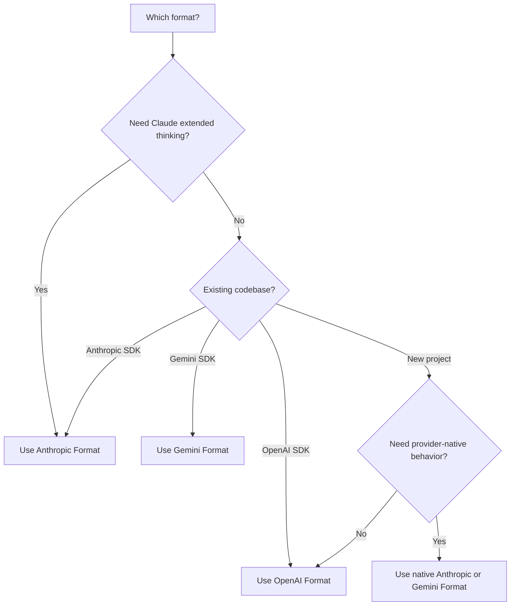

<span data-mintlify-rebuild="2026-05-19-after-mdx-parse-fix" aria-hidden="true" />

## Übersicht

AI Sonar unterstützt **drei native API-Formate** mit nur einem API-Schlüssel. Wählen Sie das Format, das am besten zu Ihrem Anwendungsfall passt - keine Konfigurationsänderungen erforderlich.

<CardGroup cols={3}>
  <Card title="OpenAI-Format" icon="plug">
    `/v1/chat/completions`
    Standardformat, größte Kompatibilität
  </Card>
  <Card title="Anthropic-Format" icon="message">
    `/v1/messages`
    Erweitertes Denken, native Claude-Funktionen
  </Card>
  <Card title="Gemini-Format" icon="sparkles">
    `/v1beta/models/:model:generateContent`
    Integration ins Google-Ökosystem
  </Card>
</CardGroup>

## Warum Multi-Format?

| Vorteil | Beschreibung |
|---------|-------------|
| **Kein SDK-Wechsel** | Verwenden Sie jedes Modell mit Ihrem bevorzugten SDK |
| **Native Funktionen** | Zugriff auf formatspezifische Fähigkeiten |
| **Einfache Migration** | Wechseln Sie von offiziellen APIs nur durch Ändern der Basis-URL |
| **Einheitliche Abrechnung** | Ein Konto, ein API-Schlüssel, alle Formate |

## Formatvergleich

| Funktion | OpenAI | Anthropic | Gemini |
|---------|--------|-----------|--------|
| **Endpoint** | `/v1/chat/completions` | `/v1/messages` | `/v1beta/models/:model:generateContent` |
| **Authentifizierungs-Header** | `Authorization: Bearer` | `x-api-key` | `Authorization: Bearer` |
| **System-Prompt** | Im `system`-Array | Getrenntes `systemInstruction`-Feld | In `systemInstruction` |
| **Erweitertes Denken** | ❌ | ✅ | ❌ |
| **Streaming** | ✅ SSE | ✅ SSE | ✅ SSE |
| **Tool-Aufrufe** | ✅ | ✅ | ✅ |
| **Vision** | ✅ | ✅ | ✅ |

## OpenAI-Format

Verwenden Sie diesen Kompatibilitätsweg für bestehende OpenAI-SDK-Integrationen und portable Chat- oder Embedding-Flows. Für Claude- oder Gemini-natives Verhalten verwenden Sie das unten stehende Anthropic- oder Gemini-Format.

```python
from openai import OpenAI

client = OpenAI(
    api_key="sk-your-api-key",
    base_url="https://api.aisonar.dev/v1"
)

# Portable chat works across many models
response = client.chat.completions.create(
    model="claude-sonnet-4-6",  # Claude via OpenAI format
    messages=[
        {"role": "system", "content": "You are a helpful assistant."},
        {"role": "user", "content": "Hello!"}
    ]
)
```

**Am besten geeignet für:**
- Allgemeiner Einsatz
- Bestehende OpenAI-SDK-Integrationen
- Maximale Kompatibilität

## Anthropic-Format

Native Anthropic Messages API. Erforderlich für Claude-spezifische Funktionen wie erweitertes Denken.

```python
from anthropic import Anthropic

client = Anthropic(
    api_key="sk-your-api-key",
    base_url="https://api.aisonar.dev"  # No /v1 suffix!
)

message = client.messages.create(
    model="claude-sonnet-4-6",
    max_tokens=1024,
    system="You are a helpful assistant.",  # Separate system field
    messages=[
        {"role": "user", "content": "Hello!"}
    ]
)
```

### Erweitertes Denken (Claude Opus 4.6)

Nur im Anthropic-Format verfügbar:

```python
message = client.messages.create(
    model="claude-opus-4-6",
    max_tokens=16000,
    thinking={
        "type": "enabled",
        "budget_tokens": 10000
    },
    messages=[{"role": "user", "content": "Solve this complex problem..."}]
)

# Access thinking process
for block in message.content:
    if block.type == "thinking":
        print(f"Thinking: {block.thinking}")
    elif block.type == "text":
        print(f"Answer: {block.text}")
```

**Am besten geeignet für:**
- Claude-spezifische Funktionen
- Modus für erweitertes Denken
- Nutzer des nativen Anthropic SDK

## Gemini-Format

Native Google Gemini API-Format zur Integration ins Google-Ökosystem.

```bash
curl "https://api.aisonar.dev/v1beta/models/gemini-2.5-flash:generateContent" \
  -H "Authorization: Bearer sk-your-api-key" \
  -H "Content-Type: application/json" \
  -d '{
    "contents": [{
      "parts": [{"text": "Hello!"}]
    }],
    "systemInstruction": {
      "parts": [{"text": "You are a helpful assistant."}]
    }
  }'
```

### Streaming

```bash
curl "https://api.aisonar.dev/v1beta/models/gemini-2.5-flash:streamGenerateContent?alt=sse" \
  -H "Authorization: Bearer sk-your-api-key" \
  -H "Content-Type: application/json" \
  -d '{
    "contents": [{"parts": [{"text": "Write a story"}]}]
  }'
```

**Am besten geeignet für:**
- Google Cloud-Integrationen
- Bestehender Gemini-SDK-Code
- Native Gemini-Funktionen

**Gemini Files und Cache:** Die native Gemini-Route unterstützt `/upload/v1beta/files`, `/v1beta/files`, `/v1beta/files:register` und `/v1beta/cachedContents`. Files nutzt upstream Kanäle, die mit der Gemini File API kompatibel sind; explizite Cache-Ressourcen können auch über Vertex AI Kanäle geroutet werden. Über AI Sonar erstellte Ressourcen werden an denselben upstream Kanal/key gebunden und spätere `generateContent` Aufrufe nutzen diese Bindung weiter.

## Grenze der Tool-Kompatibilität

Funktionstools können zwischen Formaten konvertiert werden, wenn die Zielroute sie unterstützt. Provider-native Tools müssen auf ihrer nativen Route bleiben:

- Gehostete und native OpenAI Responses-Tools wie `tool_search`, `web_search`, `file_search`, `code_interpreter`, MCP, shell/apply_patch und computer-use Tools benötigen `/v1/responses`.
- Anthropic server/native Tools wie `web_search_*`, `web_fetch_*`, `code_execution_*`, `tool_search_*`, bash, computer-use und text-editor Tools benötigen `/v1/messages`.
- Gemini Built-in-Tools wie `googleSearch`, `codeExecution`, `urlContext`, `computerUse` und ähnliche `tools`-Felder benötigen `/v1beta`.

Wenn AI Sonar eine Anfrage mit nativen Tools nicht an eine native-fähige Upstream-Route senden kann, wird ein expliziter unsupported-field Fehler zurückgegeben. Das Tool wird nicht stillschweigend entfernt und nicht als Chat Completions-Funktion ausgegeben. Benutzerdefinierte Funktionstools bleiben der portabelste Tool-Pfad.

## Wahl des richtigen Formats



## Migrationsanleitungen

### Von der offiziellen OpenAI-API

```python
# Before (OpenAI)
client = OpenAI(api_key="sk-openai-key")

# After (AI Sonar)
client = OpenAI(
    api_key="sk-your-api-key",
    base_url="https://api.aisonar.dev/v1"  # Add this line
)
# That's it! Same code works
```

### Von der offiziellen Anthropic-API

```python
# Before (Anthropic)
client = Anthropic(api_key="sk-ant-key")

# After (AI Sonar)
client = Anthropic(
    api_key="sk-your-api-key",
    base_url="https://api.aisonar.dev"  # Add this line (no /v1!)
)
```

### Von Google AI Studio

```python
# Before (Google)
import google.generativeai as genai
genai.configure(api_key="google-api-key")

# After (AI Sonar) - Use REST API
import requests

response = requests.post(
    "https://api.aisonar.dev/v1beta/models/gemini-2.5-flash:generateContent",
    headers={"Authorization": "Bearer sk-your-api-key"},
    json={"contents": [{"parts": [{"text": "Hello"}]}]}
)
```

## Modellübergreifende Kompatibilität

Das Besondere an AI Sonar: Verwenden Sie **jedes SDK** mit **jedem Modell**. Das Gateway übernimmt automatisch die Formatkonvertierung.

### Jedes SDK → Jedes Modell

```python
# Anthropic SDK with GPT-4o (auto-converts to OpenAI format)
from anthropic import Anthropic

client = Anthropic(
    api_key="sk-your-api-key",
    base_url="https://api.aisonar.dev"
)

response = client.messages.create(
    model="gpt-4o",  # ✅ Works! Auto-converted
    max_tokens=1024,
    messages=[{"role": "user", "content": "Hello!"}]
)

# Same compatibility SDK for portable chat; native-only features still need native routes
response = client.messages.create(model="gemini-2.5-flash", ...)  # ✅ Works!
response = client.messages.create(model="deepseek-r1", ...)       # ✅ Works!
```

### OpenAI-SDK → Alle Modelle

```python
from openai import OpenAI

client = OpenAI(base_url="https://api.aisonar.dev/v1", api_key="sk-...")

# These portable chat calls use the same /v1 compatibility SDK:
response = client.chat.completions.create(model="gpt-4o", ...)
response = client.chat.completions.create(model="claude-sonnet-4-6", ...)
response = client.chat.completions.create(model="gemini-2.5-flash", ...)
```

### Branchenvergleich

| Plattform | OpenAI-Format | Anthropic-Format | Gemini-Format | Responses-API |
|----------|:---:|:---:|:---:|:---:|
| **AI Sonar** | ✅ Alle Modelle | ✅ Alle Modelle | ✅ Alle Modelle | ✅ Alle Modelle |
| OpenRouter | ✅ Alle Modelle | ❌ | ❌ | ❌ |
| Together AI | ✅ Alle Modelle | ❌ | ❌ | ❌ |
| Fireworks | ✅ Alle Modelle | ❌ | ❌ | ❌ |

<Note>
Während die formatübergreifende Nutzung für die meisten Funktionen funktioniert, erfordern formatspezifische Funktionen (wie das erweiterte Denken von Anthropic) das native Format.
</Note>
