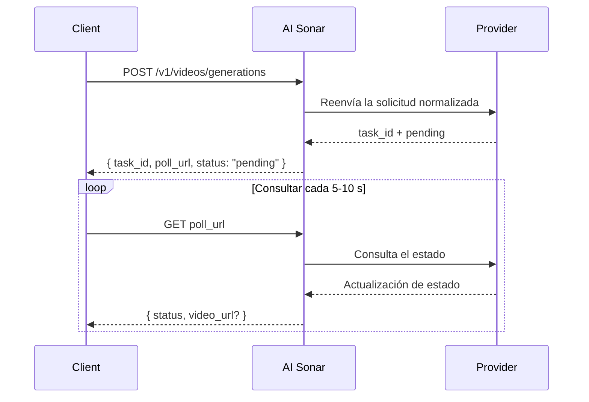

## Resumen

AI Sonar ofrece generación de video mediante una API unificada. La generación es **asíncrona**: envías una solicitud, recibes `task_id` y `poll_url`, y después consultas hasta obtener el resultado final.

### Disponibilidad y sondeo

Puedes ver el inventario público actual de modelos de video a través de la [Models API](/es/api-reference/models/list-models) o en la [página de modelos](https://aisonar.dev/models).

Si una respuesta de creación devuelve `poll_url`, llama exactamente a esa URL. Cuando apunte a `/v1/tasks/{id}`, trátala como el endpoint fijo canónico de estado.

### Comportamiento de modelos y medios

El comportamiento del audio depende del modelo. En AI Sonar, la familia Veo 3 se trata por defecto como audio activado cuando se omite `output_audio`. Otros modelos públicos son silenciosos por defecto o no exponen un interruptor de audio estable.

En producción, es mejor usar URLs `https` públicas para imágenes, videos y audio. Los modelos compatibles siguen aceptando URLs `data:`, pero las URLs son más robustas para reintentos, observabilidad y depuración.

### Flujo asíncrono



## Operaciones públicas actuales

El contrato público de video de AI Sonar se centra actualmente en estas operaciones:

- `text-to-video`
- `image-to-video`
- `reference-to-video`
- `start-end-to-video`
- `video-to-video`
- `motion-control`

El contrato también acepta `audio-to-video` y `video-extension` para flujos específicos de algunos modelos, pero en la lista pública generalmente habilitada de esta compilación no hay ningún modelo ampliamente habilitado que publique esas capacidades.

## Matriz de capacidades

**Leyenda**: ✅ Hay al menos un modelo público actualmente habilitado en esa familia de proveedores con esa capacidad | ❌ No hay modelos públicos actualmente habilitados con esa capacidad

| Serie | T2V | I2V | Referencia | Inicio-Fin | V2V | Movimiento |
|-------|-----|-----|------------|------------|-----|------------|
| OpenAI | ✅ | ✅ | ❌ | ❌ | ❌ | ❌ |
| Kuaishou | ✅ | ✅ | ✅ | ✅ | ✅ | ✅ |
| Google | ✅ | ✅ | ✅ | ✅ | ❌ | ❌ |
| ByteDance | ✅ | ✅ | ❌ | ❌ | ❌ | ❌ |
| MiniMax | ✅ | ✅ | ❌ | ❌ | ❌ | ❌ |
| Alibaba | ✅ | ✅ | ✅ | ❌ | ❌ | ❌ |
| Shengshu | ✅ | ✅ | ✅ | ✅ | ❌ | ❌ |
| xAI | ✅ | ✅ | ❌ | ❌ | ✅ | ❌ |
| Otros | ❌ | ❌ | ❌ | ❌ | ✅ | ❌ |

### Definiciones de capacidades

- **T2V (Text-to-Video)**: generar un video a partir de un prompt de texto
- **I2V (Image-to-Video)**: generar un video a partir de una imagen inicial; para la compatibilidad más amplia conviene usar `image_url`
- **Referencia**: condicionar la generación con una o varias imágenes de referencia mediante `reference_images`
- **Inicio-Fin**: controlar el primer y el último fotograma con `start_image` y `end_image`
- **V2V (Video-to-Video)**: usar un video existente como entrada principal
- **Movimiento**: combinar una imagen del sujeto con un video de referencia de movimiento

## Inventario público actual de modelos


### Kuaishou

| Modelo | Operaciones públicas |
|--------|----------------------|
| `kling-3.0-motion-control` | Control de movimiento |
| `kling-3.0-video` | Texto a video, imagen a video, inicio-fin a video, referencias de elementos |
| `kling-v2.1-master` | Texto a video, imagen a video |
| `kling-v2.1-pro` | Imagen a video, inicio-fin a video |
| `kling-v2.1-standard` | Imagen a video |
| `kling-v2.5-turbo-pro` | Texto a video, imagen a video, inicio-fin a video |
| `kling-v2.5-turbo-std` | Texto a video, imagen a video |
| `kling-v2.6-pro` | Texto a video, imagen a video, inicio-fin a video |
| `kling-v2.6-std` | Texto a video, imagen a video |
| `kling-v3.0-pro` | Texto a video, imagen a video, inicio-fin a video |
| `kling-v3.0-std` | Texto a video, imagen a video, inicio-fin a video |
| `kling-video-o1-pro` | Texto a video, imagen a video, referencia a video, inicio-fin a video, video a video |
| `kling-video-o1-std` | Texto a video, imagen a video, referencia a video, inicio-fin a video, video a video |

### Google

| Modelo | Operaciones públicas |
|--------|----------------------|
| `veo3` | Texto a video, imagen a video |
| `veo3-fast` | Texto a video, imagen a video |
| `veo3-pro` | Texto a video, imagen a video |
| `veo3.1` | Texto a video, imagen a video, referencia a video, inicio-fin a video |
| `veo3.1-fast` | Texto a video, imagen a video, referencia a video, inicio-fin a video |
| `veo3.1-pro` | Texto a video, imagen a video, inicio-fin a video |

### ByteDance

| Modelo | Operaciones públicas |
|--------|----------------------|
| `seedance-1.5-pro` | Texto a video, imagen a video |

### MiniMax

| Modelo | Operaciones públicas |
|--------|----------------------|
| `hailuo-2.3-fast` | Imagen a video |
| `hailuo-2.3-pro` | Texto a video, imagen a video |
| `hailuo-2.3-standard` | Texto a video, imagen a video |

### Alibaba

| Modelo | Operaciones públicas |
|--------|----------------------|
| `wan-2.2-plus` | Texto a video, imagen a video |
| `wan-2.5` | Texto a video, imagen a video |
| `wan-2.6` | Texto a video, imagen a video, referencia a video |

### Shengshu

| Modelo | Operaciones públicas |
|--------|----------------------|
| `viduq2` | Texto a video, referencia a video |
| `viduq2-pro` | Imagen a video, referencia a video, inicio-fin a video |
| `viduq2-pro-fast` | Imagen a video, inicio-fin a video |
| `viduq2-turbo` | Imagen a video, inicio-fin a video |
| `viduq3-pro` | Texto a video, imagen a video, inicio-fin a video |
| `viduq3-turbo` | Texto a video, imagen a video, inicio-fin a video |

### xAI

| Modelo | Operaciones públicas |
|--------|----------------------|
| `grok-imagine-video` | Texto a video, imagen a video, reference-to-video, video-to-video |
| `grok-imagine-video-1.5-preview` | Imagen a video |
| `grok-imagine-image-to-video` | Imagen a video |
| `grok-imagine-text-to-video` | Texto a video |
| `grok-imagine-upscale` | Video a video |

### Otros

| Modelo | Operaciones públicas |
|--------|----------------------|
| `topaz-video-upscale` | Video a video |

## Ejemplos de uso

### Texto a video

```python
response = requests.post(f"{BASE}/videos/generations",
    headers=headers,
    json={
        "model": "veo3.1",
        "prompt": "A calm cinematic shot of a cat walking through a sunlit garden.",
        "operation": "text-to-video",
        "duration": 4,
        "aspect_ratio": "16:9"
    }
)
```

### Imagen a video

```python
response = requests.post(f"{BASE}/videos/generations",
    headers=headers,
    json={
        "model": "hailuo-2.3-standard",
        "prompt": "The scene begins from the provided image and adds gentle natural motion.",
        "operation": "image-to-video",
        "image_url": "https://example.com/portrait.jpg",
        "duration": 6,
        "aspect_ratio": "16:9"
    }
)
```

### Kling 3.0 Elements

Usa `kling_elements` con `kling-3.0-video` cuando necesites referencias de elementos. Proporciona una solicitud condicionada por imagen (`image_url`, `image_urls`, `start_image` o `end_image`) y referencia cada elemento en el prompt con `@name`. No combines `kling_elements` con `output_audio=true`; omite `output_audio` o ponlo en `false` para solicitudes con referencias de elementos.

```python
response = requests.post(f"{BASE}/videos/generations",
    headers=headers,
    json={
        "model": "kling-3.0-video",
        "prompt": "Place @hero_bag on a studio turntable with soft product lighting.",
        "operation": "image-to-video",
        "image_url": "https://example.com/studio-start.png",
        "duration": 5,
        "resolution": "720p",
        "kling_elements": [
            {
                "name": "hero_bag",
                "description": "black leather handbag",
                "element_input_urls": [
                    "https://example.com/bag-front.png",
                    "https://example.com/bag-side.png"
                ]
            }
        ]
    }
)
```

### Referencia a video

Para `seedance-2.0` y `seedance-2.0-fast`, AI Sonar admite actualmente hasta 9 imágenes de referencia, además de hasta 3 videos de referencia y 3 audios de referencia. `duration` solo controla la duración del resultado generado; no define un límite independiente para la duración del video de referencia de entrada. Para `grok-imagine-video`, reference-to-video acepta hasta 7 referencias de imagen (`reference_images` o `image_urls`) y `duration` está limitada a 10 segundos. No combines referencias de imagen con entradas de primer fotograma `image_url` / `image`. `grok-imagine-video-1.5-preview` solo admite image-to-video.

```python
response = requests.post(f"{BASE}/videos/generations",
    headers=headers,
    json={
        "model": "veo3.1",
        "prompt": "Keep the same subject identity and palette while adding subtle motion.",
        "operation": "reference-to-video",
        "reference_images": [
            "https://example.com/ref-a.jpg",
            "https://example.com/ref-b.jpg"
        ],
        "duration": 8,
        "resolution": "720p",
        "aspect_ratio": "9:16"
    }
)
```

### Control de fotograma inicial y final

```python
response = requests.post(f"{BASE}/videos/generations",
    headers=headers,
    json={
        "model": "viduq2-pro",
        "prompt": "Smooth transition from day to night.",
        "operation": "start-end-to-video",
        "start_image": "https://example.com/city-day.jpg",
        "end_image": "https://example.com/city-night.jpg",
        "duration": 5,
        "resolution": "720p",
        "aspect_ratio": "16:9"
    }
)
```

### Video a video

Para video-to-video con `grok-imagine-video`, envía una URL HTTPS pública `.mp4` en `video_url`. AI Sonar la traduce al cuerpo REST de xAI `video.url`. Puedes definir `resolution` como `480p` o `720p`; `duration` y `aspect_ratio` no se aceptan en ese flujo de edición.

```python
response = requests.post(f"{BASE}/videos/generations",
    headers=headers,
    json={
        "model": "topaz-video-upscale",
        "operation": "video-to-video",
        "video_url": "https://example.com/source.mp4",
        "prompt": "Upscale this clip while preserving the original motion."
    }
)
```

### Control de movimiento

```python
response = requests.post(f"{BASE}/videos/generations",
    headers=headers,
    json={
        "model": "kling-3.0-motion-control",
        "operation": "motion-control",
        "prompt": "Keep the subject stable while following the motion reference.",
        "image_url": "https://example.com/subject.png",
        "video_url": "https://example.com/motion.mp4",
        "resolution": "720p"
    }
)
```

## Referencia de parámetros

| Parámetro | Tipo | Nota |
|-----------|------|------|
| `operation` | string | En producción conviene enviarlo explícitamente |
| `image_url` | string | Forma más robusta de entrada de imagen |
| `image` | string | URL `data:` útil para pruebas locales e integraciones pequeñas |
| `reference_images` | string[] | Campo público canónico para condicionamiento con referencias |
| `reference_image_type` | string | Selector opcional `asset` / `style` |
| `video_url` | string | Obligatorio para los modelos públicos actuales de `video-to-video` y `motion-control` |
| `audio_url` | string | Para flujos específicos de audio a video |
| `output_audio` | boolean | La familia Veo 3 trata la omisión como `true`. `kling-3.0-video` acepta este selector para el control `sound` upstream y queda silencioso por defecto si se omite. |

## Guía rápida de selección de modelo

<CardGroup cols={2}>
  <Card title="Máxima calidad" icon="crown">
    Si la calidad importa más que la velocidad, **veo3.1-pro**, **kling-video-o1-pro** y **viduq3-pro** son opciones fuertes.
  </Card>
  <Card title="Iteración rápida" icon="bolt">
    Para ciclos rápidos, **veo3.1-fast**, **hailuo-2.3-fast** y **viduq3-turbo** son buenos puntos de partida.
  </Card>
  <Card title="Flujos con referencias" icon="images">
    Si necesitas control dedicado por imágenes de referencia, empieza con **veo3.1**, **veo3.1-fast**, **wan-2.6** o **kling-video-o1-pro / std**.
  </Card>
  <Card title="Video a video" icon="film">
    Las rutas públicas generalmente habilitadas de `video-to-video` hoy son sobre todo **topaz-video-upscale**, **grok-imagine-upscale** y **kling-video-o1-pro / std**.
  </Card>
</CardGroup>

## Facturación

La facturación depende del modelo. Algunos modelos públicos de video se comportan en la práctica como modelos cobrados por solicitud, mientras que otros se asemejan más a un cobro por segundo. Para la superficie pública de precios actual, consulta la [página de modelos](https://aisonar.dev/models) o la [Pricing API](/es/api-reference/pricing/get-pricing).
