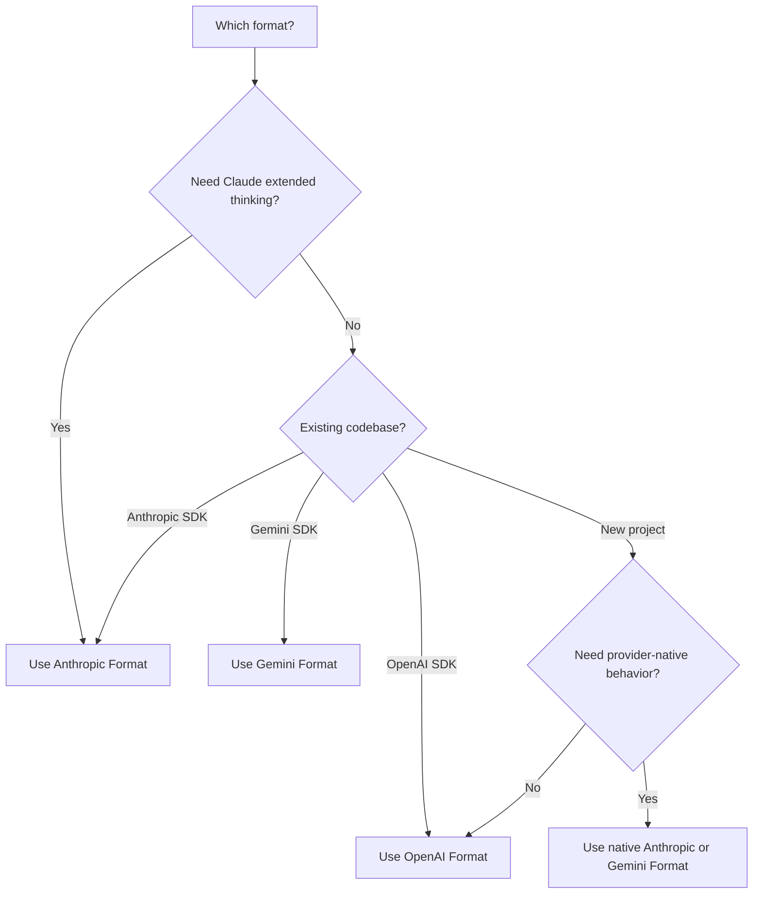

<span data-mintlify-rebuild="2026-05-19-after-mdx-parse-fix" aria-hidden="true" />

## Aperçu

AI Sonar prend en charge **trois formats d'API natifs** avec une seule clé API. Choisissez le format qui correspond le mieux à votre cas d'utilisation — aucune modification de configuration nécessaire.

<CardGroup cols={3}>
  <Card title="Format OpenAI" icon="plug">
    `/v1/chat/completions`
    Format standard, compatibilité maximale
  </Card>
  <Card title="Format Anthropic" icon="message">
    `/v1/messages`
    Réflexion étendue, fonctionnalités natives de Claude
  </Card>
  <Card title="Format Gemini" icon="sparkles">
    `/v1beta/models/:model:generateContent`
    Intégration à l'écosystème Google
  </Card>
</CardGroup>

## Pourquoi le multi-format ?

| Avantage | Description |
|---------|-------------|
| **Pas de changement de SDK** | Utilisez n'importe quel modèle avec votre SDK préféré |
| **Fonctionnalités natives** | Accédez aux capacités spécifiques à chaque format |
| **Migration facile** | Passez des API officielles en changeant uniquement l'URL de base |
| **Facturation unique** | Un compte, une clé API, tous les formats |

## Comparaison des formats

| Fonctionnalité | OpenAI | Anthropic | Gemini |
|---------|--------|-----------|--------|
| **Endpoint** | `/v1/chat/completions` | `/v1/messages` | `/v1beta/models/:model:generateContent` |
| **En-tête d'authentification** | `Authorization: Bearer` | `x-api-key` | `Authorization: Bearer` |
| **Invite système** | Dans le tableau messages | Champ `system` séparé | Dans `systemInstruction` |
| **Réflexion étendue** | ❌ | ✅ | ❌ |
| **Diffusion en continu** | ✅ SSE | ✅ SSE | ✅ SSE |
| **Appel d'outils** | ✅ | ✅ | ✅ |
| **Vision** | ✅ | ✅ | ✅ |

## Format OpenAI

Utilisez cette route de compatibilité pour les intégrations OpenAI SDK existantes et les flux portables de chat ou embeddings. Pour un comportement natif Claude ou Gemini, utilisez le format Anthropic ou Gemini ci-dessous.

```python
from openai import OpenAI

client = OpenAI(
    api_key="sk-your-api-key",
    base_url="https://api.aisonar.dev/v1"
)

# Portable chat works across many models
response = client.chat.completions.create(
    model="claude-sonnet-4-6",  # Claude via OpenAI format
    messages=[
        {"role": "system", "content": "You are a helpful assistant."},
        {"role": "user", "content": "Hello!"}
    ]
)
```

**Idéal pour :**
- Usage général
- Intégrations existantes avec l'OpenAI SDK
- Compatibilité maximale

## Format Anthropic

API Messages native d'Anthropic. Requis pour les fonctionnalités spécifiques à Claude comme la réflexion étendue.

```python
from anthropic import Anthropic

client = Anthropic(
    api_key="sk-your-api-key",
    base_url="https://api.aisonar.dev"  # No /v1 suffix!
)

message = client.messages.create(
    model="claude-sonnet-4-6",
    max_tokens=1024,
    system="You are a helpful assistant.",  # Separate system field
    messages=[
        {"role": "user", "content": "Hello!"}
    ]
)
```

### Réflexion étendue (Claude Opus 4.6)

Disponible uniquement en format Anthropic :

```python
message = client.messages.create(
    model="claude-opus-4-6",
    max_tokens=16000,
    thinking={
        "type": "enabled",
        "budget_tokens": 10000
    },
    messages=[{"role": "user", "content": "Solve this complex problem..."}]
)

# Access thinking process
for block in message.content:
    if block.type == "thinking":
        print(f"Thinking: {block.thinking}")
    elif block.type == "text":
        print(f"Answer: {block.text}")
```

**Idéal pour :**
- Fonctionnalités spécifiques à Claude
- Mode réflexion étendue
- Utilisateurs du SDK Anthropic natif

## Format Gemini

Format natif de l'API Google Gemini pour l'intégration à l'écosystème Google.

```bash
curl "https://api.aisonar.dev/v1beta/models/gemini-2.5-flash:generateContent" \
  -H "Authorization: Bearer sk-your-api-key" \
  -H "Content-Type: application/json" \
  -d '{
    "contents": [{
      "parts": [{"text": "Hello!"}]
    }],
    "systemInstruction": {
      "parts": [{"text": "You are a helpful assistant."}]
    }
  }'
```

### Diffusion en continu

```bash
curl "https://api.aisonar.dev/v1beta/models/gemini-2.5-flash:streamGenerateContent?alt=sse" \
  -H "Authorization: Bearer sk-your-api-key" \
  -H "Content-Type: application/json" \
  -d '{
    "contents": [{"parts": [{"text": "Write a story"}]}]
  }'
```

**Idéal pour :**
- Intégrations Google Cloud
- Code existant du SDK Gemini
- Fonctionnalités natives de Gemini

**Gemini Files et Cache :** La route Gemini native prend en charge `/upload/v1beta/files`, `/v1beta/files`, `/v1beta/files:register` et `/v1beta/cachedContents`. Files utilise des canaux upstream compatibles avec Gemini File API ; les ressources Cache explicites peuvent aussi passer par des canaux Vertex AI. Les ressources créées via AI Sonar sont liées au même canal/key upstream pour les appels `generateContent` suivants.

## Limite de compatibilité des outils

Les outils de fonction peuvent être convertis entre formats lorsque la route cible les prend en charge. Les outils natifs d'un fournisseur doivent rester sur leur route native :

- Les outils hébergés et natifs OpenAI Responses comme `tool_search`, `web_search`, `file_search`, `code_interpreter`, MCP, shell/apply_patch et les outils computer-use nécessitent `/v1/responses`.
- Les outils server/native Anthropic comme `web_search_*`, `web_fetch_*`, `code_execution_*`, `tool_search_*`, bash, computer-use et text-editor nécessitent `/v1/messages`.
- Les outils intégrés Gemini comme `googleSearch`, `codeExecution`, `urlContext`, `computerUse` et les champs `tools` similaires nécessitent `/v1beta`.

Si AI Sonar ne peut pas router une requête contenant des outils natifs vers un chemin upstream compatible natif, il renvoie une erreur unsupported-field explicite au lieu de supprimer l'outil en silence ou de le présenter comme une fonction Chat Completions. Les outils de fonction définis par l'utilisateur restent le chemin le plus portable.

## Choisir le bon format



## Guides de migration

### Depuis l'API officielle OpenAI

```python
# Before (OpenAI)
client = OpenAI(api_key="sk-openai-key")

# After (AI Sonar)
client = OpenAI(
    api_key="sk-your-api-key",
    base_url="https://api.aisonar.dev/v1"  # Add this line
)
# That's it! Same code works
```

### Depuis l'API officielle Anthropic

```python
# Before (Anthropic)
client = Anthropic(api_key="sk-ant-key")

# After (AI Sonar)
client = Anthropic(
    api_key="sk-your-api-key",
    base_url="https://api.aisonar.dev"  # Add this line (no /v1!)
)
```

### Depuis Google AI Studio

```python
# Before (Google)
import google.generativeai as genai
genai.configure(api_key="google-api-key")

# After (AI Sonar) - Use REST API
import requests

response = requests.post(
    "https://api.aisonar.dev/v1beta/models/gemini-2.5-flash:generateContent",
    headers={"Authorization": "Bearer sk-your-api-key"},
    json={"contents": [{"parts": [{"text": "Hello"}]}]}
)
```

## Compatibilité inter-modèles

La magie de AI Sonar : utilisez **n'importe quel SDK** avec **n'importe quel modèle**. La passerelle gère automatiquement la conversion de format.

### N'importe quel SDK → N'importe quel modèle

```python
# Anthropic SDK with GPT-4o (auto-converts to OpenAI format)
from anthropic import Anthropic

client = Anthropic(
    api_key="sk-your-api-key",
    base_url="https://api.aisonar.dev"
)

response = client.messages.create(
    model="gpt-4o",  # ✅ Works! Auto-converted
    max_tokens=1024,
    messages=[{"role": "user", "content": "Hello!"}]
)

# Same compatibility SDK for portable chat; native-only features still need native routes
response = client.messages.create(model="gemini-2.5-flash", ...)  # ✅ Works!
response = client.messages.create(model="deepseek-r1", ...)       # ✅ Works!
```

### OpenAI SDK → Tous les modèles

```python
from openai import OpenAI

client = OpenAI(base_url="https://api.aisonar.dev/v1", api_key="sk-...")

# These portable chat calls use the same /v1 compatibility SDK:
response = client.chat.completions.create(model="gpt-4o", ...)
response = client.chat.completions.create(model="claude-sonnet-4-6", ...)
response = client.chat.completions.create(model="gemini-2.5-flash", ...)
```

### Comparaison par plateforme

| Plateforme | Format OpenAI | Format Anthropic | Format Gemini | Responses API |
|----------|:---:|:---:|:---:|:---:|
| **AI Sonar** | ✅ Tous les modèles | ✅ Tous les modèles | ✅ Tous les modèles | ✅ Tous les modèles |
| OpenRouter | ✅ Tous les modèles | ❌ | ❌ | ❌ |
| Together AI | ✅ Tous les modèles | ❌ | ❌ | ❌ |
| Fireworks | ✅ Tous les modèles | ❌ | ❌ | ❌ |

<Note>
Bien que la compatibilité entre formats fonctionne pour la plupart des fonctionnalités, les fonctionnalités spécifiques à un format (comme la réflexion étendue d'Anthropic) nécessitent le format natif.
</Note>
