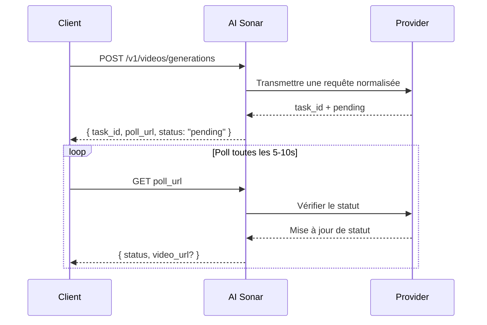

## Vue d’ensemble

AI Sonar propose la génération vidéo via une API unifiée. La génération est **asynchrone** : vous envoyez une requête, recevez `task_id` et `poll_url`, puis interrogez le task jusqu’au résultat final.

### Disponibilité et polling

Pour connaître l’inventaire public le plus récent des modèles vidéo, utilisez la [Models API](/fr/api-reference/models/list-models) ou la [page des modèles](https://aisonar.dev/models).

Si une réponse de création renvoie `poll_url`, appelez exactement cette URL. Lorsqu’elle pointe vers `/v1/tasks/{id}`, traitez-la comme l’endpoint fixe canonique de statut.

### Comportement des modèles et des médias

Le comportement audio dépend du modèle. Dans AI Sonar, la famille Veo 3 est traitée par défaut comme audio-on lorsque `output_audio` est omis. D’autres modèles publics sont silencieux par défaut ou n’exposent pas de commutateur audio stable.

En production, privilégiez des URLs `https` publiques pour les images, vidéos et fichiers audio. Les modèles compatibles acceptent toujours les `data:` URLs, mais les URLs sont généralement plus robustes pour les retries, l’observabilité et le débogage.

### Flux de travail asynchrone



## Opérations publiques actuelles

Le contrat vidéo public de AI Sonar se concentre actuellement sur les opérations suivantes :

- `text-to-video`
- `image-to-video`
- `reference-to-video`
- `start-end-to-video`
- `video-to-video`
- `motion-control`

Le contrat accepte aussi `audio-to-video` et `video-extension` pour des flux spécifiques, mais aucun modèle public largement activé ne publie actuellement ces capacités dans cette build de documentation.

## Matrice des capacités

**Légende** : ✅ Au moins un modèle public actuellement actif dans cette famille expose la capacité | ❌ La capacité n’est pas publiquement exposée par les modèles actuellement actifs

| Séries | T2V | I2V | Référence | Début-Fin | V2V | Mouvement |
|--------|-----|-----|-----------|-----------|-----|--------|
| OpenAI | ✅ | ✅ | ❌ | ❌ | ❌ | ❌ |
| Kuaishou | ✅ | ✅ | ✅ | ✅ | ✅ | ✅ |
| Google | ✅ | ✅ | ✅ | ✅ | ❌ | ❌ |
| ByteDance | ✅ | ✅ | ❌ | ❌ | ❌ | ❌ |
| MiniMax | ✅ | ✅ | ❌ | ❌ | ❌ | ❌ |
| Alibaba | ✅ | ✅ | ✅ | ❌ | ❌ | ❌ |
| Shengshu | ✅ | ✅ | ✅ | ✅ | ❌ | ❌ |
| xAI | ✅ | ✅ | ❌ | ❌ | ✅ | ❌ |
| Other | ❌ | ❌ | ❌ | ❌ | ✅ | ❌ |

### Définitions des capacités

- **T2V (Text-to-Video)** : générer une vidéo à partir d’un prompt texte
- **I2V (Image-to-Video)** : générer une vidéo à partir d’une image de départ ; `image_url` est recommandé pour la compatibilité
- **Reference** : conditionner la génération avec une ou plusieurs images via `reference_images`
- **Start-End** : contrôler la première et la dernière image via `start_image` et `end_image`
- **V2V (Video-to-Video)** : utiliser une vidéo existante comme entrée principale
- **Motion** : combiner une image de sujet et une vidéo de mouvement de référence

## Inventaire public actuel des modèles


### Kuaishou

| Modèle | Opérations publiques |
|-------|----------|
| `kling-3.0-motion-control` | Contrôle du mouvement |
| `kling-3.0-video` | Texte vers vidéo, Image vers vidéo, Début-fin vers vidéo, références d’éléments |
| `kling-v2.1-master` | Texte vers vidéo, Image vers vidéo |
| `kling-v2.1-pro` | Image vers vidéo, Début-fin vers vidéo |
| `kling-v2.1-standard` | Image vers vidéo |
| `kling-v2.5-turbo-pro` | Texte vers vidéo, Image vers vidéo, Début-fin vers vidéo |
| `kling-v2.5-turbo-std` | Texte vers vidéo, Image vers vidéo |
| `kling-v2.6-pro` | Texte vers vidéo, Image vers vidéo, Début-fin vers vidéo |
| `kling-v2.6-std` | Texte vers vidéo, Image vers vidéo |
| `kling-v3.0-pro` | Texte vers vidéo, Image vers vidéo, Début-fin vers vidéo |
| `kling-v3.0-std` | Texte vers vidéo, Image vers vidéo, Début-fin vers vidéo |
| `kling-video-o1-pro` | Texte vers vidéo, Image vers vidéo, Référence vers vidéo, Début-fin vers vidéo, Vidéo vers vidéo |
| `kling-video-o1-std` | Texte vers vidéo, Image vers vidéo, Référence vers vidéo, Début-fin vers vidéo, Vidéo vers vidéo |

### Google

| Modèle | Opérations publiques |
|-------|----------|
| `veo3` | Texte vers vidéo, Image vers vidéo |
| `veo3-fast` | Texte vers vidéo, Image vers vidéo |
| `veo3-pro` | Texte vers vidéo, Image vers vidéo |
| `veo3.1` | Texte vers vidéo, Image vers vidéo, Référence vers vidéo, Début-fin vers vidéo |
| `veo3.1-fast` | Texte vers vidéo, Image vers vidéo, Référence vers vidéo, Début-fin vers vidéo |
| `veo3.1-pro` | Texte vers vidéo, Image vers vidéo, Début-fin vers vidéo |

### ByteDance

| Modèle | Opérations publiques |
|-------|----------|
| `seedance-1.5-pro` | Texte vers vidéo, Image vers vidéo |

### MiniMax

| Modèle | Opérations publiques |
|-------|----------|
| `hailuo-2.3-fast` | Image vers vidéo |
| `hailuo-2.3-pro` | Texte vers vidéo, Image vers vidéo |
| `hailuo-2.3-standard` | Texte vers vidéo, Image vers vidéo |

### Alibaba

| Modèle | Opérations publiques |
|-------|----------|
| `wan-2.2-plus` | Texte vers vidéo, Image vers vidéo |
| `wan-2.5` | Texte vers vidéo, Image vers vidéo |
| `wan-2.6` | Texte vers vidéo, Image vers vidéo, Référence vers vidéo |

### Shengshu

| Modèle | Opérations publiques |
|-------|----------|
| `viduq2` | Texte vers vidéo, Référence vers vidéo |
| `viduq2-pro` | Image vers vidéo, Référence vers vidéo, Début-fin vers vidéo |
| `viduq2-pro-fast` | Image vers vidéo, Début-fin vers vidéo |
| `viduq2-turbo` | Image vers vidéo, Début-fin vers vidéo |
| `viduq3-pro` | Texte vers vidéo, Image vers vidéo, Début-fin vers vidéo |
| `viduq3-turbo` | Texte vers vidéo, Image vers vidéo, Début-fin vers vidéo |

### xAI

| Modèle | Opérations publiques |
|-------|----------|
| `grok-imagine-video` | Texte vers vidéo, image vers vidéo, reference-to-video, video-to-video |
| `grok-imagine-video-1.5-preview` | Image vers vidéo |
| `grok-imagine-image-to-video` | Image vers vidéo |
| `grok-imagine-text-to-video` | Texte vers vidéo |
| `grok-imagine-upscale` | Vidéo vers vidéo |

### Autres

| Modèle | Opérations publiques |
|-------|----------|
| `topaz-video-upscale` | Vidéo vers vidéo |

## Exemples d’utilisation

### Texte vers vidéo

```python
response = requests.post(f"{BASE}/videos/generations",
    headers=headers,
    json={
        "model": "veo3.1",
        "prompt": "A calm cinematic shot of a cat walking through a sunlit garden.",
        "operation": "text-to-video",
        "duration": 4,
        "aspect_ratio": "16:9"
    }
)
```

### Image vers vidéo

```python
response = requests.post(f"{BASE}/videos/generations",
    headers=headers,
    json={
        "model": "hailuo-2.3-standard",
        "prompt": "The scene begins from the provided image and adds gentle natural motion.",
        "operation": "image-to-video",
        "image_url": "https://example.com/portrait.jpg",
        "duration": 6,
        "aspect_ratio": "16:9"
    }
)
```

### Kling 3.0 Elements

Utilisez `kling_elements` avec `kling-3.0-video` lorsque vous avez besoin de références d’éléments. Fournissez une requête conditionnée par image (`image_url`, `image_urls`, `start_image` ou `end_image`) et référencez chaque élément dans le prompt avec `@name`. Ne combinez pas `kling_elements` avec `output_audio=true` ; omettez `output_audio` ou définissez-le sur `false` pour les requêtes avec références d’éléments.

```python
response = requests.post(f"{BASE}/videos/generations",
    headers=headers,
    json={
        "model": "kling-3.0-video",
        "prompt": "Place @hero_bag on a studio turntable with soft product lighting.",
        "operation": "image-to-video",
        "image_url": "https://example.com/studio-start.png",
        "duration": 5,
        "resolution": "720p",
        "kling_elements": [
            {
                "name": "hero_bag",
                "description": "black leather handbag",
                "element_input_urls": [
                    "https://example.com/bag-front.png",
                    "https://example.com/bag-side.png"
                ]
            }
        ]
    }
)
```

### Référence vers vidéo

Pour `seedance-2.0` et `seedance-2.0-fast`, AI Sonar prend actuellement en charge jusqu'à 9 images de référence, ainsi que jusqu'à 3 vidéos de référence et 3 audios de référence. `duration` contrôle uniquement la durée de sortie générée ; il ne définit pas de limite distincte pour la durée de la vidéo de référence en entrée. Pour `grok-imagine-video`, reference-to-video accepte jusqu’à 7 références image (`reference_images` ou `image_urls`) et `duration` est limitée à 10 secondes. Ne combinez pas les références image avec des entrées de première frame `image_url` / `image`. `grok-imagine-video-1.5-preview` est limité à image-to-video.

```python
response = requests.post(f"{BASE}/videos/generations",
    headers=headers,
    json={
        "model": "veo3.1",
        "prompt": "Keep the same subject identity and palette while adding subtle motion.",
        "operation": "reference-to-video",
        "reference_images": [
            "https://example.com/ref-a.jpg",
            "https://example.com/ref-b.jpg"
        ],
        "duration": 8,
        "resolution": "720p",
        "aspect_ratio": "9:16"
    }
)
```

### Contrôle début / fin

```python
response = requests.post(f"{BASE}/videos/generations",
    headers=headers,
    json={
        "model": "viduq2-pro",
        "prompt": "Smooth transition from day to night.",
        "operation": "start-end-to-video",
        "start_image": "https://example.com/city-day.jpg",
        "end_image": "https://example.com/city-night.jpg",
        "duration": 5,
        "resolution": "720p",
        "aspect_ratio": "16:9"
    }
)
```

### Vidéo vers vidéo

Pour le video-to-video de `grok-imagine-video`, envoyez une URL `.mp4` HTTPS publique dans `video_url`. AI Sonar la traduit vers le corps REST xAI `video.url`. Vous pouvez définir `resolution` sur `480p` ou `720p`; `duration` et `aspect_ratio` ne sont pas acceptés pour ce flux d’édition.

```python
response = requests.post(f"{BASE}/videos/generations",
    headers=headers,
    json={
        "model": "topaz-video-upscale",
        "operation": "video-to-video",
        "video_url": "https://example.com/source.mp4",
        "prompt": "Upscale this clip while preserving the original motion."
    }
)
```

### Contrôle de mouvement

```python
response = requests.post(f"{BASE}/videos/generations",
    headers=headers,
    json={
        "model": "kling-3.0-motion-control",
        "operation": "motion-control",
        "prompt": "Keep the subject stable while following the motion reference.",
        "image_url": "https://example.com/subject.png",
        "video_url": "https://example.com/motion.mp4",
        "resolution": "720p"
    }
)
```

## Repères sur les paramètres

| Paramètre | Type | Note |
|-----------|------|------|
| `operation` | string | Mieux vaut le renseigner explicitement en production |
| `image_url` | string | Forme d’entrée image la plus robuste |
| `image` | string | `data:` URL pour tests locaux et petites intégrations |
| `reference_images` | string[] | Champ public canonique pour le conditionnement par images de référence |
| `reference_image_type` | string | Sélecteur optionnel `asset` / `style` |
| `video_url` | string | Requis pour les modèles publics `video-to-video` et `motion-control` actuels |
| `audio_url` | string | Pour les flux audio-vers-vidéo spécifiques à certains modèles |
| `output_audio` | boolean | La famille Veo 3 traite l’omission comme `true`. `kling-3.0-video` accepte ce sélecteur pour le contrôle upstream `sound` et reste silencieux par défaut si le champ est omis. |

## Conseils de sélection de modèle

<CardGroup cols={2}>
  <Card title="Qualité maximale" icon="crown">
    Si la qualité prime sur la vitesse, **veo3.1-pro**, **kling-video-o1-pro** et **viduq3-pro** sont de bons candidats.
  </Card>
  <Card title="Itération rapide" icon="bolt">
    Pour boucler vite, **veo3.1-fast**, **hailuo-2.3-fast** et **viduq3-turbo** sont de bons points de départ.
  </Card>
  <Card title="Conditionnement par références" icon="images">
    Pour un contrôle fort par images de référence, privilégiez **veo3.1**, **veo3.1-fast**, **wan-2.6** ainsi que **kling-video-o1-pro / std**.
  </Card>
  <Card title="Vidéo vers vidéo" icon="film">
    Les chemins publics généralement actifs pour `video-to-video` sont surtout **topaz-video-upscale**, **grok-imagine-upscale** et **kling-video-o1-pro / std**.
  </Card>
</CardGroup>

## Facturation

La facturation dépend du modèle. Certains modèles publics se comportent plutôt comme des modèles facturés à la requête, d’autres plutôt à la seconde. Pour le prix public le plus récent, référez-vous à la [page des modèles](https://aisonar.dev/models) ou à la [Pricing API](/fr/api-reference/pricing/get-pricing).
