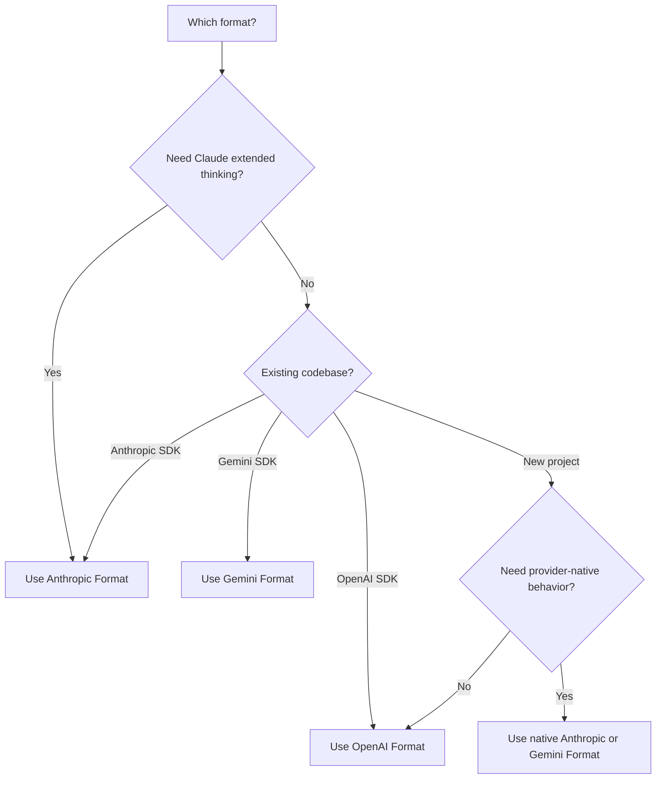

## Overview

AI Sonar supports **three native API formats** with a single API key. Choose the format that best fits your use case - no configuration changes needed.

<CardGroup cols={3}>
  <Card title="OpenAI Format" icon="plug">
    `/v1/chat/completions`
    Standard format, widest compatibility
  </Card>
  <Card title="Anthropic Format" icon="message">
    `/v1/messages`
    Extended thinking, native Claude features
  </Card>
  <Card title="Gemini Format" icon="sparkles">
    `/v1beta/models/:model:generateContent`
    Google ecosystem integration
  </Card>
</CardGroup>

## Why Multi-Format?

| Benefit | Description |
|---------|-------------|
| **No SDK switching** | Use any model with your preferred SDK |
| **Native features** | Access format-specific capabilities |
| **Native-first migration** | Keep native provider routes when behavior matters; use `/v1` OpenAI compatibility for existing OpenAI-style clients |
| **Single billing** | One account, one API key, all formats |

## Format Comparison

| Feature | OpenAI | Anthropic | Gemini |
|---------|--------|-----------|--------|
| **Endpoint** | `/v1/chat/completions` | `/v1/messages` | `/v1beta/models/:model:generateContent` |
| **Auth Header** | `Authorization: Bearer` | `x-api-key` | `Authorization: Bearer` |
| **System Prompt** | In messages array | Separate `system` field | In `systemInstruction` |
| **Extended Thinking** | ❌ | ✅ | ❌ |
| **Streaming** | ✅ SSE | ✅ SSE | ✅ SSE |
| **Tool Calling** | ✅ | ✅ | ✅ |
| **Vision** | ✅ | ✅ | ✅ |

## OpenAI Format

Use this compatibility route for existing OpenAI SDK integrations and portable chat or embedding flows. For Claude or Gemini native behavior, use the Anthropic or Gemini format below.

```python
from openai import OpenAI

client = OpenAI(
    api_key="sk-your-api-key",
    base_url="https://api.aisonar.dev/v1"
)

# Portable chat works across many models
response = client.chat.completions.create(
    model="claude-sonnet-4-6",  # Claude via OpenAI format
    messages=[
        {"role": "system", "content": "You are a helpful assistant."},
        {"role": "user", "content": "Hello!"}
    ]
)
```

**Best for:**
- General use
- Existing OpenAI SDK integrations
- Maximum compatibility

## Anthropic Format

Native Anthropic Messages API. Required for Claude-specific features like extended thinking.

```python
from anthropic import Anthropic

client = Anthropic(
    api_key="sk-your-api-key",
    base_url="https://api.aisonar.dev"  # No /v1 suffix!
)

message = client.messages.create(
    model="claude-sonnet-4-6",
    max_tokens=1024,
    system="You are a helpful assistant.",  # Separate system field
    messages=[
        {"role": "user", "content": "Hello!"}
    ]
)
```

### Extended Thinking (Claude Opus 4.6)

Only available in Anthropic format:

```python
message = client.messages.create(
    model="claude-opus-4-6",
    max_tokens=16000,
    thinking={
        "type": "enabled",
        "budget_tokens": 10000
    },
    messages=[{"role": "user", "content": "Solve this complex problem..."}]
)

# Access thinking process
for block in message.content:
    if block.type == "thinking":
        print(f"Thinking: {block.thinking}")
    elif block.type == "text":
        print(f"Answer: {block.text}")
```

**Best for:**
- Claude-specific features
- Extended thinking mode
- Native Anthropic SDK users

## Gemini Format

Native Google Gemini API format for Google ecosystem integration.

```bash
curl "https://api.aisonar.dev/v1beta/models/gemini-2.5-flash:generateContent" \
  -H "Authorization: Bearer sk-your-api-key" \
  -H "Content-Type: application/json" \
  -d '{
    "contents": [{
      "parts": [{"text": "Hello!"}]
    }],
    "systemInstruction": {
      "parts": [{"text": "You are a helpful assistant."}]
    }
  }'
```

### Streaming

```bash
curl "https://api.aisonar.dev/v1beta/models/gemini-2.5-flash:streamGenerateContent?alt=sse" \
  -H "Authorization: Bearer sk-your-api-key" \
  -H "Content-Type: application/json" \
  -d '{
    "contents": [{"parts": [{"text": "Write a story"}]}]
  }'
```

**Best for:**
- Google Cloud integrations
- Existing Gemini SDK code
- Native Gemini features

**Gemini Files and Cache:** `/upload/v1beta/files`, `/v1beta/files`, `/v1beta/files:register`, and `/v1beta/cachedContents` are available on the native Gemini route. Files use Gemini File API-compatible upstream channels; explicit cache resources can also route through Vertex AI channels. Resources created through AI Sonar are bound to the same upstream channel/key for later `generateContent` calls.

## Tool Compatibility Boundary

Function tools can be converted between formats when the target route supports them. Provider-native tools must stay on their native route:

- OpenAI Responses hosted and native tools such as `tool_search`, `web_search`, `file_search`, `code_interpreter`, MCP, shell/apply_patch, and computer-use tools require `/v1/responses`.
- Anthropic server/native tools such as `web_search_*`, `web_fetch_*`, `code_execution_*`, `tool_search_*`, bash, computer-use, and text-editor tools require `/v1/messages`.
- Gemini built-in tools such as `googleSearch`, `codeExecution`, `urlContext`, `computerUse`, and similar `tools` fields require `/v1beta`.

If AI Sonar cannot route a request with native tools to a native-capable upstream path, it returns an explicit unsupported-field error instead of dropping the tool or pretending it is a Chat Completions function. User-defined function tools remain the portable path.

## Choosing the Right Format



## Migration Guides

### From OpenAI Official API

```python
# Before (OpenAI)
client = OpenAI(api_key="sk-openai-key")

# After (AI Sonar)
client = OpenAI(
    api_key="sk-your-api-key",
    base_url="https://api.aisonar.dev/v1"  # Add this line
)
# That's it! Same code works
```

### From Anthropic Official API

```python
# Before (Anthropic)
client = Anthropic(api_key="sk-ant-key")

# After (AI Sonar)
client = Anthropic(
    api_key="sk-your-api-key",
    base_url="https://api.aisonar.dev"  # Add this line (no /v1!)
)
```

### From Google AI Studio

```python
# Before (Google)
import google.generativeai as genai
genai.configure(api_key="google-api-key")

# After (AI Sonar) - Use REST API
import requests

response = requests.post(
    "https://api.aisonar.dev/v1beta/models/gemini-2.5-flash:generateContent",
    headers={"Authorization": "Bearer sk-your-api-key"},
    json={"contents": [{"parts": [{"text": "Hello"}]}]}
)
```

## Cross-Model Compatibility

AI Sonar supports cross-format conversion for portable chat workflows. Use native routes when provider-specific features matter.

### Compatibility SDK → Portable Chat

```python
# Anthropic SDK with GPT-4o (auto-converts to OpenAI format)
from anthropic import Anthropic

client = Anthropic(
    api_key="sk-your-api-key",
    base_url="https://api.aisonar.dev"
)

response = client.messages.create(
    model="gpt-4o",  # ✅ Works! Auto-converted
    max_tokens=1024,
    messages=[{"role": "user", "content": "Hello!"}]
)

# Same compatibility SDK for portable chat; native-only features still need native routes
response = client.messages.create(model="gemini-2.5-flash", ...)  # ✅ Works!
response = client.messages.create(model="deepseek-r1", ...)       # ✅ Works!
```

### OpenAI SDK → Portable Chat Models

```python
from openai import OpenAI

client = OpenAI(base_url="https://api.aisonar.dev/v1", api_key="sk-...")

# These portable chat calls use the same /v1 compatibility SDK:
response = client.chat.completions.create(model="gpt-4o", ...)
response = client.chat.completions.create(model="claude-sonnet-4-6", ...)
response = client.chat.completions.create(model="gemini-2.5-flash", ...)
```

### Industry Comparison

| Platform | OpenAI Format | Anthropic Format | Gemini Format | Responses API |
|----------|:---:|:---:|:---:|:---:|
| **AI Sonar** | ✅ All models | ✅ All models | ✅ All models | ✅ All models |
| OpenRouter | ✅ All models | ❌ | ❌ | ❌ |
| Together AI | ✅ All models | ❌ | ❌ | ❌ |
| Fireworks | ✅ All models | ❌ | ❌ | ❌ |

<Note>
While cross-format works for most features, format-specific features (like Anthropic extended thinking) require the native format.
</Note>
