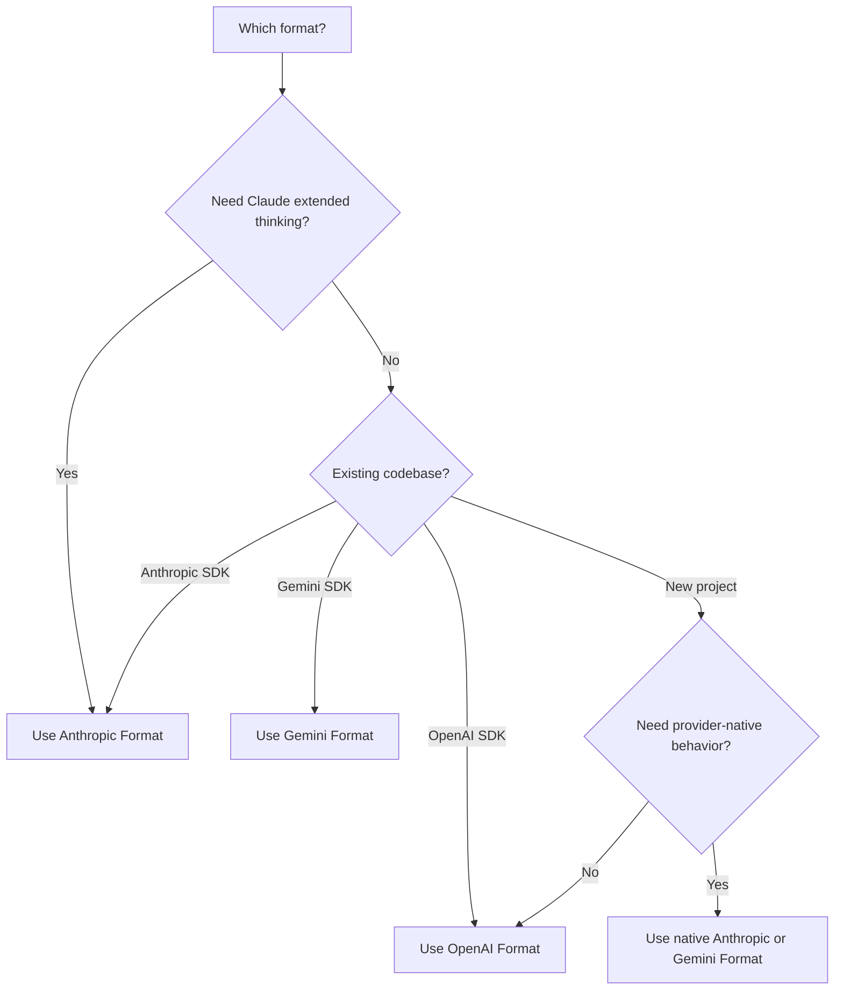

<span data-mintlify-rebuild="2026-05-19-after-mdx-parse-fix" aria-hidden="true" />

## Ikhtisar

AI Sonar mendukung **tiga format API native** dengan satu API key. Pilih format yang paling sesuai dengan kasus penggunaan Anda - tidak perlu mengubah konfigurasi.

<CardGroup cols={3}>
  <Card title="Format OpenAI" icon="plug">
    `/v1/chat/completions`
    Format standar, kompatibilitas paling luas
  </Card>
  <Card title="Format Anthropic" icon="message">
    `/v1/messages`
    Extended thinking, fitur native Claude
  </Card>
  <Card title="Format Gemini" icon="sparkles">
    `/v1beta/models/:model:generateContent`
    Integrasi ekosistem Google
  </Card>
</CardGroup>

## Mengapa Multi-Format?

| Manfaat | Deskripsi |
|---------|-----------|
| **Tanpa berpindah SDK** | Gunakan model apa pun dengan SDK pilihan Anda |
| **Fitur native** | Akses kemampuan spesifik format |
| **Migrasi native-first** | Pertahankan rute native penyedia saat perilaku penting; gunakan `/v1` OpenAI compatibility untuk klien bergaya OpenAI yang sudah ada |
| **Penagihan tunggal** | Satu akun, satu API key, semua format |

## Perbandingan Format

| Fitur | OpenAI | Anthropic | Gemini |
|---------|--------|-----------|--------|
| **Endpoint** | `/v1/chat/completions` | `/v1/messages` | `/v1beta/models/:model:generateContent` |
| **Header Autentikasi** | `Authorization: Bearer` | `x-api-key` | `Authorization: Bearer` |
| **Prompt Sistem** | Dalam array messages | Field `system` terpisah | Dalam `systemInstruction` |
| **Pemikiran diperluas** | ❌ | ✅ | ❌ |
| **Streaming** | ✅ SSE | ✅ SSE | ✅ SSE |
| **Panggilan Alat** | ✅ | ✅ | ✅ |
| **Vision** | ✅ | ✅ | ✅ |

## Format OpenAI

Gunakan rute kompatibilitas ini untuk integrasi OpenAI SDK yang sudah ada dan alur chat atau embedding portabel. Untuk perilaku native Claude atau Gemini, gunakan format Anthropic atau Gemini di bawah.

```python
from openai import OpenAI

client = OpenAI(
    api_key="sk-your-api-key",
    base_url="https://api.aisonar.dev/v1"
)

# Portable chat works across many models
response = client.chat.completions.create(
    model="claude-sonnet-4-6",  # Claude via OpenAI format
    messages=[
        {"role": "system", "content": "You are a helpful assistant."},
        {"role": "user", "content": "Hello!"}
    ]
)
```

**Terbaik untuk:**
- Penggunaan umum
- Integrasi yang sudah menggunakan OpenAI SDK
- Kompatibilitas maksimal

## Format Anthropic

API Native Anthropic Messages. Diperlukan untuk fitur spesifik Claude seperti extended thinking.

```python
from anthropic import Anthropic

client = Anthropic(
    api_key="sk-your-api-key",
    base_url="https://api.aisonar.dev"  # No /v1 suffix!
)

message = client.messages.create(
    model="claude-sonnet-4-6",
    max_tokens=1024,
    system="You are a helpful assistant.",  # Separate system field
    messages=[
        {"role": "user", "content": "Hello!"}
    ]
)
```

### Pemikiran Ekstensif (Claude Opus 4.6)

Hanya tersedia dalam format Anthropic:

```python
message = client.messages.create(
    model="claude-opus-4-6",
    max_tokens=16000,
    thinking={
        "type": "enabled",
        "budget_tokens": 10000
    },
    messages=[{"role": "user", "content": "Solve this complex problem..."}]
)

# Access thinking process
for block in message.content:
    if block.type == "thinking":
        print(f"Thinking: {block.thinking}")
    elif block.type == "text":
        print(f"Answer: {block.text}")
```

**Terbaik untuk:**
- Fitur spesifik Claude
- Mode extended thinking
- Pengguna Anthropic SDK native

## Format Gemini

Format native Google Gemini untuk integrasi ekosistem Google.

```bash
curl "https://api.aisonar.dev/v1beta/models/gemini-2.5-flash:generateContent" \
  -H "Authorization: Bearer sk-your-api-key" \
  -H "Content-Type: application/json" \
  -d '{
    "contents": [{
      "parts": [{"text": "Hello!"}]
    }],
    "systemInstruction": {
      "parts": [{"text": "You are a helpful assistant."}]
    }
  }'
```

### Streaming

```bash
curl "https://api.aisonar.dev/v1beta/models/gemini-2.5-flash:streamGenerateContent?alt=sse" \
  -H "Authorization: Bearer sk-your-api-key" \
  -H "Content-Type: application/json" \
  -d '{
    "contents": [{"parts": [{"text": "Write a story"}]}]
  }'
```

**Terbaik untuk:**
- Integrasi Google Cloud
- Kode yang sudah menggunakan Gemini SDK
- Fitur native Gemini

**Gemini Files dan Cache:** Rute native Gemini mendukung `/upload/v1beta/files`, `/v1beta/files`, `/v1beta/files:register`, dan `/v1beta/cachedContents`. Files memakai channel upstream yang kompatibel dengan Gemini File API; resource Cache eksplisit juga dapat dirutekan melalui channel Vertex AI. Resource yang dibuat melalui AI Sonar diikat ke channel/key upstream yang sama untuk panggilan `generateContent` berikutnya.

## Batas kompatibilitas tool

Function tool dapat dikonversi antar format jika rute tujuan mendukungnya. Tool native milik provider harus tetap berada di rute native-nya:

- Tool hosted dan native OpenAI Responses seperti `tool_search`, `web_search`, `file_search`, `code_interpreter`, MCP, shell/apply_patch, dan tool computer-use memerlukan `/v1/responses`.
- Tool server/native Anthropic seperti `web_search_*`, `web_fetch_*`, `code_execution_*`, `tool_search_*`, bash, computer-use, dan text-editor memerlukan `/v1/messages`.
- Tool bawaan Gemini seperti `googleSearch`, `codeExecution`, `urlContext`, `computerUse`, dan field `tools` serupa memerlukan `/v1beta`.

Jika AI Sonar tidak dapat merutekan request dengan tool native ke upstream yang mendukung format native, AI Sonar mengembalikan error unsupported-field yang eksplisit, bukan menghapus tool secara diam-diam atau berpura-pura tool itu adalah fungsi Chat Completions. Function tool buatan pengguna tetap menjadi jalur tool yang paling portabel.

## Memilih Format yang Tepat



## Panduan Migrasi

### Dari OpenAI Official API

```python
# Before (OpenAI)
client = OpenAI(api_key="sk-openai-key")

# After (AI Sonar)
client = OpenAI(
    api_key="sk-your-api-key",
    base_url="https://api.aisonar.dev/v1"  # Add this line
)
# That's it! Same code works
```

### Dari Anthropic Official API

```python
# Before (Anthropic)
client = Anthropic(api_key="sk-ant-key")

# After (AI Sonar)
client = Anthropic(
    api_key="sk-your-api-key",
    base_url="https://api.aisonar.dev"  # Add this line (no /v1!)
)
```

### Dari Google AI Studio

```python
# Before (Google)
import google.generativeai as genai
genai.configure(api_key="google-api-key")

# After (AI Sonar) - Use REST API
import requests

response = requests.post(
    "https://api.aisonar.dev/v1beta/models/gemini-2.5-flash:generateContent",
    headers={"Authorization": "Bearer sk-your-api-key"},
    json={"contents": [{"parts": [{"text": "Hello"}]}]}
)
```

## Kompatibilitas Lintas-Model

Keajaiban AI Sonar: gunakan **SDK apa pun** dengan **model apa pun**. Gateway secara otomatis menangani konversi format.

### Kompatibilitas SDK → Portable Chat

```python
# Anthropic SDK with GPT-4o (auto-converts to OpenAI format)
from anthropic import Anthropic

client = Anthropic(
    api_key="sk-your-api-key",
    base_url="https://api.aisonar.dev"
)

response = client.messages.create(
    model="gpt-4o",  # ✅ Works! Auto-converted
    max_tokens=1024,
    messages=[{"role": "user", "content": "Hello!"}]
)

# Same compatibility SDK for portable chat; native-only features still need native routes
response = client.messages.create(model="gemini-2.5-flash", ...)  # ✅ Works!
response = client.messages.create(model="deepseek-r1", ...)       # ✅ Works!
```

### OpenAI SDK → Model Portable Chat

```python
from openai import OpenAI

client = OpenAI(base_url="https://api.aisonar.dev/v1", api_key="sk-...")

# These portable chat calls use the same /v1 compatibility SDK:
response = client.chat.completions.create(model="gpt-4o", ...)
response = client.chat.completions.create(model="claude-sonnet-4-6", ...)
response = client.chat.completions.create(model="gemini-2.5-flash", ...)
```

### Perbandingan Industri

| Platforma | Format OpenAI | Format Anthropic | Format Gemini | API Responses |
|----------|:---:|:---:|:---:|:---:|
| **AI Sonar** | ✅ Semua model | ✅ Semua model | ✅ Semua model | ✅ Semua model |
| OpenRouter | ✅ Semua model | ❌ | ❌ | ❌ |
| Together AI | ✅ Semua model | ❌ | ❌ | ❌ |
| Fireworks | ✅ Semua model | ❌ | ❌ | ❌ |

<Note>
Meskipun cross-format bekerja untuk sebagian besar fitur, fitur spesifik format (seperti Anthropic extended thinking) memerlukan format native.
</Note>
