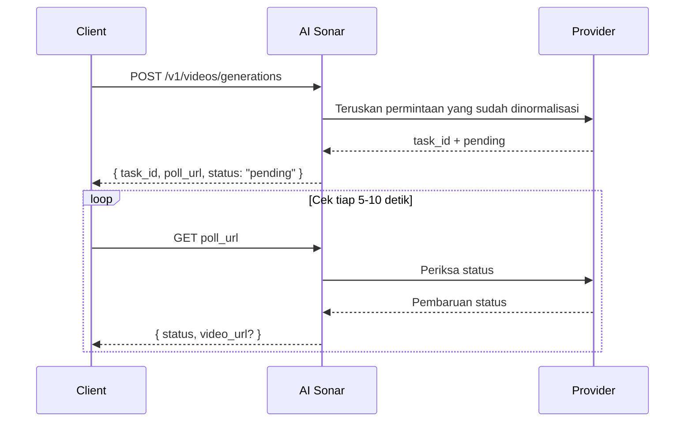

## Ringkasan

AI Sonar menyediakan generasi video melalui satu API terpadu. Prosesnya **asinkron**: Anda mengirim permintaan, menerima `task_id` dan `poll_url`, lalu memeriksa status secara berkala sampai hasil akhir tersedia.

### Ketersediaan dan polling

Inventaris model video publik terbaru dapat dilihat melalui [Models API](/id/api-reference/models/list-models) atau [halaman model](https://aisonar.dev/models).

Jika respons create mengembalikan `poll_url`, panggil URL tersebut secara persis. Saat URL itu mengarah ke `/v1/tasks/{id}`, perlakukan itu sebagai endpoint status tetap yang kanonik.

### Perilaku model dan media

Perilaku audio bergantung pada model. Di AI Sonar, keluarga Veo 3 diperlakukan sebagai audio aktif secara default ketika `output_audio` dihilangkan. Model publik lainnya bisa saja diam secara default atau tidak mengekspos sakelar audio yang stabil.

Untuk integrasi produksi, lebih baik gunakan URL `https` publik untuk gambar, video, dan audio. Model yang kompatibel masih menerima URL `data:`, tetapi URL publik biasanya lebih andal untuk coba ulang, observabilitas, dan debugging.

### Alur asinkron



## Operasi publik saat ini

Saat ini kontrak video publik AI Sonar berpusat pada operasi berikut:

- `text-to-video`
- `image-to-video`
- `reference-to-video`
- `start-end-to-video`
- `video-to-video`
- `motion-control`

Kontrak juga menerima `audio-to-video` dan `video-extension` untuk alur spesifik model tertentu, tetapi pada build dokumentasi ini belum ada model publik yang secara luas diaktifkan dan mempromosikan dua kemampuan itu.

## Matriks kemampuan

**Legenda**: ✅ Ada setidaknya satu model publik yang saat ini aktif di keluarga penyedia tersebut | ❌ Belum ada model publik aktif yang mewakili kemampuan itu

| Seri | T2V | I2V | Referensi | Start-End | V2V | Motion |
|------|-----|-----|-----------|-----------|-----|--------|
| OpenAI | ✅ | ✅ | ❌ | ❌ | ❌ | ❌ |
| Kuaishou | ✅ | ✅ | ✅ | ✅ | ✅ | ✅ |
| Google | ✅ | ✅ | ✅ | ✅ | ❌ | ❌ |
| ByteDance | ✅ | ✅ | ❌ | ❌ | ❌ | ❌ |
| MiniMax | ✅ | ✅ | ❌ | ❌ | ❌ | ❌ |
| Alibaba | ✅ | ✅ | ✅ | ❌ | ❌ | ❌ |
| Shengshu | ✅ | ✅ | ✅ | ✅ | ❌ | ❌ |
| xAI | ✅ | ✅ | ❌ | ❌ | ✅ | ❌ |
| Lainnya | ❌ | ❌ | ❌ | ❌ | ✅ | ❌ |

### Definisi kemampuan

- **T2V (Text-to-Video)**: menghasilkan video dari prompt teks
- **I2V (Image-to-Video)**: menghasilkan video dari gambar awal; untuk kompatibilitas terluas, gunakan `image_url`
- **Referensi**: mengondisikan generasi dengan satu atau beberapa gambar referensi melalui `reference_images`
- **Start-End**: mengontrol frame pertama dan terakhir dengan `start_image` dan `end_image`
- **V2V (Video-to-Video)**: menggunakan video yang sudah ada sebagai input utama
- **Motion**: menggabungkan gambar subjek dengan video referensi gerakan

## Inventaris model publik saat ini


### Kuaishou

| Model | Operasi publik |
|-------|----------------|
| `kling-3.0-motion-control` | Kontrol gerakan |
| `kling-3.0-video` | Teks ke video, image-to-video, start-end-to-video, referensi elemen |
| `kling-v2.1-master` | Teks ke video, image-to-video |
| `kling-v2.1-pro` | image-to-video, start-end-to-video |
| `kling-v2.1-standard` | image-to-video |
| `kling-v2.5-turbo-pro` | Teks ke video, image-to-video, start-end-to-video |
| `kling-v2.5-turbo-std` | Teks ke video, image-to-video |
| `kling-v2.6-pro` | Teks ke video, image-to-video, start-end-to-video |
| `kling-v2.6-std` | Teks ke video, image-to-video |
| `kling-v3.0-pro` | Teks ke video, image-to-video, start-end-to-video |
| `kling-v3.0-std` | Teks ke video, image-to-video, start-end-to-video |
| `kling-video-o1-pro` | Teks ke video, image-to-video, reference-to-video, start-end-to-video, video-to-video |
| `kling-video-o1-std` | Teks ke video, image-to-video, reference-to-video, start-end-to-video, video-to-video |

### Google

| Model | Operasi publik |
|-------|----------------|
| `veo3` | Teks ke video, image-to-video |
| `veo3-fast` | Teks ke video, image-to-video |
| `veo3-pro` | Teks ke video, image-to-video |
| `veo3.1` | Teks ke video, image-to-video, reference-to-video, start-end-to-video |
| `veo3.1-fast` | Teks ke video, image-to-video, reference-to-video, start-end-to-video |
| `veo3.1-pro` | Teks ke video, image-to-video, start-end-to-video |

### ByteDance

| Model | Operasi publik |
|-------|----------------|
| `seedance-1.5-pro` | Teks ke video, image-to-video |

### MiniMax

| Model | Operasi publik |
|-------|----------------|
| `hailuo-2.3-fast` | Gambar-ke-video |
| `hailuo-2.3-pro` | Teks ke video, image-to-video |
| `hailuo-2.3-standard` | Teks ke video, image-to-video |

### Alibaba

| Model | Operasi publik |
|-------|----------------|
| `wan-2.2-plus` | Teks ke video, image-to-video |
| `wan-2.5` | Teks ke video, image-to-video |
| `wan-2.6` | Teks ke video, image-to-video, reference-to-video |

### Shengshu

| Model | Operasi publik |
|-------|----------------|
| `viduq2` | Teks ke video, reference-to-video |
| `viduq2-pro` | Gambar-ke-video, referensi-ke-video, awal-akhir-ke-video |
| `viduq2-pro-fast` | Gambar-ke-video, awal-akhir-ke-video |
| `viduq2-turbo` | Gambar-ke-video, awal-akhir-ke-video |
| `viduq3-pro` | Teks ke video, image-to-video, start-end-to-video |
| `viduq3-turbo` | Teks ke video, image-to-video, start-end-to-video |

### xAI

| Model | Operasi publik |
|-------|----------------|
| `grok-imagine-video` | Teks ke video, gambar ke video, reference-to-video, video-to-video |
| `grok-imagine-video-1.5-preview` | Gambar ke video |
| `grok-imagine-image-to-video` | Gambar-ke-video |
| `grok-imagine-text-to-video` | Teks ke video |
| `grok-imagine-upscale` | Video-ke-video |

### Lainnya

| Model | Operasi publik |
|-------|----------------|
| `topaz-video-upscale` | Video-ke-video |

## Contoh penggunaan

### Text-to-video

```python
response = requests.post(f"{BASE}/videos/generations",
    headers=headers,
    json={
        "model": "veo3.1",
        "prompt": "A calm cinematic shot of a cat walking through a sunlit garden.",
        "operation": "text-to-video",
        "duration": 4,
        "aspect_ratio": "16:9"
    }
)
```

### Gambar ke video

```python
response = requests.post(f"{BASE}/videos/generations",
    headers=headers,
    json={
        "model": "hailuo-2.3-standard",
        "prompt": "The scene begins from the provided image and adds gentle natural motion.",
        "operation": "image-to-video",
        "image_url": "https://example.com/portrait.jpg",
        "duration": 6,
        "aspect_ratio": "16:9"
    }
)
```

### Kling 3.0 Elements

Gunakan `kling_elements` dengan `kling-3.0-video` saat memerlukan referensi elemen. Sertakan request yang dikondisikan gambar (`image_url`, `image_urls`, `start_image`, atau `end_image`) dan referensikan setiap elemen di prompt dengan `@name`. Jangan gabungkan `kling_elements` dengan `output_audio=true`; hilangkan `output_audio` atau set ke `false` saat memakai referensi elemen.

```python
response = requests.post(f"{BASE}/videos/generations",
    headers=headers,
    json={
        "model": "kling-3.0-video",
        "prompt": "Place @hero_bag on a studio turntable with soft product lighting.",
        "operation": "image-to-video",
        "image_url": "https://example.com/studio-start.png",
        "duration": 5,
        "resolution": "720p",
        "kling_elements": [
            {
                "name": "hero_bag",
                "description": "black leather handbag",
                "element_input_urls": [
                    "https://example.com/bag-front.png",
                    "https://example.com/bag-side.png"
                ]
            }
        ]
    }
)
```

### Reference-to-video

Untuk `seedance-2.0` dan `seedance-2.0-fast`, AI Sonar saat ini mendukung hingga 9 gambar referensi, ditambah hingga 3 video referensi dan 3 audio referensi. `duration` hanya mengatur panjang output yang dihasilkan; field ini tidak mendefinisikan batas terpisah untuk durasi input video referensi. Untuk `grok-imagine-video`, reference-to-video menerima hingga 7 referensi gambar (`reference_images` atau `image_urls`) dan `duration` dibatasi maksimal 10 detik. Jangan gabungkan referensi gambar dengan input frame awal `image_url` / `image`. `grok-imagine-video-1.5-preview` hanya mendukung image-to-video.

```python
response = requests.post(f"{BASE}/videos/generations",
    headers=headers,
    json={
        "model": "veo3.1",
        "prompt": "Keep the same subject identity and palette while adding subtle motion.",
        "operation": "reference-to-video",
        "reference_images": [
            "https://example.com/ref-a.jpg",
            "https://example.com/ref-b.jpg"
        ],
        "duration": 8,
        "resolution": "720p",
        "aspect_ratio": "9:16"
    }
)
```

### Start-end-to-video

```python
response = requests.post(f"{BASE}/videos/generations",
    headers=headers,
    json={
        "model": "viduq2-pro",
        "prompt": "Smooth transition from day to night.",
        "operation": "start-end-to-video",
        "start_image": "https://example.com/city-day.jpg",
        "end_image": "https://example.com/city-night.jpg",
        "duration": 5,
        "resolution": "720p",
        "aspect_ratio": "16:9"
    }
)
```

### Video ke video

Untuk video-to-video dengan `grok-imagine-video`, kirim URL HTTPS publik `.mp4` di `video_url`. AI Sonar menerjemahkannya menjadi body REST xAI `video.url`. Anda dapat mengatur `resolution` ke `480p` atau `720p`; `duration` dan `aspect_ratio` tidak diterima untuk alur edit ini.

```python
response = requests.post(f"{BASE}/videos/generations",
    headers=headers,
    json={
        "model": "topaz-video-upscale",
        "operation": "video-to-video",
        "video_url": "https://example.com/source.mp4",
        "prompt": "Upscale this clip while preserving the original motion."
    }
)
```

### Motion control

```python
response = requests.post(f"{BASE}/videos/generations",
    headers=headers,
    json={
        "model": "kling-3.0-motion-control",
        "operation": "motion-control",
        "prompt": "Keep the subject stable while following the motion reference.",
        "image_url": "https://example.com/subject.png",
        "video_url": "https://example.com/motion.mp4",
        "resolution": "720p"
    }
)
```

## Referensi parameter

| Parameter | Tipe | Catatan |
|-----------|------|---------|
| `operation` | string | Di produksi, sebaiknya dikirim eksplisit |
| `image_url` | string | Bentuk input gambar yang paling stabil |
| `image` | string | URL `data:` untuk pengujian lokal dan integrasi kecil |
| `reference_images` | string[] | Field publik kanonis untuk conditioning berbasis referensi |
| `reference_image_type` | string | Pemilih opsional `asset` / `style` |
| `video_url` | string | Wajib untuk model publik `video-to-video` dan `motion-control` saat ini |
| `audio_url` | string | Dipakai oleh alur audio-conditioned tertentu jika tersedia |
| `output_audio` | boolean | Keluarga Veo 3 memperlakukan field yang dihilangkan sebagai `true`. `kling-3.0-video` menerima selector ini untuk kontrol upstream `sound` dan default-nya senyap jika dihilangkan. |

## Panduan cepat memilih model

<CardGroup cols={2}>
  <Card title="Kualitas tertinggi" icon="crown">
    Jika kualitas lebih penting daripada kecepatan, **veo3.1-pro**, **kling-video-o1-pro**, dan **viduq3-pro** adalah pilihan yang kuat.
  </Card>
  <Card title="Iterasi cepat" icon="bolt">
    Untuk iterasi cepat, **veo3.1-fast**, **hailuo-2.3-fast**, dan **viduq3-turbo** adalah titik awal yang bagus.
  </Card>
  <Card title="Alur berbasis referensi" icon="images">
    Jika Anda membutuhkan conditioning khusus dengan gambar referensi, mulai dari **veo3.1**, **veo3.1-fast**, **wan-2.6**, atau **kling-video-o1-pro / std**.
  </Card>
  <Card title="Video ke video" icon="film">
    Jalur `video-to-video` publik yang saat ini paling umum diaktifkan terutama adalah **topaz-video-upscale**, **grok-imagine-upscale**, dan **kling-video-o1-pro / std**.
  </Card>
</CardGroup>

## Penagihan

Penagihan bergantung pada model. Beberapa model video publik secara efektif berperilaku seperti model berbasis permintaan, sedangkan yang lain lebih mirip model berbasis durasi. Untuk informasi harga publik terbaru, lihat [halaman model](https://aisonar.dev/models) atau [Pricing API](/id/api-reference/pricing/get-pricing).
