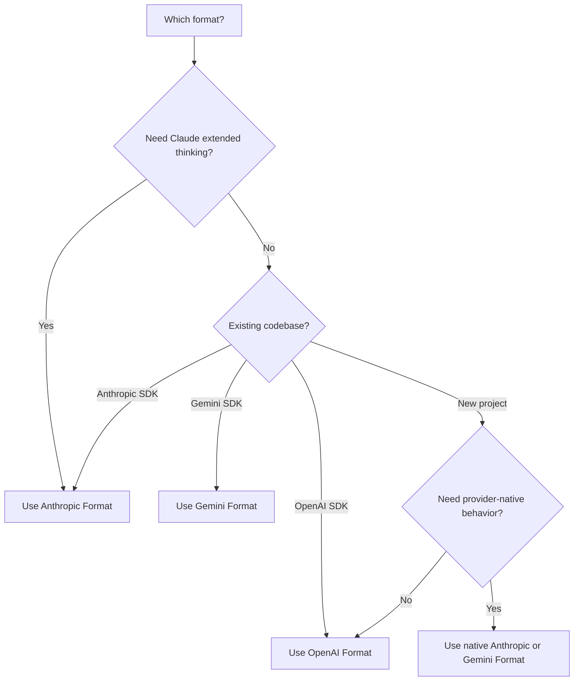

<span data-mintlify-rebuild="2026-05-19-after-mdx-parse-fix" aria-hidden="true" />

## 概要

AI Sonar は単一の API キーで **3 つのネイティブ API フォーマット** をサポートします。設定を変更することなく、ユースケースに最適なフォーマットを選んでください。

<CardGroup cols={3}>
  <Card title="OpenAI フォーマット" icon="plug">
    `/v1/chat/completions`
    標準フォーマット、最も幅広い互換性
  </Card>
  <Card title="Anthropic フォーマット" icon="message">
    `/v1/messages`
    Extended thinking、Claude 固有の機能
  </Card>
  <Card title="Gemini フォーマット" icon="sparkles">
    `/v1beta/models/:model:generateContent`
    Google エコシステムとの統合
  </Card>
</CardGroup>

## なぜマルチフォーマットか？

| 利点 | 説明 |
|---------|-------------|
| **SDK の切り替え不要** | お好みの SDK で任意のモデルを使用可能 |
| **ネイティブ機能** | フォーマット固有の機能にアクセス |
| **簡単な移行** | 公式 API からベース URL を変更するだけで移行可能 |
| **単一課金** | 1 つのアカウント、1 つの API キー、すべてのフォーマット |

## フォーマット比較

| 特徴 | OpenAI | Anthropic | Gemini |
|---------|--------|-----------|--------|
| **Endpoint** | `/v1/chat/completions` | `/v1/messages` | `/v1beta/models/:model:generateContent` |
| **認証ヘッダー** | `Authorization: Bearer` | `x-api-key` | `Authorization: Bearer` |
| **System Prompt** | `messages` 配列内 | 別の `system` フィールド | `systemInstruction` 内 |
| **拡張思考** | ❌ | ✅ | ❌ |
| **ストリーミング** | ✅ SSE | ✅ SSE | ✅ SSE |
| **ツール呼び出し** | ✅ | ✅ | ✅ |
| **ビジョン** | ✅ | ✅ | ✅ |

## OpenAI フォーマット

既存の OpenAI SDK 統合や、移植性のあるチャット/embedding フローには、この互換経路を使用してください。Claude または Gemini のネイティブな挙動が必要な場合は、下記の Anthropic または Gemini 形式を使用してください。

```python
from openai import OpenAI

client = OpenAI(
    api_key="sk-your-api-key",
    base_url="https://api.aisonar.dev/v1"
)

# Portable chat works across many models
response = client.chat.completions.create(
    model="claude-sonnet-4-6",  # Claude via OpenAI format
    messages=[
        {"role": "system", "content": "You are a helpful assistant."},
        {"role": "user", "content": "Hello!"}
    ]
)
```

**適している用途：**
- 一般的な用途
- 既存の OpenAI SDK 統合
- 最大の互換性

## Anthropic フォーマット

Anthropic のネイティブ Messages API。Extended thinking のような Claude 固有の機能にはこのフォーマットが必要です。

```python
from anthropic import Anthropic

client = Anthropic(
    api_key="sk-your-api-key",
    base_url="https://api.aisonar.dev"  # No /v1 suffix!
)

message = client.messages.create(
    model="claude-sonnet-4-6",
    max_tokens=1024,
    system="You are a helpful assistant.",  # Separate system field
    messages=[
        {"role": "user", "content": "Hello!"}
    ]
)
```

### 拡張思考 (Claude Opus 4.6)

Anthropic フォーマットでのみ利用可能：

```python
message = client.messages.create(
    model="claude-opus-4-6",
    max_tokens=16000,
    thinking={
        "type": "enabled",
        "budget_tokens": 10000
    },
    messages=[{"role": "user", "content": "Solve this complex problem..."}]
)

# Access thinking process
for block in message.content:
    if block.type == "thinking":
        print(f"Thinking: {block.thinking}")
    elif block.type == "text":
        print(f"Answer: {block.text}")
```

**適している用途：**
- Claude 固有の機能
- Extended thinking モード
- ネイティブ Anthropic SDK ユーザー

## Gemini フォーマット

Google エコシステム統合のためのネイティブな Google Gemini API フォーマットです。

```bash
curl "https://api.aisonar.dev/v1beta/models/gemini-2.5-flash:generateContent" \
  -H "Authorization: Bearer sk-your-api-key" \
  -H "Content-Type: application/json" \
  -d '{
    "contents": [{
      "parts": [{"text": "Hello!"}]
    }],
    "systemInstruction": {
      "parts": [{"text": "You are a helpful assistant."}]
    }
  }'
```

### ストリーミング

```bash
curl "https://api.aisonar.dev/v1beta/models/gemini-2.5-flash:streamGenerateContent?alt=sse" \
  -H "Authorization: Bearer sk-your-api-key" \
  -H "Content-Type: application/json" \
  -d '{
    "contents": [{"parts": [{"text": "Write a story"}]}]
  }'
```

**適している用途：**
- Google Cloud 統合
- 既存の Gemini SDK コード
- ネイティブ Gemini 機能

**Gemini Files と Cache:** ネイティブ Gemini ルートでは `/upload/v1beta/files`、`/v1beta/files`、`/v1beta/files:register`、`/v1beta/cachedContents` を利用できます。Files は Gemini File API 互換の上流チャネルを使い、明示的な Cache リソースは Vertex AI チャネルにもルーティングできます。AI Sonar 経由で作成したリソースは同じ上流チャネル/key に束縛され、後続の `generateContent` でもその束縛が使われます。

## ツール互換性の境界

関数ツールは、対象ルートが対応している場合にフォーマット間で変換できます。プロバイダー固有のネイティブツールは、それぞれのネイティブルートに残す必要があります。

- OpenAI Responses のホスト型およびネイティブツール、たとえば `tool_search`、`web_search`、`file_search`、`code_interpreter`、MCP、shell/apply_patch、computer-use ツールには `/v1/responses` が必要です。
- Anthropic の server/native ツール、たとえば `web_search_*`、`web_fetch_*`、`code_execution_*`、`tool_search_*`、bash、computer-use、text-editor ツールには `/v1/messages` が必要です。
- Gemini の組み込みツール、たとえば `googleSearch`、`codeExecution`、`urlContext`、`computerUse`、および同種の `tools` フィールドには `/v1beta` が必要です。

AI Sonar がネイティブツールを含むリクエストをネイティブ対応の上流ルートへ送れない場合、ツールを黙って削除したり Chat Completions の関数として扱ったりせず、明示的な unsupported-field エラーを返します。ユーザー定義の関数ツールは引き続き最も移植性の高いツール経路です。

## 適切なフォーマットの選び方



## マイグレーションガイド

### OpenAI 公式APIから

```python
# Before (OpenAI)
client = OpenAI(api_key="sk-openai-key")

# After (AI Sonar)
client = OpenAI(
    api_key="sk-your-api-key",
    base_url="https://api.aisonar.dev/v1"  # Add this line
)
# That's it! Same code works
```

### Anthropic 公式APIから

```python
# Before (Anthropic)
client = Anthropic(api_key="sk-ant-key")

# After (AI Sonar)
client = Anthropic(
    api_key="sk-your-api-key",
    base_url="https://api.aisonar.dev"  # Add this line (no /v1!)
)
```

### Google AI Studio から

```python
# Before (Google)
import google.generativeai as genai
genai.configure(api_key="google-api-key")

# After (AI Sonar) - Use REST API
import requests

response = requests.post(
    "https://api.aisonar.dev/v1beta/models/gemini-2.5-flash:generateContent",
    headers={"Authorization": "Bearer sk-your-api-key"},
    json={"contents": [{"parts": [{"text": "Hello"}]}]}
)
```

## クロスモデル互換性

AI Sonar の利点：任意の SDK で任意のモデルを使用できます。ゲートウェイがフォーマット変換を自動で処理します。

### 任意の SDK → 任意のモデル

```python
# Anthropic SDK with GPT-4o (auto-converts to OpenAI format)
from anthropic import Anthropic

client = Anthropic(
    api_key="sk-your-api-key",
    base_url="https://api.aisonar.dev"
)

response = client.messages.create(
    model="gpt-4o",  # ✅ Works! Auto-converted
    max_tokens=1024,
    messages=[{"role": "user", "content": "Hello!"}]
)

# Same compatibility SDK for portable chat; native-only features still need native routes
response = client.messages.create(model="gemini-2.5-flash", ...)  # ✅ Works!
response = client.messages.create(model="deepseek-r1", ...)       # ✅ Works!
```

### OpenAI SDK → 全モデル

```python
from openai import OpenAI

client = OpenAI(base_url="https://api.aisonar.dev/v1", api_key="sk-...")

# These portable chat calls use the same /v1 compatibility SDK:
response = client.chat.completions.create(model="gpt-4o", ...)
response = client.chat.completions.create(model="claude-sonnet-4-6", ...)
response = client.chat.completions.create(model="gemini-2.5-flash", ...)
```

### 業界比較

| プラットフォーム | OpenAI フォーマット | Anthropic フォーマット | Gemini フォーマット | Responses API |
|----------|:---:|:---:|:---:|:---:|
| **AI Sonar** | ✅ すべてのモデル | ✅ すべてのモデル | ✅ すべてのモデル | ✅ すべてのモデル |
| OpenRouter | ✅ すべてのモデル | ❌ | ❌ | ❌ |
| Together AI | ✅ すべてのモデル | ❌ | ❌ | ❌ |
| Fireworks | ✅ すべてのモデル | ❌ | ❌ | ❌ |

<Note>
クロスフォーマットはほとんどの機能で動作しますが、Anthropic の Extended thinking のようなフォーマット固有の機能はネイティブなフォーマットが必要です。
</Note>
