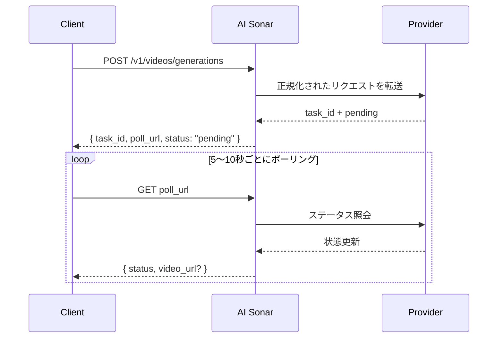

## 概要

AI Sonar は単一の統一 API を通じて動画生成機能を提供します。動画生成は**非同期**です。リクエスト送信後、`task_id` と `poll_url` が返り、その後はポーリングで最終結果を取得します。

### 可用性とポーリング

公開動画モデルの最新在庫を確認するには、[Models API](/ja/api-reference/models/list-models) または [モデルページ](https://aisonar.dev/models) を利用してください。

作成レスポンスで `poll_url` が返る場合は、その URL をそのまま使ってください。`/v1/tasks/{id}` を指す場合は、それを固定の正規ステータスエンドポイントとして扱ってください。

### モデルとメディアの動作

音声挙動はモデル依存です。AI Sonar では、Veo 3 系列は `output_audio` を省略すると既定で有声として扱われます。一方、無音が既定のモデルや、安定した音声トグルを公開していないモデルもあります。

本番運用では、画像・動画・音声入力には公開アクセス可能な `https` URL を優先してください。互換モデルでは `data:` URL も利用できますが、URL の方が retry・観測・デバッグの面で扱いやすくなります。

### 非同期ワークフロー



## 現在の公開操作

AI Sonar の公開動画契約は主に次の操作をカバーしています。

- `text-to-video`
- `image-to-video`
- `reference-to-video`
- `start-end-to-video`
- `video-to-video`
- `motion-control`

`audio-to-video` と `video-extension` も契約上は受け付けますが、このドキュメント時点の「広く有効な公開モデル」一覧には、これらを一般公開しているモデルは含まれていません。

## 能力マトリクス

**凡例**：✅ 該当 プロバイダー ファミリーに、現在有効な公開モデルが少なくとも 1 つ存在する | ❌ 現在有効な公開モデルでは未公開

| シリーズ | T2V | I2V | 参照 | 開始-終了 | V2V | モーション |
|--------|-----|-----|-----------|-----------|-----|--------|
| OpenAI | ✅ | ✅ | ❌ | ❌ | ❌ | ❌ |
| Kuaishou | ✅ | ✅ | ✅ | ✅ | ✅ | ✅ |
| Google | ✅ | ✅ | ✅ | ✅ | ❌ | ❌ |
| ByteDance | ✅ | ✅ | ❌ | ❌ | ❌ | ❌ |
| MiniMax | ✅ | ✅ | ❌ | ❌ | ❌ | ❌ |
| Alibaba | ✅ | ✅ | ✅ | ❌ | ❌ | ❌ |
| Shengshu | ✅ | ✅ | ✅ | ✅ | ❌ | ❌ |
| xAI | ✅ | ✅ | ❌ | ❌ | ✅ | ❌ |
| Other | ❌ | ❌ | ❌ | ❌ | ✅ | ❌ |

### 用語の意味

- **T2V (Text-to-Video)**：テキスト prompt から動画を生成
- **I2V (Image-to-Video)**：開始画像から動画を生成。互換性の観点では `image_url` を推奨
- **Reference**：`reference_images` で 1 枚または複数の参考画像を渡して条件制御
- **Start-End**：`start_image` と `end_image` で開始フレームと終了フレームを制御
- **V2V (Video-to-Video)**：既存動画を主入力として扱う
- **Motion**：主体画像とモーション参照動画を同時に使う

## 現在の公開モデル一覧


### Kuaishou

| モデル | 公開オペレーション |
|-------|----------|
| `kling-3.0-motion-control` | モーション制御 |
| `kling-3.0-video` | テキストから動画、画像から動画、開始・終了フレームから動画、要素参照 |
| `kling-v2.1-master` | テキストから動画、画像から動画 |
| `kling-v2.1-pro` | 画像から動画、開始・終了フレームから動画 |
| `kling-v2.1-standard` | 画像から動画 |
| `kling-v2.5-turbo-pro` | テキストから動画、画像から動画、開始・終了フレームから動画 |
| `kling-v2.5-turbo-std` | テキストから動画、画像から動画 |
| `kling-v2.6-pro` | テキストから動画、画像から動画、開始・終了フレームから動画 |
| `kling-v2.6-std` | テキストから動画、画像から動画 |
| `kling-v3.0-pro` | テキストから動画、画像から動画、開始・終了フレームから動画 |
| `kling-v3.0-std` | テキストから動画、画像から動画、開始・終了フレームから動画 |
| `kling-video-o1-pro` | テキストから動画、画像から動画、参考画像から動画、開始・終了フレームから動画、動画から動画 |
| `kling-video-o1-std` | テキストから動画、画像から動画、参考画像から動画、開始・終了フレームから動画、動画から動画 |

### Google

| モデル | 公開オペレーション |
|-------|----------|
| `veo3` | テキストから動画、画像から動画 |
| `veo3-fast` | テキストから動画、画像から動画 |
| `veo3-pro` | テキストから動画、画像から動画 |
| `veo3.1` | テキストから動画、画像から動画、参考画像から動画、開始・終了フレームから動画 |
| `veo3.1-fast` | テキストから動画、画像から動画、参考画像から動画、開始・終了フレームから動画 |
| `veo3.1-pro` | テキストから動画、画像から動画、開始・終了フレームから動画 |

### ByteDance

| モデル | 公開オペレーション |
|-------|----------|
| `seedance-1.5-pro` | テキストから動画、画像から動画 |

### MiniMax

| モデル | 公開オペレーション |
|-------|----------|
| `hailuo-2.3-fast` | 画像から動画 |
| `hailuo-2.3-pro` | テキストから動画、画像から動画 |
| `hailuo-2.3-standard` | テキストから動画、画像から動画 |

### Alibaba

| モデル | 公開オペレーション |
|-------|----------|
| `wan-2.2-plus` | テキストから動画、画像から動画 |
| `wan-2.5` | テキストから動画、画像から動画 |
| `wan-2.6` | テキストから動画、画像から動画、参考画像から動画 |

### Shengshu

| モデル | 公開オペレーション |
|-------|----------|
| `viduq2` | テキストから動画、参考画像から動画 |
| `viduq2-pro` | 画像から動画、参考画像から動画、開始・終了フレームから動画 |
| `viduq2-pro-fast` | 画像から動画、開始・終了フレームから動画 |
| `viduq2-turbo` | 画像から動画、開始・終了フレームから動画 |
| `viduq3-pro` | テキストから動画、画像から動画、開始・終了フレームから動画 |
| `viduq3-turbo` | テキストから動画、画像から動画、開始・終了フレームから動画 |

### xAI

| モデル | 公開オペレーション |
|-------|----------|
| `grok-imagine-video` | テキストから動画、画像から動画、参照画像から動画、動画から動画 |
| `grok-imagine-video-1.5-preview` | 画像から動画 |
| `grok-imagine-image-to-video` | 画像から動画 |
| `grok-imagine-text-to-video` | テキストから動画 |
| `grok-imagine-upscale` | 動画から動画 |

### その他

| モデル | 公開オペレーション |
|-------|----------|
| `topaz-video-upscale` | 動画から動画 |

## 使用例

### テキストから動画

```python
response = requests.post(f"{BASE}/videos/generations",
    headers=headers,
    json={
        "model": "veo3.1",
        "prompt": "A calm cinematic shot of a cat walking through a sunlit garden.",
        "operation": "text-to-video",
        "duration": 4,
        "aspect_ratio": "16:9"
    }
)
```

### 画像から動画

```python
response = requests.post(f"{BASE}/videos/generations",
    headers=headers,
    json={
        "model": "hailuo-2.3-standard",
        "prompt": "The scene begins from the provided image and adds gentle natural motion.",
        "operation": "image-to-video",
        "image_url": "https://example.com/portrait.jpg",
        "duration": 6,
        "aspect_ratio": "16:9"
    }
)
```

### Kling 3.0 Elements

`kling_elements` は、要素参照が必要な場合に `kling-3.0-video` と一緒に使います。画像条件付きリクエスト（`image_url`、`image_urls`、`start_image`、`end_image`）を指定し、各要素をプロンプト内で `@name` として参照します。`kling_elements` と `output_audio=true` は併用できません。要素参照を使う場合は `output_audio` を省略するか `false` にしてください。

```python
response = requests.post(f"{BASE}/videos/generations",
    headers=headers,
    json={
        "model": "kling-3.0-video",
        "prompt": "Place @hero_bag on a studio turntable with soft product lighting.",
        "operation": "image-to-video",
        "image_url": "https://example.com/studio-start.png",
        "duration": 5,
        "resolution": "720p",
        "kling_elements": [
            {
                "name": "hero_bag",
                "description": "black leather handbag",
                "element_input_urls": [
                    "https://example.com/bag-front.png",
                    "https://example.com/bag-side.png"
                ]
            }
        ]
    }
)
```

### 参考画像から動画

`seedance-2.0` と `seedance-2.0-fast` では、AI Sonar は現在最大 9 枚の参照画像に加えて、最大 3 本の参照動画と 3 本の参照音声をサポートします。`duration` は生成される出力長のみを制御し、参照動画入力の長さ上限を個別に定義するものではありません。 `grok-imagine-video` の reference-to-video は最大 7 件の画像参照（`reference_images` または `image_urls`）を受け付け、`duration` は最大 10 秒です。参照画像を `image_url` / `image` の先頭フレーム入力と組み合わせないでください。`grok-imagine-video-1.5-preview` は image-to-video のみです。

```python
response = requests.post(f"{BASE}/videos/generations",
    headers=headers,
    json={
        "model": "veo3.1",
        "prompt": "Keep the same subject identity and palette while adding subtle motion.",
        "operation": "reference-to-video",
        "reference_images": [
            "https://example.com/ref-a.jpg",
            "https://example.com/ref-b.jpg"
        ],
        "duration": 8,
        "resolution": "720p",
        "aspect_ratio": "9:16"
    }
)
```

### 開始・終了フレーム制御

```python
response = requests.post(f"{BASE}/videos/generations",
    headers=headers,
    json={
        "model": "viduq2-pro",
        "prompt": "Smooth transition from day to night.",
        "operation": "start-end-to-video",
        "start_image": "https://example.com/city-day.jpg",
        "end_image": "https://example.com/city-night.jpg",
        "duration": 5,
        "resolution": "720p",
        "aspect_ratio": "16:9"
    }
)
```

### 動画から動画

`grok-imagine-video` の video-to-video では、公開 HTTPS の `.mp4` URL を `video_url` に渡します。AI Sonar はこれを xAI REST の `video.url` ボディへ変換します。`resolution` は `480p` または `720p` に設定できます。この編集フローでは `duration` と `aspect_ratio` は受け付けません。

```python
response = requests.post(f"{BASE}/videos/generations",
    headers=headers,
    json={
        "model": "topaz-video-upscale",
        "operation": "video-to-video",
        "video_url": "https://example.com/source.mp4",
        "prompt": "Upscale this clip while preserving the original motion."
    }
)
```

### モーション制御

```python
response = requests.post(f"{BASE}/videos/generations",
    headers=headers,
    json={
        "model": "kling-3.0-motion-control",
        "operation": "motion-control",
        "prompt": "Keep the subject stable while following the motion reference.",
        "image_url": "https://example.com/subject.png",
        "video_url": "https://example.com/motion.mp4",
        "resolution": "720p"
    }
)
```

## パラメータの目安

| パラメータ | 型 | メモ |
|-----------|------|------|
| `operation` | string | 本番では明示指定を推奨 |
| `image_url` | string | 最も互換性が高い画像入力 |
| `image` | string | ローカル検証や小さな入力向けの `data:` URL |
| `reference_images` | string[] | 参考画像条件制御の正式な公開フィールド |
| `reference_image_type` | string | 任意の `asset` / `style` 切り替え |
| `video_url` | string | 現在の公開 `video-to-video` / `motion-control` モデルで必要 |
| `audio_url` | string | モデル固有の音声条件フロー向け |
| `output_audio` | boolean | Veo 3 系列は省略時に `true` 扱い。`kling-3.0-video` は upstream の sound 制御用にこの selector を受け付け、省略時は無音です。 |

## モデル選定のヒント

<CardGroup cols={2}>
  <Card title="最高品質" icon="crown">
    品質優先なら **veo3.1-pro**、**kling-video-o1-pro**、**viduq3-pro** が有力です。
  </Card>
  <Card title="高速な反復" icon="bolt">
    より速い試行には **veo3.1-fast**、**hailuo-2.3-fast**、**viduq3-turbo** が有力です。
  </Card>
  <Card title="参照画像条件制御" icon="images">
    参照画像ベースの条件制御には **veo3.1**、**veo3.1-fast**、**wan-2.6**、**kling-video-o1-pro / std** を優先してください。
  </Card>
  <Card title="動画から動画" icon="film">
    一般公開されている `video-to-video` ルートは主に **topaz-video-upscale**、**grok-imagine-upscale**、**kling-video-o1-pro / std** です。
  </Card>
</CardGroup>

## 課金

動画課金はモデルごとに異なります。実質的に従量が「回数ベース」のモデルもあれば、「秒ベース」のモデルもあります。最新の公開価格は [モデルページ](https://aisonar.dev/models) または [Pricing API](/ja/api-reference/pricing/get-pricing) を確認してください。
