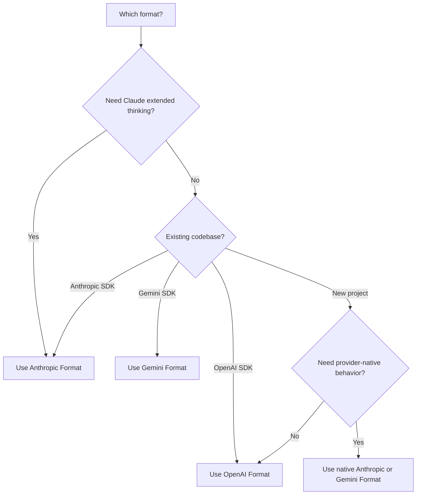

<span data-mintlify-rebuild="2026-05-19-after-mdx-parse-fix" aria-hidden="true" />

## 개요

AI Sonar는 하나의 API 키로 **세 가지 네이티브 API 형식**을 지원합니다. 구성 변경 없이 사용 사례에 가장 적합한 형식을 선택하세요.

<CardGroup cols={3}>
  <Card title="OpenAI 형식" icon="plug">
    `/v1/chat/completions`
    표준 형식, 가장 넓은 호환성
  </Card>
  <Card title="Anthropic 형식" icon="message">
    `/v1/messages`
    확장 사고, Claude 고유 기능 지원
  </Card>
  <Card title="Gemini 형식" icon="sparkles">
    `/v1beta/models/:model:generateContent`
    Google 생태계 통합
  </Card>
</CardGroup>

## 멀티 포맷을 사용하는 이유

| 이점 | 설명 |
|---------|-------------|
| **SDK 전환 불필요** | 선호하는 SDK로 아무 모델이나 사용 가능 |
| **네이티브 기능 접근** | 형식별 고유 기능 사용 가능 |
| **네이티브 우선 마이그레이션** | 동작이 중요할 때는 네이티브 공급자 경로를 유지하고; 기존 OpenAI 스타일 클라이언트에는 `/v1` OpenAI 호환성을 사용하세요 |
| **단일 청구** | 하나의 계정, 하나의 API 키로 모든 형식 사용 |

## 형식 비교

| 기능 | OpenAI | Anthropic | Gemini |
|---------|--------|-----------|--------|
| **Endpoint** | `/v1/chat/completions` | `/v1/messages` | `/v1beta/models/:model:generateContent` |
| **인증 헤더** | `Authorization: Bearer` | `x-api-key` | `Authorization: Bearer` |
| **시스템 프롬프트** | messages 배열 내 | 별도 `system` 필드 | `systemInstruction` 내 |
| **확장 사고** | ❌ | ✅ | ❌ |
| **스트리밍** | ✅ SSE | ✅ SSE | ✅ SSE |
| **도구 호출** | ✅ | ✅ | ✅ |
| **비전** | ✅ | ✅ | ✅ |

## OpenAI 형식

기존 OpenAI SDK 통합과 이식 가능한 채팅 또는 임베딩 플로우에는 이 호환 경로를 사용하세요. Claude 또는 Gemini 네이티브 동작에는 아래의 Anthropic 또는 Gemini 형식을 사용하세요.

```python
from openai import OpenAI

client = OpenAI(
    api_key="sk-your-api-key",
    base_url="https://api.aisonar.dev/v1"
)

# Portable chat works across many models
response = client.chat.completions.create(
    model="claude-sonnet-4-6",  # Claude via OpenAI format
    messages=[
        {"role": "system", "content": "You are a helpful assistant."},
        {"role": "user", "content": "Hello!"}
    ]
)
```

**적합한 용도:**
- 일반적인 사용
- 기존 OpenAI SDK 통합
- 최대 호환성

## Anthropic 형식

Anthropic Messages API의 네이티브 형식입니다. 확장 사고와 같은 Claude 전용 기능을 사용하려면 필요합니다.

```python
from anthropic import Anthropic

client = Anthropic(
    api_key="sk-your-api-key",
    base_url="https://api.aisonar.dev"  # No /v1 suffix!
)

message = client.messages.create(
    model="claude-sonnet-4-6",
    max_tokens=1024,
    system="You are a helpful assistant.",  # Separate system field
    messages=[
        {"role": "user", "content": "Hello!"}
    ]
)
```

### 확장 사고 (Claude Opus 4.6)

Anthropic 형식에서만 사용할 수 있습니다:

```python
message = client.messages.create(
    model="claude-opus-4-6",
    max_tokens=16000,
    thinking={
        "type": "enabled",
        "budget_tokens": 10000
    },
    messages=[{"role": "user", "content": "Solve this complex problem..."}]
)

# Access thinking process
for block in message.content:
    if block.type == "thinking":
        print(f"Thinking: {block.thinking}")
    elif block.type == "text":
        print(f"Answer: {block.text}")
```

**적합한 용도:**
- Claude 전용 기능
- 확장 사고 모드
- 네이티브 Anthropic SDK 사용자

## Gemini 형식

Google 생태계 통합을 위한 네이티브 Google Gemini API 형식입니다.

```bash
curl "https://api.aisonar.dev/v1beta/models/gemini-2.5-flash:generateContent" \
  -H "Authorization: Bearer sk-your-api-key" \
  -H "Content-Type: application/json" \
  -d '{
    "contents": [{
      "parts": [{"text": "Hello!"}]
    }],
    "systemInstruction": {
      "parts": [{"text": "You are a helpful assistant."}]
    }
  }'
```

### 스트리밍

```bash
curl "https://api.aisonar.dev/v1beta/models/gemini-2.5-flash:streamGenerateContent?alt=sse" \
  -H "Authorization: Bearer sk-your-api-key" \
  -H "Content-Type: application/json" \
  -d '{
    "contents": [{"parts": [{"text": "Write a story"}]}]
  }'
```

**적합한 용도:**
- Google Cloud 통합
- 기존 Gemini SDK 코드
- 네이티브 Gemini 기능

**Gemini Files 및 Cache:** 네이티브 Gemini 경로에서 `/upload/v1beta/files`, `/v1beta/files`, `/v1beta/files:register`, `/v1beta/cachedContents`를 사용할 수 있습니다. Files는 Gemini File API 호환 업스트림 채널을 사용하고, 명시적 Cache 리소스는 Vertex AI 채널로도 라우팅할 수 있습니다. AI Sonar를 통해 생성한 리소스는 같은 업스트림 채널/key에 바인딩되며 이후 `generateContent` 호출도 이 바인딩을 사용합니다.

## 도구 호환성 경계

함수 도구는 대상 경로가 지원할 때 형식 간 변환할 수 있습니다. 공급자 네이티브 도구는 해당 네이티브 경로에 그대로 남아 있어야 합니다.

- OpenAI Responses의 호스팅 및 네이티브 도구, 예를 들어 `tool_search`, `web_search`, `file_search`, `code_interpreter`, MCP, shell/apply_patch, computer-use 도구는 `/v1/responses`가 필요합니다.
- Anthropic server/native 도구, 예를 들어 `web_search_*`, `web_fetch_*`, `code_execution_*`, `tool_search_*`, bash, computer-use, text-editor 도구는 `/v1/messages`가 필요합니다.
- Gemini 내장 도구, 예를 들어 `googleSearch`, `codeExecution`, `urlContext`, `computerUse` 및 유사한 `tools` 필드는 `/v1beta`가 필요합니다.

AI Sonar가 네이티브 도구가 포함된 요청을 네이티브 지원 업스트림 경로로 라우팅할 수 없으면, 도구를 조용히 제거하거나 Chat Completions 함수처럼 처리하지 않고 명시적인 unsupported-field 오류를 반환합니다. 사용자 정의 함수 도구는 계속 가장 이식성 높은 도구 경로입니다.

## 적절한 형식 선택



## 마이그레이션 가이드

### OpenAI 공식 API에서

```python
# Before (OpenAI)
client = OpenAI(api_key="sk-openai-key")

# After (AI Sonar)
client = OpenAI(
    api_key="sk-your-api-key",
    base_url="https://api.aisonar.dev/v1"  # Add this line
)
# That's it! Same code works
```

### Anthropic 공식 API에서

```python
# Before (Anthropic)
client = Anthropic(api_key="sk-ant-key")

# After (AI Sonar)
client = Anthropic(
    api_key="sk-your-api-key",
    base_url="https://api.aisonar.dev"  # Add this line (no /v1!)
)
```

### Google AI Studio에서

```python
# Before (Google)
import google.generativeai as genai
genai.configure(api_key="google-api-key")

# After (AI Sonar) - Use REST API
import requests

response = requests.post(
    "https://api.aisonar.dev/v1beta/models/gemini-2.5-flash:generateContent",
    headers={"Authorization": "Bearer sk-your-api-key"},
    json={"contents": [{"parts": [{"text": "Hello"}]}]}
)
```

## 모델 간 호환성

AI Sonar의 마법: **어떤 SDK**로도 **어떤 모델**이든 사용 가능합니다. 게이트웨이가 형식 변환을 자동으로 처리합니다.

### 호환 SDK → Portable Chat

```python
# Anthropic SDK with GPT-4o (auto-converts to OpenAI format)
from anthropic import Anthropic

client = Anthropic(
    api_key="sk-your-api-key",
    base_url="https://api.aisonar.dev"
)

response = client.messages.create(
    model="gpt-4o",  # ✅ Works! Auto-converted
    max_tokens=1024,
    messages=[{"role": "user", "content": "Hello!"}]
)

# Same compatibility SDK for portable chat; native-only features still need native routes
response = client.messages.create(model="gemini-2.5-flash", ...)  # ✅ Works!
response = client.messages.create(model="deepseek-r1", ...)       # ✅ Works!
```

### OpenAI SDK → 모든 모델

```python
from openai import OpenAI

client = OpenAI(base_url="https://api.aisonar.dev/v1", api_key="sk-...")

# These portable chat calls use the same /v1 compatibility SDK:
response = client.chat.completions.create(model="gpt-4o", ...)
response = client.chat.completions.create(model="claude-sonnet-4-6", ...)
response = client.chat.completions.create(model="gemini-2.5-flash", ...)
```

### 업계 비교

| 플랫폼 | OpenAI 형식 | Anthropic 형식 | Gemini 형식 | Responses API |
|----------|:---:|:---:|:---:|:---:|
| **AI Sonar** | ✅ 모든 모델 | ✅ 모든 모델 | ✅ 모든 모델 | ✅ 모든 모델 |
| OpenRouter | ✅ 모든 모델 | ❌ | ❌ | ❌ |
| Together AI | ✅ 모든 모델 | ❌ | ❌ | ❌ |
| Fireworks | ✅ 모든 모델 | ❌ | ❌ | ❌ |

<Note>
대부분의 기능은 형식 간에 작동하지만, Anthropic의 확장 사고와 같은 형식 고유 기능은 네이티브 형식을 사용해야 합니다.
</Note>
