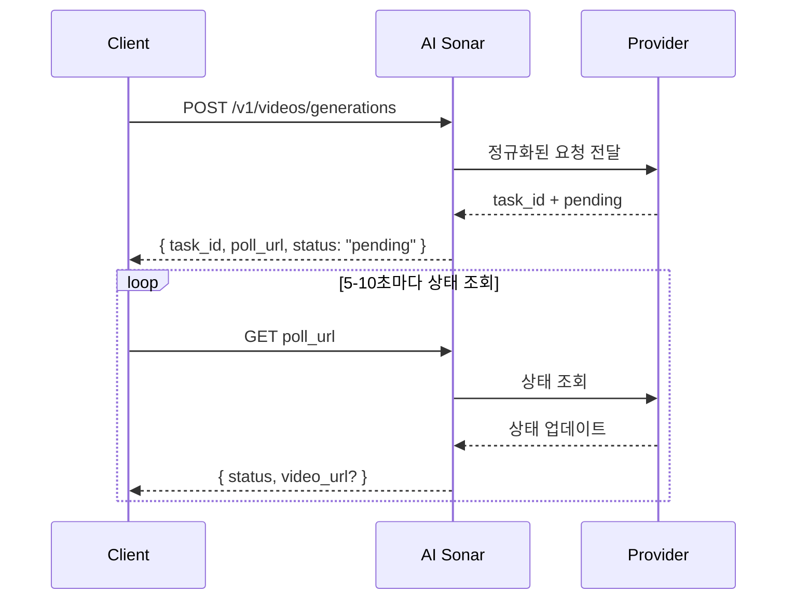

<span data-mintlify-rebuild="2026-05-19-after-mdx-parse-fix" aria-hidden="true" />

## 개요

AI Sonar 는 하나의 통합 API 를 통해 비디오 생성을 제공합니다. 생성은 **비동기 방식**으로 진행되며, 요청을 보내면 `task_id` 와 `poll_url` 을 받은 뒤 최종 결과가 나올 때까지 상태를 주기적으로 조회하면 됩니다.

### 가용성과 폴링

모델 인벤토리는 [Models API](/ko/api-reference/models/list-models) 또는 [모델 페이지](https://aisonar.dev/models)에서 확인할 수 있습니다.

create 응답에 `poll_url`이 있으면 그 URL을 그대로 사용하세요. 그것이 `/v1/tasks/{id}`를 가리키면 고정 상태 조회의 canonical endpoint로 취급하세요.

### 모델 및 미디어 동작

오디오 동작은 모델마다 다릅니다. AI Sonar 에서는 `output_audio` 를 생략하면 Veo 3 계열을 기본적으로 오디오 켜짐으로 처리합니다. 다른 공개 모델은 기본적으로 무음이거나, 안정적인 오디오 토글을 노출하지 않을 수 있습니다.

운영 환경에서는 이미지, 비디오, 오디오 입력에 공개 접근 가능한 `https` URL 을 사용하는 것이 좋습니다. 호환 모델은 `data:` URL 도 계속 지원하지만, 공개 URL 이 재시도, 관측, 디버깅에 더 유리합니다.

### 비동기 흐름



## 현재 공개 작업

현재 AI Sonar 공개 비디오 계약의 중심이 되는 작업은 다음과 같습니다.

- `text-to-video`
- `image-to-video`
- `reference-to-video`
- `start-end-to-video`
- `video-to-video`
- `motion-control`

계약 자체는 `audio-to-video` 와 `video-extension` 도 모델별 흐름을 위해 허용하지만, 이 문서 빌드 시점의 공개 활성 모델 목록에는 두 기능을 널리 제공하는 모델이 포함되어 있지 않습니다.

## 기능 매트릭스

**범례**: ✅ 해당 공급자 계열에 현재 공개 활성 모델이 최소 1개 이상 존재 | ❌ 현재 공개 활성 모델로는 제공되지 않음

| 계열 | T2V | I2V | 참조 | 시작-종료 | V2V | 모션 |
|------|-----|-----|------|-----------|-----|------|
| OpenAI | ✅ | ✅ | ❌ | ❌ | ❌ | ❌ |
| Kuaishou | ✅ | ✅ | ✅ | ✅ | ✅ | ✅ |
| Google | ✅ | ✅ | ✅ | ✅ | ❌ | ❌ |
| ByteDance | ✅ | ✅ | ❌ | ❌ | ❌ | ❌ |
| MiniMax | ✅ | ✅ | ❌ | ❌ | ❌ | ❌ |
| Alibaba | ✅ | ✅ | ✅ | ❌ | ❌ | ❌ |
| Shengshu | ✅ | ✅ | ✅ | ✅ | ❌ | ❌ |
| xAI | ✅ | ✅ | ❌ | ❌ | ✅ | ❌ |
| 기타 | ❌ | ❌ | ❌ | ❌ | ✅ | ❌ |

### 기능 정의

- **T2V (Text-to-Video)**: 텍스트 프롬프트에서 비디오 생성
- **I2V (Image-to-Video)**: 시작 이미지를 기반으로 비디오 생성. 가장 넓은 호환성을 위해 `image_url` 권장
- **참조**: `reference_images` 를 통해 하나 이상의 참조 이미지로 생성 조건 부여
- **시작-종료**: `start_image` 와 `end_image` 로 첫 프레임과 마지막 프레임 제어
- **V2V (Video-to-Video)**: 기존 비디오를 주 입력으로 사용
- **모션**: 피사체 이미지와 모션 참조 비디오를 함께 사용

## 현재 공개 모델 인벤토리


### Kuaishou

| 모델 | 공개 작업 |
|------|-----------|
| `kling-3.0-motion-control` | 모션 컨트롤 |
| `kling-3.0-video` | 텍스트에서 비디오, 이미지에서 비디오, 시작-종료 프레임 비디오, 요소 참조 |
| `kling-v2.1-master` | 텍스트에서 비디오, 이미지에서 비디오 |
| `kling-v2.1-pro` | 이미지에서 비디오, 시작-종료 프레임 비디오 |
| `kling-v2.1-standard` | 이미지에서 비디오 |
| `kling-v2.5-turbo-pro` | 텍스트에서 비디오, 이미지에서 비디오, 시작-종료 프레임 비디오 |
| `kling-v2.5-turbo-std` | 텍스트에서 비디오, 이미지에서 비디오 |
| `kling-v2.6-pro` | 텍스트에서 비디오, 이미지에서 비디오, 시작-종료 프레임 비디오 |
| `kling-v2.6-std` | 텍스트에서 비디오, 이미지에서 비디오 |
| `kling-v3.0-pro` | 텍스트에서 비디오, 이미지에서 비디오, 시작-종료 프레임 비디오 |
| `kling-v3.0-std` | 텍스트에서 비디오, 이미지에서 비디오, 시작-종료 프레임 비디오 |
| `kling-video-o1-pro` | 텍스트에서 비디오, 이미지에서 비디오, 참조 이미지 기반 비디오, 시작-종료 프레임 비디오, 비디오에서 비디오 |
| `kling-video-o1-std` | 텍스트에서 비디오, 이미지에서 비디오, 참조 이미지 기반 비디오, 시작-종료 프레임 비디오, 비디오에서 비디오 |

### Google

| 모델 | 공개 작업 |
|------|-----------|
| `veo3` | 텍스트에서 비디오, 이미지에서 비디오 |
| `veo3-fast` | 텍스트에서 비디오, 이미지에서 비디오 |
| `veo3-pro` | 텍스트에서 비디오, 이미지에서 비디오 |
| `veo3.1` | 텍스트에서 비디오, 이미지에서 비디오, 참조 이미지 기반 비디오, 시작-종료 프레임 비디오 |
| `veo3.1-fast` | 텍스트에서 비디오, 이미지에서 비디오, 참조 이미지 기반 비디오, 시작-종료 프레임 비디오 |
| `veo3.1-pro` | 텍스트에서 비디오, 이미지에서 비디오, 시작-종료 프레임 비디오 |

### ByteDance

| 모델 | 공개 작업 |
|------|-----------|
| `seedance-1.5-pro` | 텍스트에서 비디오, 이미지에서 비디오 |

### MiniMax

| 모델 | 공개 작업 |
|------|-----------|
| `hailuo-2.3-fast` | 이미지에서 비디오 |
| `hailuo-2.3-pro` | 텍스트에서 비디오, 이미지에서 비디오 |
| `hailuo-2.3-standard` | 텍스트에서 비디오, 이미지에서 비디오 |

### Alibaba

| 모델 | 공개 작업 |
|------|-----------|
| `wan-2.2-plus` | 텍스트에서 비디오, 이미지에서 비디오 |
| `wan-2.5` | 텍스트에서 비디오, 이미지에서 비디오 |
| `wan-2.6` | 텍스트에서 비디오, 이미지에서 비디오, 참조 이미지 기반 비디오 |

### Shengshu

| 모델 | 공개 작업 |
|------|-----------|
| `viduq2` | 텍스트에서 비디오, 참조 이미지 기반 비디오 |
| `viduq2-pro` | 이미지에서 비디오, 참조 이미지 기반 비디오, 시작-종료 프레임 비디오 |
| `viduq2-pro-fast` | 이미지에서 비디오, 시작-종료 프레임 비디오 |
| `viduq2-turbo` | 이미지에서 비디오, 시작-종료 프레임 비디오 |
| `viduq3-pro` | 텍스트에서 비디오, 이미지에서 비디오, 시작-종료 프레임 비디오 |
| `viduq3-turbo` | 텍스트에서 비디오, 이미지에서 비디오, 시작-종료 프레임 비디오 |

### xAI

| 모델 | 공개 작업 |
|------|-----------|
| `grok-imagine-video` | 텍스트에서 비디오, 이미지에서 비디오, 참조 이미지에서 비디오, 비디오에서 비디오 |
| `grok-imagine-video-1.5-preview` | 이미지에서 비디오 |
| `grok-imagine-image-to-video` | 이미지에서 비디오 |
| `grok-imagine-text-to-video` | 텍스트에서 비디오 |
| `grok-imagine-upscale` | 비디오에서 비디오 |

### 기타

| 모델 | 공개 작업 |
|------|-----------|
| `topaz-video-upscale` | 비디오에서 비디오 |

## 사용 예시

### 텍스트에서 비디오

```python
response = requests.post(f"{BASE}/videos/generations",
    headers=headers,
    json={
        "model": "veo3.1",
        "prompt": "A calm cinematic shot of a cat walking through a sunlit garden.",
        "operation": "text-to-video",
        "duration": 4,
        "aspect_ratio": "16:9"
    }
)
```

### 이미지에서 비디오

```python
response = requests.post(f"{BASE}/videos/generations",
    headers=headers,
    json={
        "model": "hailuo-2.3-standard",
        "prompt": "The scene begins from the provided image and adds gentle natural motion.",
        "operation": "image-to-video",
        "image_url": "https://example.com/portrait.jpg",
        "duration": 6,
        "aspect_ratio": "16:9"
    }
)
```

### Kling 3.0 Elements

요소 참조가 필요할 때 `kling_elements`를 `kling-3.0-video`와 함께 사용하세요. 이미지 조건 요청(`image_url`, `image_urls`, `start_image`, `end_image`)을 제공하고 프롬프트에서 각 요소를 `@name`으로 참조합니다. `kling_elements`와 `output_audio=true`를 함께 사용하지 마세요. 요소 참조 요청에서는 `output_audio`를 생략하거나 `false`로 설정하세요.

```python
response = requests.post(f"{BASE}/videos/generations",
    headers=headers,
    json={
        "model": "kling-3.0-video",
        "prompt": "Place @hero_bag on a studio turntable with soft product lighting.",
        "operation": "image-to-video",
        "image_url": "https://example.com/studio-start.png",
        "duration": 5,
        "resolution": "720p",
        "kling_elements": [
            {
                "name": "hero_bag",
                "description": "black leather handbag",
                "element_input_urls": [
                    "https://example.com/bag-front.png",
                    "https://example.com/bag-side.png"
                ]
            }
        ]
    }
)
```

### 참조 이미지 기반 비디오

`seedance-2.0` 및 `seedance-2.0-fast` 에서 AI Sonar 는 현재 최대 9장의 참조 이미지와 추가로 최대 3개의 참조 비디오, 3개의 참조 오디오를 지원합니다. `duration` 은 생성 출력 길이만 제어하며, 참조 비디오 입력 길이의 별도 제한을 정의하지 않습니다. `grok-imagine-video`의 reference-to-video는 최대 7개의 이미지 참조(`reference_images` 또는 `image_urls`)를 허용하며 `duration`은 최대 10초입니다. 참조 이미지를 `image_url` / `image` 첫 프레임 입력과 함께 보내지 마세요. `grok-imagine-video-1.5-preview`는 image-to-video만 지원합니다.

```python
response = requests.post(f"{BASE}/videos/generations",
    headers=headers,
    json={
        "model": "veo3.1",
        "prompt": "Keep the same subject identity and palette while adding subtle motion.",
        "operation": "reference-to-video",
        "reference_images": [
            "https://example.com/ref-a.jpg",
            "https://example.com/ref-b.jpg"
        ],
        "duration": 8,
        "resolution": "720p",
        "aspect_ratio": "9:16"
    }
)
```

### 시작/종료 프레임 제어

```python
response = requests.post(f"{BASE}/videos/generations",
    headers=headers,
    json={
        "model": "viduq2-pro",
        "prompt": "Smooth transition from day to night.",
        "operation": "start-end-to-video",
        "start_image": "https://example.com/city-day.jpg",
        "end_image": "https://example.com/city-night.jpg",
        "duration": 5,
        "resolution": "720p",
        "aspect_ratio": "16:9"
    }
)
```

### 비디오에서 비디오로

`grok-imagine-video`의 video-to-video에는 공개 HTTPS `.mp4` URL을 `video_url`로 보내세요. AI Sonar은 이를 xAI REST `video.url` 본문으로 변환합니다. `resolution`은 `480p` 또는 `720p`로 설정할 수 있으며, 이 편집 흐름은 `duration`과 `aspect_ratio`를 받지 않습니다.

```python
response = requests.post(f"{BASE}/videos/generations",
    headers=headers,
    json={
        "model": "topaz-video-upscale",
        "operation": "video-to-video",
        "video_url": "https://example.com/source.mp4",
        "prompt": "Upscale this clip while preserving the original motion."
    }
)
```

### 모션 컨트롤

```python
response = requests.post(f"{BASE}/videos/generations",
    headers=headers,
    json={
        "model": "kling-3.0-motion-control",
        "operation": "motion-control",
        "prompt": "Keep the subject stable while following the motion reference.",
        "image_url": "https://example.com/subject.png",
        "video_url": "https://example.com/motion.mp4",
        "resolution": "720p"
    }
)
```

## 파라미터 참고

| 파라미터 | 타입 | 설명 |
|-----------|------|------|
| `operation` | string | 운영 환경에서는 명시적으로 보내는 편이 좋습니다 |
| `image_url` | string | 가장 안정적인 이미지 입력 방식 |
| `image` | string | 로컬 테스트와 작은 연동에 유용한 `data:` URL |
| `reference_images` | string[] | 참조 이미지 조건부 생성을 위한 표준 공개 필드 |
| `reference_image_type` | string | 선택 가능한 `asset` / `style` 스위치 |
| `video_url` | string | 현재 공개된 `video-to-video`, `motion-control` 모델에서 필요 |
| `audio_url` | string | 모델별 오디오 기반 비디오 흐름에서 사용 |
| `output_audio` | boolean | Veo 3 계열은 생략 시 `true` 로 처리. `kling-3.0-video` 는 upstream sound 제어용으로 이 selector 를 허용하며, 생략 시 무음입니다. |

## 빠른 모델 선택 가이드

<CardGroup cols={2}>
  <Card title="최고 화질" icon="crown">
    속도보다 품질이 중요하다면 **veo3.1-pro**, **kling-video-o1-pro**, **viduq3-pro** 가 좋은 선택입니다.
  </Card>
  <Card title="빠른 반복" icon="bolt">
    빠르게 반복 실험하려면 **veo3.1-fast**, **hailuo-2.3-fast**, **viduq3-turbo** 부터 시작해볼 수 있습니다.
  </Card>
  <Card title="참조 이미지 중심 흐름" icon="images">
    전용 참조 이미지 제어가 필요하다면 **veo3.1**, **veo3.1-fast**, **wan-2.6**, **kling-video-o1-pro / std** 가 좋은 출발점입니다.
  </Card>
  <Card title="비디오에서 비디오로" icon="film">
    현재 공개적으로 널리 활성화된 `video-to-video` 경로는 주로 **topaz-video-upscale**, **grok-imagine-upscale**, **kling-video-o1-pro / std** 입니다.
  </Card>
</CardGroup>

## 과금

과금 방식은 모델마다 다릅니다. 일부 공개 비디오 모델은 사실상 요청 단위 과금에 가깝고, 다른 모델은 초 단위 과금에 더 가깝습니다. 최신 공개 가격 정보는 [모델 페이지](https://aisonar.dev/models) 또는 [Pricing API](/ko/api-reference/pricing/get-pricing)에서 확인하세요.
