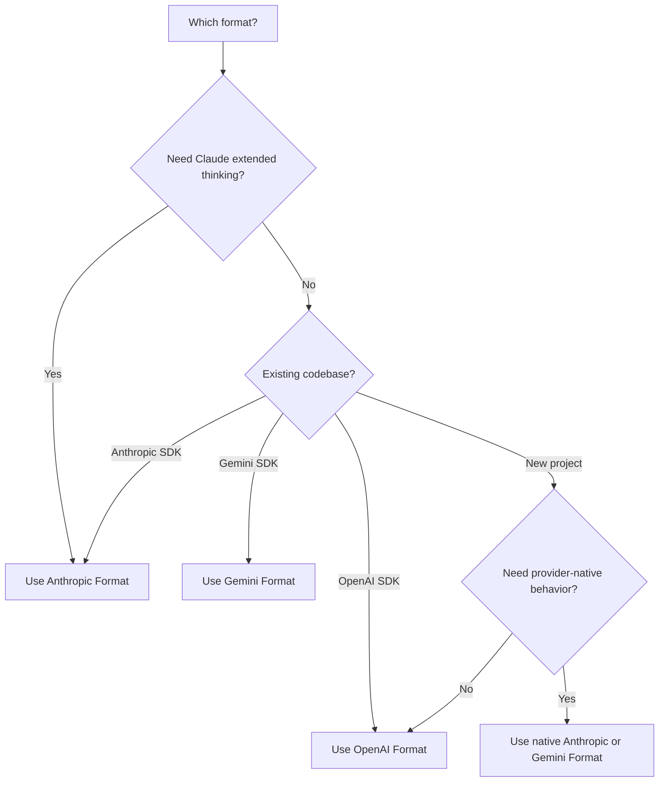

<span data-mintlify-rebuild="2026-05-19-after-mdx-parse-fix" aria-hidden="true" />

## Visão Geral

AI Sonar suporta **três formatos de API nativos** com uma única chave de API. Escolha o formato que melhor se adapta ao seu caso de uso - sem necessidade de alterar configurações.

<CardGroup cols={3}>
  <Card title="Formato OpenAI" icon="plug">
    `/v1/chat/completions`
    Formato padrão, compatibilidade mais ampla
  </Card>
  <Card title="Formato Anthropic" icon="message">
    `/v1/messages`
    Raciocínio estendido, recursos nativos do Claude
  </Card>
  <Card title="Formato Gemini" icon="sparkles">
    `/v1beta/models/:model:generateContent`
    Integração com o ecossistema Google
  </Card>
</CardGroup>

## Por que Multi-Formato?

| Benefício | Descrição |
|---------|-------------|
| **Sem troca de SDK** | Use qualquer modelo com seu SDK preferido |
| **Recursos nativos** | Acesse funcionalidades específicas do formato |
| **Migração fácil** | Mude das APIs oficiais apenas alterando a URL base |
| **Faturamento único** | Uma conta, uma chave de API, todos os formatos |

## Comparação de Formatos

| Recurso | OpenAI | Anthropic | Gemini |
|---------|--------|-----------|--------|
| **Endpoint** | `/v1/chat/completions` | `/v1/messages` | `/v1beta/models/:model:generateContent` |
| **Cabeçalho de Autenticação** | `Authorization: Bearer` | `x-api-key` | `Authorization: Bearer` |
| **Prompt do Sistema** | No array `messages` | Campo separado `system` | Em `systemInstruction` |
| **Raciocínio Estendido** | ❌ | ✅ | ❌ |
| **Fluxo contínuo** | ✅ SSE | ✅ SSE | ✅ SSE |
| **Chamada de ferramentas** | ✅ | ✅ | ✅ |
| **Visão** | ✅ | ✅ | ✅ |

## Formato OpenAI

Use esta rota de compatibilidade para integrações OpenAI SDK existentes e fluxos portáteis de chat ou embeddings. Para comportamento nativo Claude ou Gemini, use o formato Anthropic ou Gemini abaixo.

```python
from openai import OpenAI

client = OpenAI(
    api_key="sk-your-api-key",
    base_url="https://api.aisonar.dev/v1"
)

# Portable chat works across many models
response = client.chat.completions.create(
    model="claude-sonnet-4-6",  # Claude via OpenAI format
    messages=[
        {"role": "system", "content": "You are a helpful assistant."},
        {"role": "user", "content": "Hello!"}
    ]
)
```

**Melhor para:**
- Uso geral
- Integrações existentes com o SDK OpenAI
- Compatibilidade máxima

## Formato Anthropic

API Messages nativa da Anthropic. Necessário para recursos específicos do Claude, como o raciocínio estendido.

```python
from anthropic import Anthropic

client = Anthropic(
    api_key="sk-your-api-key",
    base_url="https://api.aisonar.dev"  # No /v1 suffix!
)

message = client.messages.create(
    model="claude-sonnet-4-6",
    max_tokens=1024,
    system="You are a helpful assistant.",  # Separate system field
    messages=[
        {"role": "user", "content": "Hello!"}
    ]
)
```

### Raciocínio Estendido (Claude Opus 4.6)

Disponível apenas no formato Anthropic:

```python
message = client.messages.create(
    model="claude-opus-4-6",
    max_tokens=16000,
    thinking={
        "type": "enabled",
        "budget_tokens": 10000
    },
    messages=[{"role": "user", "content": "Solve this complex problem..."}]
)

# Access thinking process
for block in message.content:
    if block.type == "thinking":
        print(f"Thinking: {block.thinking}")
    elif block.type == "text":
        print(f"Answer: {block.text}")
```

**Melhor para:**
- Recursos específicos do Claude
- Modo de raciocínio estendido
- Usuários do SDK Anthropic nativo

## Formato Gemini

Formato nativo da API Google Gemini para integração ao ecossistema Google.

```bash
curl "https://api.aisonar.dev/v1beta/models/gemini-2.5-flash:generateContent" \
  -H "Authorization: Bearer sk-your-api-key" \
  -H "Content-Type: application/json" \
  -d '{
    "contents": [{
      "parts": [{"text": "Hello!"}]
    }],
    "systemInstruction": {
      "parts": [{"text": "You are a helpful assistant."}]
    }
  }'
```

### Streaming

```bash
curl "https://api.aisonar.dev/v1beta/models/gemini-2.5-flash:streamGenerateContent?alt=sse" \
  -H "Authorization: Bearer sk-your-api-key" \
  -H "Content-Type: application/json" \
  -d '{
    "contents": [{"parts": [{"text": "Write a story"}]}]
  }'
```

**Melhor para:**
- Integrações com Google Cloud
- Código existente do SDK Gemini
- Recursos nativos do Gemini

**Gemini Files e Cache:** A rota nativa do Gemini oferece `/upload/v1beta/files`, `/v1beta/files`, `/v1beta/files:register` e `/v1beta/cachedContents`. Files usa canais upstream compatíveis com a Gemini File API; recursos explícitos de Cache também podem ser roteados por canais Vertex AI. Recursos criados via AI Sonar ficam vinculados ao mesmo canal/key upstream para chamadas `generateContent` posteriores.

## Limite de compatibilidade de ferramentas

Ferramentas de função podem ser convertidas entre formatos quando a rota de destino oferece suporte. Ferramentas nativas do provedor devem permanecer na rota nativa:

- Ferramentas hospedadas e nativas do OpenAI Responses, como `tool_search`, `web_search`, `file_search`, `code_interpreter`, MCP, shell/apply_patch e ferramentas computer-use, exigem `/v1/responses`.
- Ferramentas server/native da Anthropic, como `web_search_*`, `web_fetch_*`, `code_execution_*`, `tool_search_*`, bash, computer-use e text-editor, exigem `/v1/messages`.
- Ferramentas integradas do Gemini, como `googleSearch`, `codeExecution`, `urlContext`, `computerUse` e campos `tools` semelhantes, exigem `/v1beta`.

Se a AI Sonar não puder rotear uma solicitação com ferramentas nativas para um caminho upstream compatível com formato nativo, ela retorna um erro unsupported-field explícito em vez de descartar a ferramenta silenciosamente ou fingir que ela é uma função de Chat Completions. Ferramentas de função definidas pelo usuário continuam sendo o caminho mais portátil.

## Escolhendo o Formato Certo



## Guias de Migração

### A partir da API Oficial da OpenAI

```python
# Before (OpenAI)
client = OpenAI(api_key="sk-openai-key")

# After (AI Sonar)
client = OpenAI(
    api_key="sk-your-api-key",
    base_url="https://api.aisonar.dev/v1"  # Add this line
)
# That's it! Same code works
```

### A partir da API Oficial da Anthropic

```python
# Before (Anthropic)
client = Anthropic(api_key="sk-ant-key")

# After (AI Sonar)
client = Anthropic(
    api_key="sk-your-api-key",
    base_url="https://api.aisonar.dev"  # Add this line (no /v1!)
)
```

### A partir do Google AI Studio

```python
# Before (Google)
import google.generativeai as genai
genai.configure(api_key="google-api-key")

# After (AI Sonar) - Use REST API
import requests

response = requests.post(
    "https://api.aisonar.dev/v1beta/models/gemini-2.5-flash:generateContent",
    headers={"Authorization": "Bearer sk-your-api-key"},
    json={"contents": [{"parts": [{"text": "Hello"}]}]}
)
```

## Compatibilidade entre Modelos

A mágica do AI Sonar: use **qualquer SDK** com **qualquer modelo**. O gateway lida automaticamente com a conversão de formatos.

### Qualquer SDK → Qualquer Modelo

```python
# Anthropic SDK with GPT-4o (auto-converts to OpenAI format)
from anthropic import Anthropic

client = Anthropic(
    api_key="sk-your-api-key",
    base_url="https://api.aisonar.dev"
)

response = client.messages.create(
    model="gpt-4o",  # ✅ Works! Auto-converted
    max_tokens=1024,
    messages=[{"role": "user", "content": "Hello!"}]
)

# Same compatibility SDK for portable chat; native-only features still need native routes
response = client.messages.create(model="gemini-2.5-flash", ...)  # ✅ Works!
response = client.messages.create(model="deepseek-r1", ...)       # ✅ Works!
```

### SDK OpenAI → Todos os Modelos

```python
from openai import OpenAI

client = OpenAI(base_url="https://api.aisonar.dev/v1", api_key="sk-...")

# These portable chat calls use the same /v1 compatibility SDK:
response = client.chat.completions.create(model="gpt-4o", ...)
response = client.chat.completions.create(model="claude-sonnet-4-6", ...)
response = client.chat.completions.create(model="gemini-2.5-flash", ...)
```

### Comparação entre Plataformas

| Plataforma | Formato OpenAI | Formato Anthropic | Formato Gemini | Responses API |
|----------|:---:|:---:|:---:|:---:|
| **AI Sonar** | ✅ Todos os modelos | ✅ Todos os modelos | ✅ Todos os modelos | ✅ Todos os modelos |
| OpenRouter | ✅ Todos os modelos | ❌ | ❌ | ❌ |
| Together AI | ✅ Todos os modelos | ❌ | ❌ | ❌ |
| Fireworks | ✅ Todos os modelos | ❌ | ❌ | ❌ |

<Note>
Embora a compatibilidade entre formatos funcione para a maioria dos recursos, funcionalidades específicas de formato (como o raciocínio estendido da Anthropic) exigem o uso do formato nativo.
</Note>
