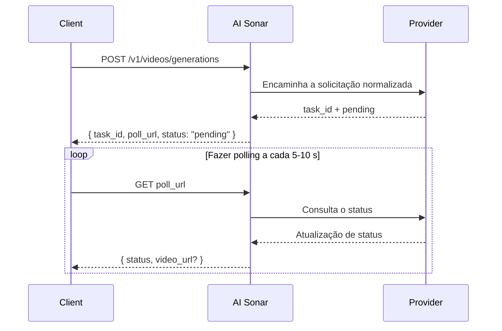

## Visão geral

A AI Sonar oferece geração de vídeo por meio de uma API unificada. A geração é **assíncrona**: você envia uma solicitação, recebe `task_id` e `poll_url`, e então faz polling até obter o resultado final.

### Disponibilidade e polling

Você pode consultar o inventário público atual de modelos de vídeo pela [Models API](/pt/api-reference/models/list-models) ou pela [página de modelos](https://aisonar.dev/models).

Se uma resposta de criação retornar `poll_url`, chame exatamente essa URL. Quando ela apontar para `/v1/tasks/{id}`, trate-a como o endpoint fixo canônico de status.

### Comportamento de modelos e mídia

O comportamento de áudio depende do modelo. Na AI Sonar, a família Veo 3 é tratada por padrão como áudio ativado quando `output_audio` é omitido. Outros modelos públicos são silenciosos por padrão ou não expõem um alternador estável de áudio.

Em produção, prefira URLs `https` públicas para imagens, vídeos e áudio. Modelos compatíveis continuam aceitando URLs `data:`, mas URLs públicas são mais robustas para retries, observabilidade e depuração.

### Fluxo assíncrono



## Operações públicas atuais

O contrato público de vídeo da AI Sonar hoje se concentra nestas operações:

- `text-to-video`
- `image-to-video`
- `reference-to-video`
- `start-end-to-video`
- `video-to-video`
- `motion-control`

O contrato também aceita `audio-to-video` e `video-extension` para fluxos específicos de alguns modelos, mas nesta compilação da documentação não há nenhum modelo amplamente habilitado que publique essas capacidades.

## Matriz de capacidades

**Legenda**: ✅ Existe pelo menos um modelo público atualmente habilitado nessa família de provedores com essa capacidade | ❌ Não há modelos públicos atualmente habilitados com essa capacidade

| Série | T2V | I2V | Referência | Início-Fim | V2V | Movimento |
|-------|-----|-----|------------|------------|-----|------------|
| OpenAI | ✅ | ✅ | ❌ | ❌ | ❌ | ❌ |
| Kuaishou | ✅ | ✅ | ✅ | ✅ | ✅ | ✅ |
| Google | ✅ | ✅ | ✅ | ✅ | ❌ | ❌ |
| ByteDance | ✅ | ✅ | ❌ | ❌ | ❌ | ❌ |
| MiniMax | ✅ | ✅ | ❌ | ❌ | ❌ | ❌ |
| Alibaba | ✅ | ✅ | ✅ | ❌ | ❌ | ❌ |
| Shengshu | ✅ | ✅ | ✅ | ✅ | ❌ | ❌ |
| xAI | ✅ | ✅ | ❌ | ❌ | ✅ | ❌ |
| Outros | ❌ | ❌ | ❌ | ❌ | ✅ | ❌ |

### Definições de capacidades

- **T2V (Text-to-Video)**: gerar vídeo a partir de um prompt de texto
- **I2V (Image-to-Video)**: gerar vídeo a partir de uma imagem inicial; para a compatibilidade mais ampla, prefira `image_url`
- **Referência**: condicionar a geração usando uma ou mais imagens de referência via `reference_images`
- **Início-Fim**: controlar o primeiro e o último quadro com `start_image` e `end_image`
- **V2V (Video-to-Video)**: usar um vídeo existente como entrada principal
- **Movimento**: combinar uma imagem do sujeito com um vídeo de referência de movimento

## Inventário público atual de modelos


### Kuaishou

| Modelo | Operações públicas |
|--------|--------------------|
| `kling-3.0-motion-control` | Controle de movimento |
| `kling-3.0-video` | Texto para vídeo, imagem para vídeo, início-fim para vídeo, referências de elementos |
| `kling-v2.1-master` | Texto para vídeo, imagem para vídeo |
| `kling-v2.1-pro` | Imagem para vídeo, início-fim para vídeo |
| `kling-v2.1-standard` | Imagem para vídeo |
| `kling-v2.5-turbo-pro` | Texto para vídeo, imagem para vídeo, início-fim para vídeo |
| `kling-v2.5-turbo-std` | Texto para vídeo, imagem para vídeo |
| `kling-v2.6-pro` | Texto para vídeo, imagem para vídeo, início-fim para vídeo |
| `kling-v2.6-std` | Texto para vídeo, imagem para vídeo |
| `kling-v3.0-pro` | Texto para vídeo, imagem para vídeo, início-fim para vídeo |
| `kling-v3.0-std` | Texto para vídeo, imagem para vídeo, início-fim para vídeo |
| `kling-video-o1-pro` | Texto para vídeo, imagem para vídeo, referência para vídeo, início-fim para vídeo, vídeo para vídeo |
| `kling-video-o1-std` | Texto para vídeo, imagem para vídeo, referência para vídeo, início-fim para vídeo, vídeo para vídeo |

### Google

| Modelo | Operações públicas |
|--------|--------------------|
| `veo3` | Texto para vídeo, imagem para vídeo |
| `veo3-fast` | Texto para vídeo, imagem para vídeo |
| `veo3-pro` | Texto para vídeo, imagem para vídeo |
| `veo3.1` | Texto para vídeo, imagem para vídeo, referência para vídeo, início-fim para vídeo |
| `veo3.1-fast` | Texto para vídeo, imagem para vídeo, referência para vídeo, início-fim para vídeo |
| `veo3.1-pro` | Texto para vídeo, imagem para vídeo, início-fim para vídeo |

### ByteDance

| Modelo | Operações públicas |
|--------|--------------------|
| `seedance-1.5-pro` | Texto para vídeo, imagem para vídeo |

### MiniMax

| Modelo | Operações públicas |
|--------|--------------------|
| `hailuo-2.3-fast` | Imagem para vídeo |
| `hailuo-2.3-pro` | Texto para vídeo, imagem para vídeo |
| `hailuo-2.3-standard` | Texto para vídeo, imagem para vídeo |

### Alibaba

| Modelo | Operações públicas |
|--------|--------------------|
| `wan-2.2-plus` | Texto para vídeo, imagem para vídeo |
| `wan-2.5` | Texto para vídeo, imagem para vídeo |
| `wan-2.6` | Texto para vídeo, imagem para vídeo, referência para vídeo |

### Shengshu

| Modelo | Operações públicas |
|--------|--------------------|
| `viduq2` | Texto para vídeo, referência para vídeo |
| `viduq2-pro` | Imagem para vídeo, referência para vídeo, início-fim para vídeo |
| `viduq2-pro-fast` | Imagem para vídeo, início-fim para vídeo |
| `viduq2-turbo` | Imagem para vídeo, início-fim para vídeo |
| `viduq3-pro` | Texto para vídeo, imagem para vídeo, início-fim para vídeo |
| `viduq3-turbo` | Texto para vídeo, imagem para vídeo, início-fim para vídeo |

### xAI

| Modelo | Operações públicas |
|--------|--------------------|
| `grok-imagine-video` | Texto para vídeo, imagem para vídeo, reference-to-video, video-to-video |
| `grok-imagine-video-1.5-preview` | Imagem para vídeo |
| `grok-imagine-image-to-video` | Imagem para vídeo |
| `grok-imagine-text-to-video` | Texto para vídeo |
| `grok-imagine-upscale` | Vídeo para vídeo |

### Outros

| Modelo | Operações públicas |
|--------|--------------------|
| `topaz-video-upscale` | Vídeo para vídeo |

## Exemplos de uso

### Texto para vídeo

```python
response = requests.post(f"{BASE}/videos/generations",
    headers=headers,
    json={
        "model": "veo3.1",
        "prompt": "A calm cinematic shot of a cat walking through a sunlit garden.",
        "operation": "text-to-video",
        "duration": 4,
        "aspect_ratio": "16:9"
    }
)
```

### Imagem para vídeo

```python
response = requests.post(f"{BASE}/videos/generations",
    headers=headers,
    json={
        "model": "hailuo-2.3-standard",
        "prompt": "The scene begins from the provided image and adds gentle natural motion.",
        "operation": "image-to-video",
        "image_url": "https://example.com/portrait.jpg",
        "duration": 6,
        "aspect_ratio": "16:9"
    }
)
```

### Kling 3.0 Elements

Use `kling_elements` com `kling-3.0-video` quando precisar de referências de elementos. Forneça uma solicitação condicionada por imagem (`image_url`, `image_urls`, `start_image` ou `end_image`) e referencie cada elemento no prompt com `@name`. Não combine `kling_elements` com `output_audio=true`; omita `output_audio` ou defina como `false` em solicitações com referências de elementos.

```python
response = requests.post(f"{BASE}/videos/generations",
    headers=headers,
    json={
        "model": "kling-3.0-video",
        "prompt": "Place @hero_bag on a studio turntable with soft product lighting.",
        "operation": "image-to-video",
        "image_url": "https://example.com/studio-start.png",
        "duration": 5,
        "resolution": "720p",
        "kling_elements": [
            {
                "name": "hero_bag",
                "description": "black leather handbag",
                "element_input_urls": [
                    "https://example.com/bag-front.png",
                    "https://example.com/bag-side.png"
                ]
            }
        ]
    }
)
```

### Referência para vídeo

Para `seedance-2.0` e `seedance-2.0-fast`, a AI Sonar suporta atualmente até 9 imagens de referência, além de até 3 vídeos de referência e 3 áudios de referência. `duration` controla apenas a duração do resultado gerado; ele não define um limite separado para a duração do vídeo de referência de entrada. Para `grok-imagine-video`, reference-to-video aceita até 7 referências de imagem (`reference_images` ou `image_urls`) e `duration` é limitado a 10 segundos. Não combine referências de imagem com entradas de primeiro frame `image_url` / `image`. `grok-imagine-video-1.5-preview` é apenas image-to-video.

```python
response = requests.post(f"{BASE}/videos/generations",
    headers=headers,
    json={
        "model": "veo3.1",
        "prompt": "Keep the same subject identity and palette while adding subtle motion.",
        "operation": "reference-to-video",
        "reference_images": [
            "https://example.com/ref-a.jpg",
            "https://example.com/ref-b.jpg"
        ],
        "duration": 8,
        "resolution": "720p",
        "aspect_ratio": "9:16"
    }
)
```

### Controle de quadro inicial e final

```python
response = requests.post(f"{BASE}/videos/generations",
    headers=headers,
    json={
        "model": "viduq2-pro",
        "prompt": "Smooth transition from day to night.",
        "operation": "start-end-to-video",
        "start_image": "https://example.com/city-day.jpg",
        "end_image": "https://example.com/city-night.jpg",
        "duration": 5,
        "resolution": "720p",
        "aspect_ratio": "16:9"
    }
)
```

### Vídeo para vídeo

Para video-to-video com `grok-imagine-video`, envie uma URL HTTPS pública `.mp4` em `video_url`. O AI Sonar traduz isso para o corpo REST xAI `video.url`. Você pode definir `resolution` como `480p` ou `720p`; `duration` e `aspect_ratio` não são aceitos nesse fluxo de edição.

```python
response = requests.post(f"{BASE}/videos/generations",
    headers=headers,
    json={
        "model": "topaz-video-upscale",
        "operation": "video-to-video",
        "video_url": "https://example.com/source.mp4",
        "prompt": "Upscale this clip while preserving the original motion."
    }
)
```

### Controle de movimento

```python
response = requests.post(f"{BASE}/videos/generations",
    headers=headers,
    json={
        "model": "kling-3.0-motion-control",
        "operation": "motion-control",
        "prompt": "Keep the subject stable while following the motion reference.",
        "image_url": "https://example.com/subject.png",
        "video_url": "https://example.com/motion.mp4",
        "resolution": "720p"
    }
)
```

## Referência de parâmetros

| Parâmetro | Tipo | Observação |
|-----------|------|------------|
| `operation` | string | Em produção, vale a pena informá-lo explicitamente |
| `image_url` | string | Forma mais robusta de entrada de imagem |
| `image` | string | URL `data:` útil para testes locais e integrações pequenas |
| `reference_images` | string[] | Campo público canônico para condicionamento por referências |
| `reference_image_type` | string | Seletor opcional `asset` / `style` |
| `video_url` | string | Obrigatório para os modelos públicos atuais de `video-to-video` e `motion-control` |
| `audio_url` | string | Para fluxos específicos de áudio para vídeo |
| `output_audio` | boolean | A família Veo 3 trata a omissão como `true`. `kling-3.0-video` aceita esse seletor para o controle upstream `sound` e fica silencioso por padrão quando omitido. |

## Guia rápido de escolha de modelo

<CardGroup cols={2}>
  <Card title="Maior qualidade" icon="crown">
    Se a qualidade for mais importante que a velocidade, **veo3.1-pro**, **kling-video-o1-pro** e **viduq3-pro** são escolhas fortes.
  </Card>
  <Card title="Iteração rápida" icon="bolt">
    Para ciclos rápidos, **veo3.1-fast**, **hailuo-2.3-fast** e **viduq3-turbo** são bons pontos de partida.
  </Card>
  <Card title="Fluxos com referência" icon="images">
    Se você precisa de controle dedicado por imagens de referência, comece com **veo3.1**, **veo3.1-fast**, **wan-2.6** ou **kling-video-o1-pro / std**.
  </Card>
  <Card title="Vídeo para vídeo" icon="film">
    Hoje, os principais caminhos públicos geralmente habilitados para `video-to-video` são **topaz-video-upscale**, **grok-imagine-upscale** e **kling-video-o1-pro / std**.
  </Card>
</CardGroup>

## Cobrança

A cobrança depende do modelo. Alguns modelos públicos de vídeo se comportam, na prática, como modelos cobrados por solicitação, enquanto outros se aproximam mais de uma cobrança por segundo. Para a superfície pública de preços atual, consulte a [página de modelos](https://aisonar.dev/models) ou a [Pricing API](/pt/api-reference/pricing/get-pricing).
