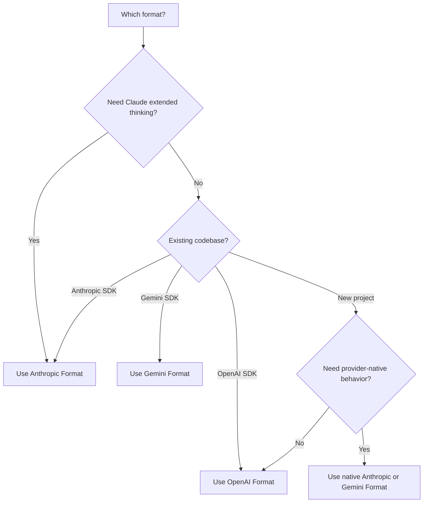

<span data-mintlify-rebuild="2026-05-19-after-mdx-parse-fix" aria-hidden="true" />

## Genel Bakış

AI Sonar tek bir API anahtarıyla **üç yerel API biçimini** destekler. Kullanım durumunuza en uygun biçimi seçin — herhangi bir yapılandırma değişikliği gerekli değildir.

<CardGroup cols={3}>
  <Card title="OpenAI Biçimi" icon="plug">
    `/v1/chat/completions`
    Standart biçim, en geniş uyumluluk
  </Card>
  <Card title="Anthropic Biçimi" icon="message">
    `/v1/messages`
    Genişletilmiş düşünme, yerel Claude özellikleri
  </Card>
  <Card title="Gemini Biçimi" icon="sparkles">
    `/v1beta/models/:model:generateContent`
    Google ekosistemi entegrasyonu
  </Card>
</CardGroup>

## Neden Çoklu-Format?

| Avantaj | Açıklama |
|---------|-------------|
| **SDK değişikliği gerekmez** | Tercih ettiğiniz SDK ile herhangi bir modeli kullanın |
| **Yerel özellikler** | Biçime özgü yeteneklere erişin |
| **Yerel öncelikli geçiş** | Davranış önemli olduğunda yerel sağlayıcı rotalarını koruyun; mevcut OpenAI tarzı istemciler için `/v1` OpenAI uyumluluğunu kullanın |
| **Tek faturalama** | Tek hesap, tek API anahtarı, tüm biçimler |

## Biçim Karşılaştırması

| Özellik | OpenAI | Anthropic | Gemini |
|---------|--------|-----------|--------|
| **Uç Nokta** | `/v1/chat/completions` | `/v1/messages` | `/v1beta/models/:model:generateContent` |
| **Yetkilendirme Başlığı** | `Authorization: Bearer` | `x-api-key` | `Authorization: Bearer` |
| **Sistem İstemi** | messages dizisinde | Ayrı `system` alanı | `systemInstruction` içinde |
| **Genişletilmiş Düşünme** | ❌ | ✅ | ❌ |
| **Akış** | ✅ SSE | ✅ SSE | ✅ SSE |
| **Araç Çağırma** | ✅ | ✅ | ✅ |
| **Görsel** | ✅ | ✅ | ✅ |

## OpenAI Biçimi

Mevcut OpenAI SDK entegrasyonları ve taşınabilir sohbet veya embedding akışları için bu uyumluluk yolunu kullanın. Claude veya Gemini yerel davranışı için aşağıdaki Anthropic veya Gemini biçimini kullanın.

```python
from openai import OpenAI

client = OpenAI(
    api_key="sk-your-api-key",
    base_url="https://api.aisonar.dev/v1"
)

# Portable chat works across many models
response = client.chat.completions.create(
    model="claude-sonnet-4-6",  # Claude via OpenAI format
    messages=[
        {"role": "system", "content": "You are a helpful assistant."},
        {"role": "user", "content": "Hello!"}
    ]
)
```

**En iyi kullanım alanları:**
- Genel kullanım
- Mevcut OpenAI SDK entegrasyonları
- Azami uyumluluk

## Anthropic Biçimi

Yerel Anthropic Messages API'si. Genişletilmiş düşünme gibi Claude'a özgü özellikler için gereklidir.

```python
from anthropic import Anthropic

client = Anthropic(
    api_key="sk-your-api-key",
    base_url="https://api.aisonar.dev"  # No /v1 suffix!
)

message = client.messages.create(
    model="claude-sonnet-4-6",
    max_tokens=1024,
    system="You are a helpful assistant.",  # Separate system field
    messages=[
        {"role": "user", "content": "Hello!"}
    ]
)
```

### Genişletilmiş Düşünme (Claude Opus 4.6)

Sadece Anthropic biçiminde kullanılabilir:

```python
message = client.messages.create(
    model="claude-opus-4-6",
    max_tokens=16000,
    thinking={
        "type": "enabled",
        "budget_tokens": 10000
    },
    messages=[{"role": "user", "content": "Solve this complex problem..."}]
)

# Access thinking process
for block in message.content:
    if block.type == "thinking":
        print(f"Thinking: {block.thinking}")
    elif block.type == "text":
        print(f"Answer: {block.text}")
```

**En iyi kullanım alanları:**
- Claude'a özgü özellikler
- Genişletilmiş düşünme modu
- Yerel Anthropic SDK kullanıcıları

## Gemini Biçimi

Google ekosistemi entegrasyonu için yerel Google Gemini API biçimi.

```bash
curl "https://api.aisonar.dev/v1beta/models/gemini-2.5-flash:generateContent" \
  -H "Authorization: Bearer sk-your-api-key" \
  -H "Content-Type: application/json" \
  -d '{
    "contents": [{
      "parts": [{"text": "Hello!"}]
    }],
    "systemInstruction": {
      "parts": [{"text": "You are a helpful assistant."}]
    }
  }'
```

### Akış

```bash
curl "https://api.aisonar.dev/v1beta/models/gemini-2.5-flash:streamGenerateContent?alt=sse" \
  -H "Authorization: Bearer sk-your-api-key" \
  -H "Content-Type: application/json" \
  -d '{
    "contents": [{"parts": [{"text": "Write a story"}]}]
  }'
```

**En iyi kullanım alanları:**
- Google Cloud entegrasyonları
- Mevcut Gemini SDK kodu
- Yerel Gemini özellikleri

**Gemini Files ve Cache:** Yerel Gemini rotası `/upload/v1beta/files`, `/v1beta/files`, `/v1beta/files:register` ve `/v1beta/cachedContents` uç noktalarını destekler. Files, Gemini File API uyumlu upstream kanallarını kullanır; açık Cache kaynakları Vertex AI kanalları üzerinden de yönlendirilebilir. AI Sonar üzerinden oluşturulan kaynaklar sonraki `generateContent` çağrıları için aynı upstream kanal/key ile bağlı kalır.

## Araç Uyumluluğu Sınırı

Fonksiyon araçları, hedef rota desteklediğinde formatlar arasında dönüştürülebilir. Sağlayıcıya özgü yerel araçlar kendi yerel rotasında kalmalıdır:

- OpenAI Responses barındırılan ve yerel araçları, örneğin `tool_search`, `web_search`, `file_search`, `code_interpreter`, MCP, shell/apply_patch ve computer-use araçları için `/v1/responses` gerekir.
- Anthropic server/native araçları, örneğin `web_search_*`, `web_fetch_*`, `code_execution_*`, `tool_search_*`, bash, computer-use ve text-editor araçları için `/v1/messages` gerekir.
- Gemini yerleşik araçları, örneğin `googleSearch`, `codeExecution`, `urlContext`, `computerUse` ve benzer `tools` alanları için `/v1beta` gerekir.

AI Sonar, yerel araç içeren bir isteği yerel formatı destekleyen upstream rotasına yönlendiremiyorsa aracı sessizce düşürmek veya Chat Completions fonksiyonu gibi göstermek yerine açık bir unsupported-field hatası döndürür. Kullanıcı tanımlı fonksiyon araçları en taşınabilir araç yolu olmaya devam eder.

## Doğru Biçimi Seçme



## Geçiş Kılavuzları

### OpenAI Resmi API'sından

```python
# Before (OpenAI)
client = OpenAI(api_key="sk-openai-key")

# After (AI Sonar)
client = OpenAI(
    api_key="sk-your-api-key",
    base_url="https://api.aisonar.dev/v1"  # Add this line
)
# That's it! Same code works
```

### Anthropic Resmi API'sından

```python
# Before (Anthropic)
client = Anthropic(api_key="sk-ant-key")

# After (AI Sonar)
client = Anthropic(
    api_key="sk-your-api-key",
    base_url="https://api.aisonar.dev"  # Add this line (no /v1!)
)
```

### Google AI Studio'dan

```python
# Before (Google)
import google.generativeai as genai
genai.configure(api_key="google-api-key")

# After (AI Sonar) - Use REST API
import requests

response = requests.post(
    "https://api.aisonar.dev/v1beta/models/gemini-2.5-flash:generateContent",
    headers={"Authorization": "Bearer sk-your-api-key"},
    json={"contents": [{"parts": [{"text": "Hello"}]}]}
)
```

## Çapraz Model Uyumluluğu

AI Sonar'nin gücü: **herhangi bir SDK** ile **herhangi bir modeli** kullanın. Ağ geçidi biçim dönüşümünü otomatik olarak yönetir.

### Herhangi bir SDK → Herhangi bir Model

```python
# Anthropic SDK with GPT-4o (auto-converts to OpenAI format)
from anthropic import Anthropic

client = Anthropic(
    api_key="sk-your-api-key",
    base_url="https://api.aisonar.dev"
)

response = client.messages.create(
    model="gpt-4o",  # ✅ Works! Auto-converted
    max_tokens=1024,
    messages=[{"role": "user", "content": "Hello!"}]
)

# Same compatibility SDK for portable chat; native-only features still need native routes
response = client.messages.create(model="gemini-2.5-flash", ...)  # ✅ Works!
response = client.messages.create(model="deepseek-r1", ...)       # ✅ Works!
```

### OpenAI SDK → Tüm Modeller

```python
from openai import OpenAI

client = OpenAI(base_url="https://api.aisonar.dev/v1", api_key="sk-...")

# These portable chat calls use the same /v1 compatibility SDK:
response = client.chat.completions.create(model="gpt-4o", ...)
response = client.chat.completions.create(model="claude-sonnet-4-6", ...)
response = client.chat.completions.create(model="gemini-2.5-flash", ...)
```

### Sektör Karşılaştırması

| Platform | OpenAI Biçimi | Anthropic Biçimi | Gemini Biçimi | Responses API |
|----------|:---:|:---:|:---:|:---:|
| **AI Sonar** | ✅ Tüm modeller | ✅ Tüm modeller | ✅ Tüm modeller | ✅ Tüm modeller |
| OpenRouter | ✅ Tüm modeller | ❌ | ❌ | ❌ |
| Together AI | ✅ Tüm modeller | ❌ | ❌ | ❌ |
| Fireworks | ✅ Tüm modeller | ❌ | ❌ | ❌ |

<Note>
Çapraz biçim çoğu özellik için çalışsa da, biçime özgü özellikler (ör. Anthropic genişletilmiş düşünme) yerel biçimi gerektirir.
</Note>
