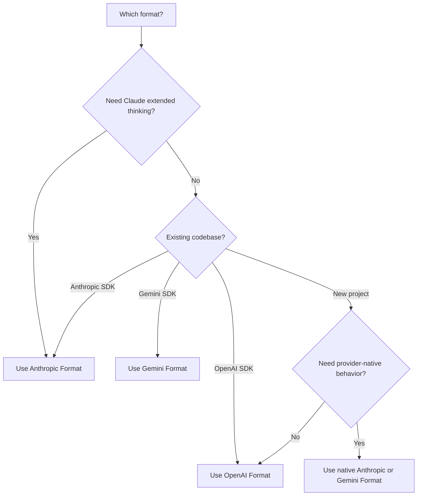

<span data-mintlify-rebuild="2026-05-19-after-mdx-parse-fix" aria-hidden="true" />

## Tổng quan

AI Sonar hỗ trợ **ba định dạng API gốc** với một khóa API duy nhất. Chọn định dạng phù hợp nhất với trường hợp sử dụng của bạn — không cần thay đổi cấu hình.

<CardGroup cols={3}>
  <Card title="Định dạng OpenAI" icon="plug">
    `/v1/chat/completions`
    Định dạng tiêu chuẩn, tương thích rộng nhất
  </Card>
  <Card title="Định dạng Anthropic" icon="message">
    `/v1/messages`
    Tư duy mở rộng, các tính năng Claude nguyên gốc
  </Card>
  <Card title="Định dạng Gemini" icon="sparkles">
    `/v1beta/models/:model:generateContent`
    Tích hợp hệ sinh thái Google
  </Card>
</CardGroup>

## Tại sao hỗ trợ đa định dạng?

| Lợi ích | Mô tả |
|---------|-------------|
| **No SDK switching** | Sử dụng bất kỳ mô hình nào với SDK bạn ưa thích |
| **Native features** | Truy cập các khả năng riêng theo định dạng |
| **Di chuyển ưu tiên gốc** | Giữ các tuyến gốc của nhà cung cấp khi hành vi là quan trọng; dùng khả năng tương thích OpenAI `/v1` cho các client kiểu OpenAI hiện có |
| **Single billing** | Một tài khoản, một khóa API, tất cả các định dạng |

## So sánh định dạng

| Tính năng | OpenAI | Anthropic | Gemini |
|---------|--------|-----------|--------|
| **Endpoint** | `/v1/chat/completions` | `/v1/messages` | `/v1beta/models/:model:generateContent` |
| **Tiêu đề xác thực** | `Authorization: Bearer` | `x-api-key` | `Authorization: Bearer` |
| **System Prompt** | Trong mảng `messages` | Trường `system` riêng biệt | Trong `systemInstruction` |
| **Extended Thinking** | ❌ | ✅ | ❌ |
| **Phát trực tuyến** | ✅ SSE | ✅ SSE | ✅ SSE |
| **Gọi công cụ** | ✅ | ✅ | ✅ |
| **Vision** | ✅ | ✅ | ✅ |

## Định dạng OpenAI

Hãy dùng tuyến tương thích này cho các tích hợp OpenAI SDK hiện có và các luồng chat hoặc embedding di động. Với hành vi gốc của Claude hoặc Gemini, hãy dùng định dạng Anthropic hoặc Gemini bên dưới.

```python
from openai import OpenAI

client = OpenAI(
    api_key="sk-your-api-key",
    base_url="https://api.aisonar.dev/v1"
)

# Portable chat works across many models
response = client.chat.completions.create(
    model="claude-sonnet-4-6",  # Claude via OpenAI format
    messages=[
        {"role": "system", "content": "You are a helpful assistant."},
        {"role": "user", "content": "Hello!"}
    ]
)
```

**Phù hợp cho:**
- Sử dụng chung
- Các tích hợp hiện có với OpenAI SDK
- Tương thích tối đa

## Định dạng Anthropic

API Messages gốc của Anthropic. Cần thiết cho các tính năng riêng của Claude như tư duy mở rộng.

```python
from anthropic import Anthropic

client = Anthropic(
    api_key="sk-your-api-key",
    base_url="https://api.aisonar.dev"  # No /v1 suffix!
)

message = client.messages.create(
    model="claude-sonnet-4-6",
    max_tokens=1024,
    system="You are a helpful assistant.",  # Separate system field
    messages=[
        {"role": "user", "content": "Hello!"}
    ]
)
```

### Tư duy mở rộng (Claude Opus 4.6)

Chỉ có sẵn ở định dạng Anthropic:

```python
message = client.messages.create(
    model="claude-opus-4-6",
    max_tokens=16000,
    thinking={
        "type": "enabled",
        "budget_tokens": 10000
    },
    messages=[{"role": "user", "content": "Solve this complex problem..."}]
)

# Access thinking process
for block in message.content:
    if block.type == "thinking":
        print(f"Thinking: {block.thinking}")
    elif block.type == "text":
        print(f"Answer: {block.text}")
```

**Phù hợp cho:**
- Các tính năng riêng của Claude
- Chế độ tư duy mở rộng
- Người dùng Anthropic SDK gốc

## Định dạng Gemini

Định dạng API Gemini gốc của Google để tích hợp trong hệ sinh thái Google.

```bash
curl "https://api.aisonar.dev/v1beta/models/gemini-2.5-flash:generateContent" \
  -H "Authorization: Bearer sk-your-api-key" \
  -H "Content-Type: application/json" \
  -d '{
    "contents": [{
      "parts": [{"text": "Hello!"}]
    }],
    "systemInstruction": {
      "parts": [{"text": "You are a helpful assistant."}]
    }
  }'
```

### Phát luồng

```bash
curl "https://api.aisonar.dev/v1beta/models/gemini-2.5-flash:streamGenerateContent?alt=sse" \
  -H "Authorization: Bearer sk-your-api-key" \
  -H "Content-Type: application/json" \
  -d '{
    "contents": [{"parts": [{"text": "Write a story"}]}]
  }'
```

**Phù hợp cho:**
- Tích hợp Google Cloud
- Mã nguồn sẵn có với Gemini SDK
- Các tính năng gốc của Gemini

**Gemini Files và Cache:** Tuyến Gemini gốc hỗ trợ `/upload/v1beta/files`, `/v1beta/files`, `/v1beta/files:register` và `/v1beta/cachedContents`. Files dùng các kênh upstream tương thích Gemini File API; tài nguyên Cache tường minh cũng có thể đi qua kênh Vertex AI. Tài nguyên tạo qua AI Sonar được gắn với cùng channel/key upstream cho các lần gọi `generateContent` sau đó.

## Ranh giới tương thích công cụ

Công cụ hàm có thể được chuyển đổi giữa các định dạng khi tuyến đích hỗ trợ. Công cụ gốc của nhà cung cấp phải ở lại tuyến gốc của nó:

- Công cụ hosted và native của OpenAI Responses như `tool_search`, `web_search`, `file_search`, `code_interpreter`, MCP, shell/apply_patch và công cụ computer-use cần `/v1/responses`.
- Công cụ server/native của Anthropic như `web_search_*`, `web_fetch_*`, `code_execution_*`, `tool_search_*`, bash, computer-use và text-editor cần `/v1/messages`.
- Công cụ tích hợp của Gemini như `googleSearch`, `codeExecution`, `urlContext`, `computerUse` và các trường `tools` tương tự cần `/v1beta`.

Nếu AI Sonar không thể định tuyến yêu cầu có công cụ native tới một đường upstream hỗ trợ định dạng native, hệ thống sẽ trả lỗi unsupported-field rõ ràng thay vì âm thầm bỏ công cụ hoặc giả vờ đó là hàm Chat Completions. Công cụ hàm do người dùng định nghĩa vẫn là đường công cụ dễ di chuyển nhất.

## Chọn định dạng phù hợp



## Hướng dẫn chuyển đổi

### Từ API chính thức của OpenAI

```python
# Before (OpenAI)
client = OpenAI(api_key="sk-openai-key")

# After (AI Sonar)
client = OpenAI(
    api_key="sk-your-api-key",
    base_url="https://api.aisonar.dev/v1"  # Add this line
)
# That's it! Same code works
```

### Từ API chính thức của Anthropic

```python
# Before (Anthropic)
client = Anthropic(api_key="sk-ant-key")

# After (AI Sonar)
client = Anthropic(
    api_key="sk-your-api-key",
    base_url="https://api.aisonar.dev"  # Add this line (no /v1!)
)
```

### Từ Google AI Studio

```python
# Before (Google)
import google.generativeai as genai
genai.configure(api_key="google-api-key")

# After (AI Sonar) - Use REST API
import requests

response = requests.post(
    "https://api.aisonar.dev/v1beta/models/gemini-2.5-flash:generateContent",
    headers={"Authorization": "Bearer sk-your-api-key"},
    json={"contents": [{"parts": [{"text": "Hello"}]}]}
)
```

## Tương thích đa mô hình

Sức mạnh của AI Sonar: sử dụng **bất kỳ SDK nào** với **bất kỳ mô hình nào**. Cổng sẽ tự động xử lý việc chuyển đổi định dạng.

### Bất kỳ SDK → Bất kỳ mô hình

```python
# Anthropic SDK with GPT-4o (auto-converts to OpenAI format)
from anthropic import Anthropic

client = Anthropic(
    api_key="sk-your-api-key",
    base_url="https://api.aisonar.dev"
)

response = client.messages.create(
    model="gpt-4o",  # ✅ Works! Auto-converted
    max_tokens=1024,
    messages=[{"role": "user", "content": "Hello!"}]
)

# Same compatibility SDK for portable chat; native-only features still need native routes
response = client.messages.create(model="gemini-2.5-flash", ...)  # ✅ Works!
response = client.messages.create(model="deepseek-r1", ...)       # ✅ Works!
```

### OpenAI SDK → Tất cả các mô hình

```python
from openai import OpenAI

client = OpenAI(base_url="https://api.aisonar.dev/v1", api_key="sk-...")

# These portable chat calls use the same /v1 compatibility SDK:
response = client.chat.completions.create(model="gpt-4o", ...)
response = client.chat.completions.create(model="claude-sonnet-4-6", ...)
response = client.chat.completions.create(model="gemini-2.5-flash", ...)
```

### So sánh giữa các nhà cung cấp

| Nền tảng | Định dạng OpenAI | Định dạng Anthropic | Định dạng Gemini | Responses API |
|----------|:---:|:---:|:---:|:---:|
| **AI Sonar** | ✅ Tất cả mô hình | ✅ Tất cả mô hình | ✅ Tất cả mô hình | ✅ Tất cả mô hình |
| OpenRouter | ✅ Tất cả mô hình | ❌ | ❌ | ❌ |
| Together AI | ✅ Tất cả mô hình | ❌ | ❌ | ❌ |
| Fireworks | ✅ Tất cả mô hình | ❌ | ❌ | ❌ |

<Note>
Mặc dù chuyển đổi giữa các định dạng hoạt động với hầu hết các tính năng, các tính năng đặc thù theo định dạng (như tính năng tư duy mở rộng của Anthropic) yêu cầu sử dụng định dạng gốc.
</Note>
