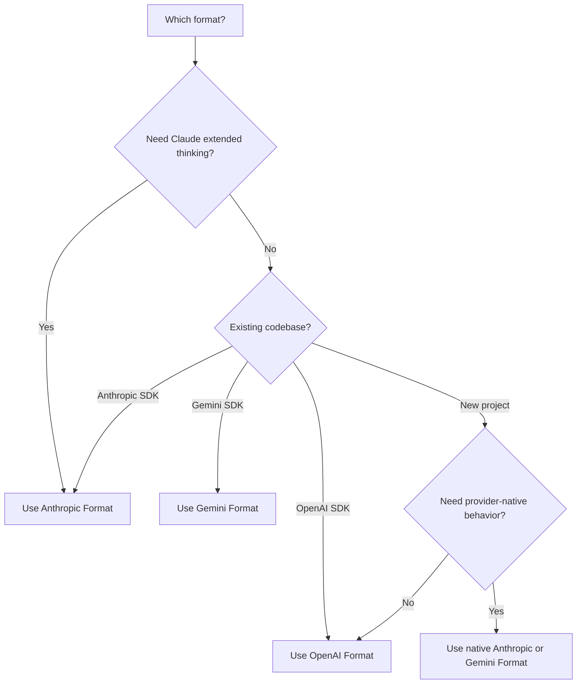

<span data-mintlify-rebuild="2026-05-19-after-mdx-parse-fix" aria-hidden="true" />

## 概覽

AI Sonar 支援使用單一 API 金鑰的 **三種原生 API 格式**。選擇最適合您使用情境的格式 — 無需變更任何設定。

<CardGroup cols={3}>
  <Card title="OpenAI 格式" icon="plug">
    `/v1/chat/completions`
    標準格式，最高相容性
  </Card>
  <Card title="Anthropic 格式" icon="message">
    `/v1/messages`
    延伸思考，Claude 原生功能
  </Card>
  <Card title="Gemini 格式" icon="sparkles">
    `/v1beta/models/:model:generateContent`
    整合 Google 生態系
  </Card>
</CardGroup>

## 為何使用多格式？

| 優勢 | 說明 |
|---------|-------------|
| **無須切換 SDK** | 使用您慣用的 SDK 操作任何模型 |
| **原生功能** | 存取格式專屬的能力 |
| **原生優先遷移** | 行為重要時保留供應商原生路由；已有 OpenAI 風格客戶端使用 `/v1` 相容路徑 |
| **單一計費** | 一個帳戶、一組 API 金鑰，支援所有格式 |

## 格式比較

| 功能 | OpenAI | Anthropic | Gemini |
|---------|--------|-----------|--------|
| **Endpoint** | `/v1/chat/completions` | `/v1/messages` | `/v1beta/models/:model:generateContent` |
| **認證標頭** | `Authorization: Bearer` | `x-api-key` | `Authorization: Bearer` |
| **System Prompt** | 位於 messages 陣列中 | 分開的 `system` 欄位 | 位於 `systemInstruction` 中 |
| **延伸思考** | ❌ | ✅ | ❌ |
| **串流** | ✅ SSE | ✅ SSE | ✅ SSE |
| **工具呼叫** | ✅ | ✅ | ✅ |
| **Vision** | ✅ | ✅ | ✅ |

## OpenAI 格式

這是面向已有 OpenAI SDK 整合、可移植聊天或 embeddings 的相容路由。需要 Claude 或 Gemini 原生行為時，請使用下面的 Anthropic 或 Gemini 格式。

```python
from openai import OpenAI

client = OpenAI(
    api_key="sk-your-api-key",
    base_url="https://api.aisonar.dev/v1"
)

# Portable chat works across many models
response = client.chat.completions.create(
    model="claude-sonnet-4-6",  # Claude via OpenAI format
    messages=[
        {"role": "system", "content": "You are a helpful assistant."},
        {"role": "user", "content": "Hello!"}
    ]
)
```

**適用情境：**
- 一般用途
- 既有 OpenAI SDK 整合
- 最高相容性

## Anthropic 格式

Anthropic 原生 Messages API。若要使用 Claude 特有功能（例如延伸思考），需使用此格式。

```python
from anthropic import Anthropic

client = Anthropic(
    api_key="sk-your-api-key",
    base_url="https://api.aisonar.dev"  # No /v1 suffix!
)

message = client.messages.create(
    model="claude-sonnet-4-6",
    max_tokens=1024,
    system="You are a helpful assistant.",  # Separate system field
    messages=[
        {"role": "user", "content": "Hello!"}
    ]
)
```

### 延伸思考（Claude Opus 4.6）

僅在 Anthropic 格式中提供：

```python
message = client.messages.create(
    model="claude-opus-4-6",
    max_tokens=16000,
    thinking={
        "type": "enabled",
        "budget_tokens": 10000
    },
    messages=[{"role": "user", "content": "Solve this complex problem..."}]
)

# Access thinking process
for block in message.content:
    if block.type == "thinking":
        print(f"Thinking: {block.thinking}")
    elif block.type == "text":
        print(f"Answer: {block.text}")
```

**適用情境：**
- Claude 特有功能
- 延伸思考模式
- 使用原生 Anthropic SDK 的用戶

## Gemini 格式

原生 Google Gemini API 格式，便於整合 Google 生態系。

```bash
curl "https://api.aisonar.dev/v1beta/models/gemini-2.5-flash:generateContent" \
  -H "Authorization: Bearer sk-your-api-key" \
  -H "Content-Type: application/json" \
  -d '{
    "contents": [{
      "parts": [{"text": "Hello!"}]
    }],
    "systemInstruction": {
      "parts": [{"text": "You are a helpful assistant."}]
    }
  }'
```

### 串流

```bash
curl "https://api.aisonar.dev/v1beta/models/gemini-2.5-flash:streamGenerateContent?alt=sse" \
  -H "Authorization: Bearer sk-your-api-key" \
  -H "Content-Type: application/json" \
  -d '{
    "contents": [{"parts": [{"text": "Write a story"}]}]
  }'
```

**適用情境：**
- Google Cloud 整合
- 既有 Gemini SDK 程式碼
- 原生 Gemini 功能

**Gemini Files 和 Cache：** 原生 Gemini 路徑支援 `/upload/v1beta/files`、`/v1beta/files`、`/v1beta/files:register` 和 `/v1beta/cachedContents`。Files 使用相容 Gemini File API 的上游渠道；顯式 Cache 資源也可以走 Vertex AI 渠道。透過 AI Sonar 建立的資源會綁定到同一個上游渠道/key，後續 `generateContent` 會沿用該綁定。

## 工具相容邊界

當目標路徑支援時，函式工具可以在不同格式之間轉換。供應商原生工具必須保留在對應的原生路徑上：

- OpenAI Responses 託管和原生工具，例如 `tool_search`、`web_search`、`file_search`、`code_interpreter`、MCP、shell/apply_patch 和 computer-use 工具，需要 `/v1/responses`。
- Anthropic server/native 工具，例如 `web_search_*`、`web_fetch_*`、`code_execution_*`、`tool_search_*`、bash、computer-use 和 text-editor 工具，需要 `/v1/messages`。
- Gemini 內建工具，例如 `googleSearch`、`codeExecution`、`urlContext`、`computerUse` 以及類似的 `tools` 欄位，需要 `/v1beta`。

如果 AI Sonar 無法將帶有原生工具的請求路由到支援原生格式的上游路徑，會回傳明確的 unsupported-field 錯誤，而不是靜默丟棄工具或偽裝成 Chat Completions 函式。使用者自訂函式工具仍然是最可攜的工具路徑。

## 選擇合適的格式



## 遷移指南

### 從 OpenAI 官方 API 遷移

```python
# Before (OpenAI)
client = OpenAI(api_key="sk-openai-key")

# After (AI Sonar)
client = OpenAI(
    api_key="sk-your-api-key",
    base_url="https://api.aisonar.dev/v1"  # Add this line
)
# That's it! Same code works
```

### 從 Anthropic 官方 API 遷移

```python
# Before (Anthropic)
client = Anthropic(api_key="sk-ant-key")

# After (AI Sonar)
client = Anthropic(
    api_key="sk-your-api-key",
    base_url="https://api.aisonar.dev"  # Add this line (no /v1!)
)
```

### 從 Google AI Studio 遷移

```python
# Before (Google)
import google.generativeai as genai
genai.configure(api_key="google-api-key")

# After (AI Sonar) - Use REST API
import requests

response = requests.post(
    "https://api.aisonar.dev/v1beta/models/gemini-2.5-flash:generateContent",
    headers={"Authorization": "Bearer sk-your-api-key"},
    json={"contents": [{"parts": [{"text": "Hello"}]}]}
)
```

## 跨模型相容性

AI Sonar 的魔力：使用 **任何 SDK** 搭配 **任何模型**。網關會自動處理格式轉換。

### 任何 SDK → 任何模型

```python
# Anthropic SDK with GPT-4o (auto-converts to OpenAI format)
from anthropic import Anthropic

client = Anthropic(
    api_key="sk-your-api-key",
    base_url="https://api.aisonar.dev"
)

response = client.messages.create(
    model="gpt-4o",  # ✅ Works! Auto-converted
    max_tokens=1024,
    messages=[{"role": "user", "content": "Hello!"}]
)

# Same compatibility SDK for portable chat; native-only features still need native routes
response = client.messages.create(model="gemini-2.5-flash", ...)  # ✅ Works!
response = client.messages.create(model="deepseek-r1", ...)       # ✅ Works!
```

### OpenAI SDK → 支援所有模型

```python
from openai import OpenAI

client = OpenAI(base_url="https://api.aisonar.dev/v1", api_key="sk-...")

# These portable chat calls use the same /v1 compatibility SDK:
response = client.chat.completions.create(model="gpt-4o", ...)
response = client.chat.completions.create(model="claude-sonnet-4-6", ...)
response = client.chat.completions.create(model="gemini-2.5-flash", ...)
```

### 產業比較

| 平台 | OpenAI 格式 | Anthropic 格式 | Gemini 格式 | Responses API |
|----------|:---:|:---:|:---:|:---:|
| **AI Sonar** | ✅ 所有模型 | ✅ 所有模型 | ✅ 所有模型 | ✅ 所有模型 |
| OpenRouter | ✅ 所有模型 | ❌ | ❌ | ❌ |
| Together AI | ✅ 所有模型 | ❌ | ❌ | ❌ |
| Fireworks | ✅ 所有模型 | ❌ | ❌ | ❌ |

<Note>
雖然跨格式在大多數功能下可運作，但格式特定功能（例如 Anthropic 的延伸思考）仍需使用原生格式。
</Note>
