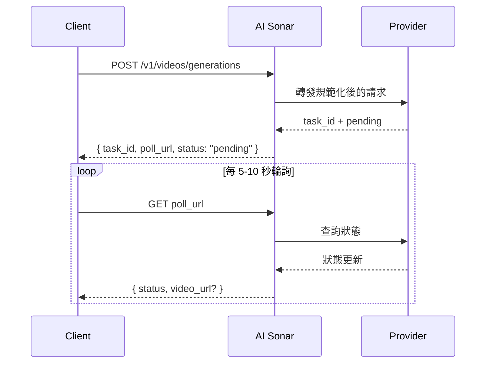

## 概覽

AI Sonar 透過單一統一 API 提供影片生成能力。影片生成是**非同步**流程：提交請求後，會回傳 `task_id` 與 `poll_url`，之後再輪詢任務狀態以取得最終結果。

### 可用性與輪詢

如果建立回應有返回 `poll_url`，請優先直接呼叫該網址。若它指向 `/v1/tasks/{id}`，就把它視為公開影片任務的規範狀態入口；`/v1/videos/generations/{id}` 只保留相容用途。

模型庫存會持續變化。若要取得最新的公開影片模型可用性，請使用 [Models API](/zh-Hant/api-reference/models/list-models) 或造訪[模型頁面](https://aisonar.dev/models)。

### 模型與媒體行為

音訊行為取決於具體模型。在 AI Sonar 中，Veo 3 家族在省略 `output_audio` 時預設按有聲處理；部分公開模型預設無聲，或僅提供無聲版本。

在生產環境中，建議優先使用公網可存取的 `https` URL 作為圖片、影片與音訊輸入。相容模型仍支援內嵌 `data:` URL，但 URL 在重試、觀測與除錯時通常更容易處理。

### 非同步工作流程



## 目前公開操作

AI Sonar 目前的公開影片契約主要覆蓋以下操作：

- `text-to-video`
- `image-to-video`
- `reference-to-video`
- `start-end-to-video`
- `video-to-video`
- `motion-control`

請求契約同時也接受 `audio-to-video` 與 `video-extension`，用於模型特定流程；但在目前這版文件對應的「通用啟用」公開影片模型清單中，並沒有一個廣泛啟用的公開模型明確對外提供這兩項能力。

## 能力矩陣

**圖例**：✅ 該 Provider 家族中至少有一個目前啟用的公開影片模型支援此能力；❌ 目前啟用模型中未公開這項能力

| 系列 | T2V | I2V | 參考 | 起點-終點 | V2V | 動作 |
|--------|-----|-----|-----------|-----------|-----|--------|
| OpenAI | ✅ | ✅ | ❌ | ❌ | ❌ | ❌ |
| Kuaishou | ✅ | ✅ | ✅ | ✅ | ✅ | ✅ |
| Google | ✅ | ✅ | ✅ | ✅ | ❌ | ❌ |
| ByteDance | ✅ | ✅ | ❌ | ❌ | ❌ | ❌ |
| MiniMax | ✅ | ✅ | ❌ | ❌ | ❌ | ❌ |
| Alibaba | ✅ | ✅ | ✅ | ❌ | ❌ | ❌ |
| Shengshu | ✅ | ✅ | ✅ | ✅ | ❌ | ❌ |
| xAI | ✅ | ✅ | ❌ | ❌ | ✅ | ❌ |
| Other | ❌ | ❌ | ❌ | ❌ | ✅ | ❌ |

### 能力定義

- **T2V（Text-to-Video）**：根據文字 prompt 生成影片
- **I2V（Image-to-Video）**：根據起始圖片生成影片；為了獲得更好的相容性，建議傳入 `image_url`
- **Reference**：透過 `reference_images` 傳入一張或多張參考圖進行條件控制
- **Start-End**：透過 `start_image` 與 `end_image` 控制首幀與尾幀
- **V2V（Video-to-Video）**：以現有影片作為主要輸入
- **Motion**：同時使用主體圖片與動作參考影片

## 目前公開模型清單


### Kuaishou

| 模型 | 公開操作 |
|-------|----------|
| `kling-3.0-motion-control` | 動作控制 |
| `kling-3.0-video` | 文生影片、圖生影片、首尾幀生影片、元素引用 |
| `kling-v2.1-master` | 文生影片、圖生影片 |
| `kling-v2.1-pro` | 圖生影片、首尾幀生影片 |
| `kling-v2.1-standard` | 圖生影片 |
| `kling-v2.5-turbo-pro` | 文生影片、圖生影片、首尾幀生影片 |
| `kling-v2.5-turbo-std` | 文生影片、圖生影片 |
| `kling-v2.6-pro` | 文生影片、圖生影片、首尾幀生影片 |
| `kling-v2.6-std` | 文生影片、圖生影片 |
| `kling-v3.0-pro` | 文生影片、圖生影片、首尾幀生影片 |
| `kling-v3.0-std` | 文生影片、圖生影片、首尾幀生影片 |
| `kling-video-o1-pro` | 文生影片、圖生影片、參考圖生影片、首尾幀生影片、影片轉影片 |
| `kling-video-o1-std` | 文生影片、圖生影片、參考圖生影片、首尾幀生影片、影片轉影片 |

### Google

| 模型 | 公開操作 |
|-------|----------|
| `veo3` | 文生影片、圖生影片 |
| `veo3-fast` | 文生影片、圖生影片 |
| `veo3-pro` | 文生影片、圖生影片 |
| `veo3.1` | 文生影片、圖生影片、參考圖生影片、首尾幀生影片 |
| `veo3.1-fast` | 文生影片、圖生影片、參考圖生影片、首尾幀生影片 |
| `veo3.1-pro` | 文生影片、圖生影片、首尾幀生影片 |

### ByteDance

| 模型 | 公開操作 |
|-------|----------|
| `seedance-1.5-pro` | 文生影片、圖生影片 |

### MiniMax

| 模型 | 公開操作 |
|-------|----------|
| `hailuo-2.3-fast` | 圖生影片 |
| `hailuo-2.3-pro` | 文生影片、圖生影片 |
| `hailuo-2.3-standard` | 文生影片、圖生影片 |

### Alibaba

| 模型 | 公開操作 |
|-------|----------|
| `wan-2.2-plus` | 文生影片、圖生影片 |
| `wan-2.5` | 文生影片、圖生影片 |
| `wan-2.6` | 文生影片、圖生影片、參考圖生影片 |

### Shengshu

| 模型 | 公開操作 |
|-------|----------|
| `viduq2` | 文生影片、參考圖生影片 |
| `viduq2-pro` | 圖生影片、參考圖生影片、首尾幀生影片 |
| `viduq2-pro-fast` | 圖生影片、首尾幀生影片 |
| `viduq2-turbo` | 圖生影片、首尾幀生影片 |
| `viduq3-pro` | 文生影片、圖生影片、首尾幀生影片 |
| `viduq3-turbo` | 文生影片、圖生影片、首尾幀生影片 |

### xAI

| 模型 | 公開操作 |
|-------|----------|
| `grok-imagine-video` | 文生影片、圖生影片、參考圖生影片、影片轉影片 |
| `grok-imagine-video-1.5-preview` | 圖生影片 |
| `grok-imagine-image-to-video` | 圖生影片 |
| `grok-imagine-text-to-video` | 文生影片 |
| `grok-imagine-upscale` | 影片轉影片 |

### 其他

| 模型 | 公開操作 |
|-------|----------|
| `topaz-video-upscale` | 影片轉影片 |

## 使用範例

### 文生影片

```python
response = requests.post(f"{BASE}/videos/generations",
    headers=headers,
    json={
        "model": "veo3.1",
        "prompt": "A calm cinematic shot of a cat walking through a sunlit garden.",
        "operation": "text-to-video",
        "duration": 4,
        "aspect_ratio": "16:9"
    }
)
```

### 圖生影片

```python
response = requests.post(f"{BASE}/videos/generations",
    headers=headers,
    json={
        "model": "hailuo-2.3-standard",
        "prompt": "The scene begins from the provided image and adds gentle natural motion.",
        "operation": "image-to-video",
        "image_url": "https://example.com/portrait.jpg",
        "duration": 6,
        "aspect_ratio": "16:9"
    }
)
```

### Kling 3.0 元素引用

需要元素引用時，請在 `kling-3.0-video` 請求中傳入 `kling_elements`。請求需要包含圖片條件輸入（`image_url`、`image_urls`、`start_image` 或 `end_image`），並在提示詞中用 `@name` 引用對應元素。

```python
response = requests.post(f"{BASE}/videos/generations",
    headers=headers,
    json={
        "model": "kling-3.0-video",
        "prompt": "Place @hero_bag on a studio turntable with soft product lighting.",
        "operation": "image-to-video",
        "image_url": "https://example.com/studio-start.png",
        "duration": 5,
        "resolution": "720p",
        "kling_elements": [
            {
                "name": "hero_bag",
                "description": "black leather handbag",
                "element_input_urls": [
                    "https://example.com/bag-front.png",
                    "https://example.com/bag-side.png"
                ]
            }
        ]
    }
)
```

### 參考圖生影片

對於 `seedance-2.0` 與 `seedance-2.0-fast`，AI Sonar 目前支援最多 9 張參考圖，外加最多 3 段參考影片與 3 段參考音訊。`duration` 只控制生成輸出時長，不單獨限制參考影片輸入時長。 對於 `grok-imagine-video`，reference-to-video 最多接受 7 個圖片參考（`reference_images` 或 `image_urls`），且 `duration` 最高為 10 秒。不要把參考圖片與 `image_url` / `image` 首幀輸入混用。`grok-imagine-video-1.5-preview` 僅支援圖生影片。

```python
response = requests.post(f"{BASE}/videos/generations",
    headers=headers,
    json={
        "model": "veo3.1",
        "prompt": "Keep the same subject identity and palette while adding subtle motion.",
        "operation": "reference-to-video",
        "reference_images": [
            "https://example.com/ref-a.jpg",
            "https://example.com/ref-b.jpg"
        ],
        "duration": 8,
        "resolution": "720p",
        "aspect_ratio": "9:16"
    }
)
```

### 首尾幀控制

```python
response = requests.post(f"{BASE}/videos/generations",
    headers=headers,
    json={
        "model": "viduq2-pro",
        "prompt": "Smooth transition from day to night.",
        "operation": "start-end-to-video",
        "start_image": "https://example.com/city-day.jpg",
        "end_image": "https://example.com/city-night.jpg",
        "duration": 5,
        "resolution": "720p",
        "aspect_ratio": "16:9"
    }
)
```

### 影片轉影片

對於 `grok-imagine-video` 的 video-to-video，請在 `video_url` 中傳入公開 HTTPS `.mp4` URL。AI Sonar 會把它轉換為 xAI REST 的 `video.url` 請求體。你可以將 `resolution` 設為 `480p` 或 `720p`；此編輯流程不接受 `duration` 與 `aspect_ratio`。

```python
response = requests.post(f"{BASE}/videos/generations",
    headers=headers,
    json={
        "model": "topaz-video-upscale",
        "operation": "video-to-video",
        "video_url": "https://example.com/source.mp4",
        "prompt": "Upscale this clip while preserving the original motion."
    }
)
```

### 動作控制

```python
response = requests.post(f"{BASE}/videos/generations",
    headers=headers,
    json={
        "model": "kling-3.0-motion-control",
        "operation": "motion-control",
        "prompt": "Keep the subject stable while following the motion reference.",
        "image_url": "https://example.com/subject.png",
        "video_url": "https://example.com/motion.mp4",
        "resolution": "720p"
    }
)
```

## 參數說明

| 參數 | 型別 | 說明 |
|------|------|------|
| `operation` | string | 在生產環境中，建議顯式傳入 `operation`。 |
| `image_url` | string | 相容性最好的圖片輸入形式。 |
| `image` | string | 內嵌 data URL，適合本地除錯或小體積整合。 |
| `reference_images` | string[] | 用於參考圖條件控制的公開規範欄位。 |
| `reference_image_type` | string | 可選的 `asset` / `style` 角色選擇器。 |
| `video_url` | string | 目前公開的 `video-to-video` 與 `motion-control` 模型都需要這個欄位。 |
| `audio_url` | string | 用於模型特定音訊條件流程。 |
| `output_audio` | boolean | Veo 3 家族在省略時預設按 `true` 處理。`kling-3.0-video` 接受此 selector 用於上游 sound 控制，省略時預設無聲。 |

## 模型選擇建議

<CardGroup cols={2}>
  <Card title="最高品質" icon="crown">
    若品質優先於速度，可優先考慮 **veo3.1-pro**、**kling-video-o1-pro** 或 **viduq3-pro**。
  </Card>
  <Card title="更快迭代" icon="bolt">
    若需要更快出結果，可先嘗試 **veo3.1-fast**、**hailuo-2.3-fast** 或 **viduq3-turbo**。
  </Card>
  <Card title="參考圖條件控制" icon="images">
    若需要專門的參考圖條件控制，可優先考慮 **veo3.1**、**veo3.1-fast**、**wan-2.6** 或 **kling-video-o1-pro / std**。
  </Card>
  <Card title="影片轉影片" icon="film">
    目前一般啟用的公開 `video-to-video` 路徑主要包括 **topaz-video-upscale**、**grok-imagine-upscale** 以及 **kling-video-o1-pro / std**。
  </Card>
</CardGroup>

## 計費

影片計費會依模型而異。有些公開影片模型實際上偏向按次計費，有些則偏向按秒計費。請以[模型頁面](https://aisonar.dev/models)或 [Pricing API](/zh-Hant/api-reference/pricing/get-pricing) 的即時公開價格為準。
