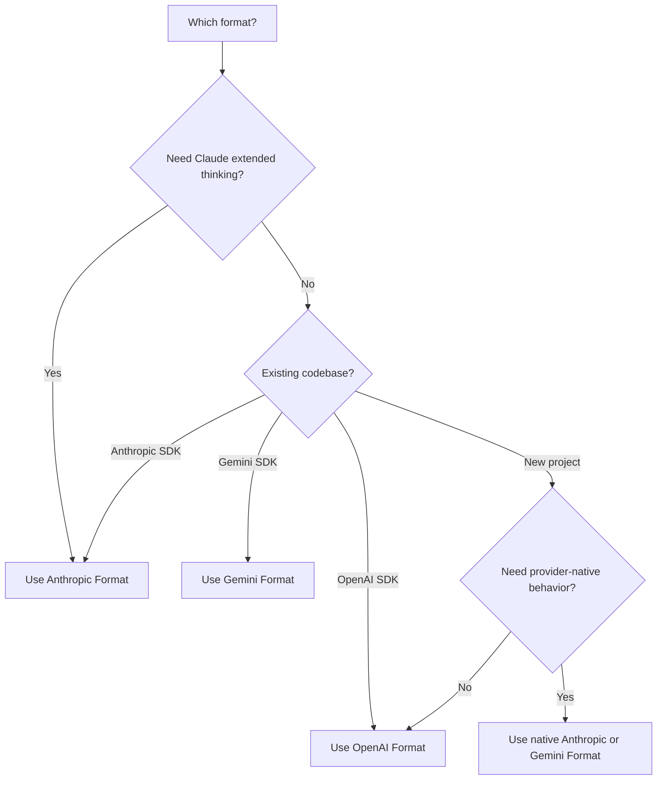

## 概览

AI Sonar 支持使用单个 API 密钥的**三种原生 API 格式**。选择最适合您用例的格式 — 无需更改配置。

<CardGroup cols={3}>
  <Card title="OpenAI 格式" icon="plug">
    `/v1/chat/completions`
    标准格式，兼容性最广
  </Card>
  <Card title="Anthropic 格式" icon="message">
    `/v1/messages`
    延展思维，原生 Claude 功能
  </Card>
  <Card title="Gemini 格式" icon="sparkles">
    `/v1beta/models/:model:generateContent`
    Google 生态系统集成
  </Card>
</CardGroup>

## 为什么使用多格式？

| 优点 | 说明 |
|---------|-------------|
| **无需切换 SDK** | 在您偏好的 SDK 中使用任意模型 |
| **原生功能** | 访问格式特定能力 |
| **原生优先迁移** | 行为重要时保留提供商原生路由；已有 OpenAI 风格客户端使用 `/v1` 兼容路径 |
| **统一计费** | 一个账户，一个 API 密钥，支持所有格式 |

## 格式比较

| 功能 | OpenAI | Anthropic | Gemini |
|---------|--------|-----------|--------|
| **端点** | `/v1/chat/completions` | `/v1/messages` | `/v1beta/models/:model:generateContent` |
| **认证头** | `Authorization: Bearer` | `x-api-key` | `Authorization: Bearer` |
| **系统提示** | 在 `messages` 数组中 | 独立的 `system` 字段 | 在 `systemInstruction` 中 |
| **延展思维** | ❌ | ✅ | ❌ |
| **流式传输** | ✅ SSE | ✅ SSE | ✅ SSE |
| **工具调用** | ✅ | ✅ | ✅ |
| **视觉能力** | ✅ | ✅ | ✅ |

## OpenAI 格式

这是面向已有 OpenAI SDK 集成、可移植聊天或 embeddings 的兼容路由。需要 Claude 或 Gemini 原生行为时，请使用下面的 Anthropic 或 Gemini 格式。

```python
from openai import OpenAI

client = OpenAI(
    api_key="sk-your-api-key",
    base_url="https://api.aisonar.dev/v1"
)

# Portable chat works across many models
response = client.chat.completions.create(
    model="claude-sonnet-4-6",  # Claude via OpenAI format
    messages=[
        {"role": "system", "content": "You are a helpful assistant."},
        {"role": "user", "content": "Hello!"}
    ]
)
```

**适用场景：**
- 通用场景
- 已有 OpenAI SDK 集成
- 最大兼容性

## Anthropic 格式

原生 Anthropic Messages API。用于 Claude 特有功能，如延展思维。

```python
from anthropic import Anthropic

client = Anthropic(
    api_key="sk-your-api-key",
    base_url="https://api.aisonar.dev"  # No /v1 suffix!
)

message = client.messages.create(
    model="claude-sonnet-4-6",
    max_tokens=1024,
    system="You are a helpful assistant.",  # Separate system field
    messages=[
        {"role": "user", "content": "Hello!"}
    ]
)
```

### 延展思维（Claude Opus 4.6）

仅在 Anthropic 格式可用：

```python
message = client.messages.create(
    model="claude-opus-4-6",
    max_tokens=16000,
    thinking={
        "type": "enabled",
        "budget_tokens": 10000
    },
    messages=[{"role": "user", "content": "Solve this complex problem..."}]
)

# Access thinking process
for block in message.content:
    if block.type == "thinking":
        print(f"Thinking: {block.thinking}")
    elif block.type == "text":
        print(f"Answer: {block.text}")
```

**适用场景：**
- Claude 特有功能
- 延展思维模式
- 原生 Anthropic SDK 用户

## Gemini 格式

原生 Google Gemini API 格式，适用于 Google 生态系统集成。

```bash
curl "https://api.aisonar.dev/v1beta/models/gemini-2.5-flash:generateContent" \
  -H "Authorization: Bearer sk-your-api-key" \
  -H "Content-Type: application/json" \
  -d '{
    "contents": [{
      "parts": [{"text": "Hello!"}]
    }],
    "systemInstruction": {
      "parts": [{"text": "You are a helpful assistant."}]
    }
  }'
```

### 流式传输

```bash
curl "https://api.aisonar.dev/v1beta/models/gemini-2.5-flash:streamGenerateContent?alt=sse" \
  -H "Authorization: Bearer sk-your-api-key" \
  -H "Content-Type: application/json" \
  -d '{
    "contents": [{"parts": [{"text": "Write a story"}]}]
  }'
```

**适用场景：**
- Google Cloud 集成
- 已有 Gemini SDK 代码
- 原生 Gemini 功能

**Gemini Files 和 Cache：** 原生 Gemini 路径支持 `/upload/v1beta/files`、`/v1beta/files`、`/v1beta/files:register` 和 `/v1beta/cachedContents`。Files 使用兼容 Gemini File API 的上游渠道；显式 Cache 资源也可以走 Vertex AI 渠道。通过 AI Sonar 创建的资源会绑定到同一个上游渠道/key，后续 `generateContent` 会沿用该绑定。

## 工具兼容边界

当目标路径支持时，函数工具可以在不同格式之间转换。提供商原生工具必须保留在对应的原生路径上：

- OpenAI Responses 托管和原生工具，例如 `tool_search`、`web_search`、`file_search`、`code_interpreter`、MCP、shell/apply_patch 和 computer-use 工具，需要 `/v1/responses`。
- Anthropic server/native 工具，例如 `web_search_*`、`web_fetch_*`、`code_execution_*`、`tool_search_*`、bash、computer-use 和 text-editor 工具，需要 `/v1/messages`。
- Gemini 内置工具，例如 `googleSearch`、`codeExecution`、`urlContext`、`computerUse` 以及类似的 `tools` 字段，需要 `/v1beta`。

如果 AI Sonar 无法把带原生工具的请求路由到支持原生格式的上游路径，会返回明确的 unsupported-field 错误，而不是静默丢弃工具或伪装成 Chat Completions 函数。用户自定义函数工具仍然是最可移植的工具路径。

## 选择合适的格式



## 迁移指南

### 来自 OpenAI 官方 API

```python
# Before (OpenAI)
client = OpenAI(api_key="sk-openai-key")

# After (AI Sonar)
client = OpenAI(
    api_key="sk-your-api-key",
    base_url="https://api.aisonar.dev/v1"  # Add this line
)
# That's it! Same code works
```

### 来自 Anthropic 官方 API

```python
# Before (Anthropic)
client = Anthropic(api_key="sk-ant-key")

# After (AI Sonar)
client = Anthropic(
    api_key="sk-your-api-key",
    base_url="https://api.aisonar.dev"  # Add this line (no /v1!)
)
```

### 来自 Google AI Studio

```python
# Before (Google)
import google.generativeai as genai
genai.configure(api_key="google-api-key")

# After (AI Sonar) - Use REST API
import requests

response = requests.post(
    "https://api.aisonar.dev/v1beta/models/gemini-2.5-flash:generateContent",
    headers={"Authorization": "Bearer sk-your-api-key"},
    json={"contents": [{"parts": [{"text": "Hello"}]}]}
)
```

## 跨模型兼容性

AI Sonar 的魔力：使用 **任意 SDK** 访问 **任意模型**。网关会自动处理格式转换。

### 任意 SDK → 任意模型

```python
# Anthropic SDK with GPT-4o (auto-converts to OpenAI format)
from anthropic import Anthropic

client = Anthropic(
    api_key="sk-your-api-key",
    base_url="https://api.aisonar.dev"
)

response = client.messages.create(
    model="gpt-4o",  # ✅ Works! Auto-converted
    max_tokens=1024,
    messages=[{"role": "user", "content": "Hello!"}]
)

# Same compatibility SDK for portable chat; native-only features still need native routes
response = client.messages.create(model="gemini-2.5-flash", ...)  # ✅ Works!
response = client.messages.create(model="deepseek-r1", ...)       # ✅ Works!
```

### OpenAI SDK → 所有模型

```python
from openai import OpenAI

client = OpenAI(base_url="https://api.aisonar.dev/v1", api_key="sk-...")

# These portable chat calls use the same /v1 compatibility SDK:
response = client.chat.completions.create(model="gpt-4o", ...)
response = client.chat.completions.create(model="claude-sonnet-4-6", ...)
response = client.chat.completions.create(model="gemini-2.5-flash", ...)
```

### 行业比较

| 平台 | OpenAI 格式 | Anthropic 格式 | Gemini 格式 | Responses API |
|----------|:---:|:---:|:---:|:---:|
| **AI Sonar** | ✅ 所有模型 | ✅ 所有模型 | ✅ 所有模型 | ✅ 所有模型 |
| OpenRouter | ✅ 所有模型 | ❌ | ❌ | ❌ |
| Together AI | ✅ 所有模型 | ❌ | ❌ | ❌ |
| Fireworks | ✅ 所有模型 | ❌ | ❌ | ❌ |

<Note>
虽然跨格式在大多数功能上可行，但格式特定的功能（例如 Anthropic 的延展思维）仍然需要使用原生格式。
</Note>
